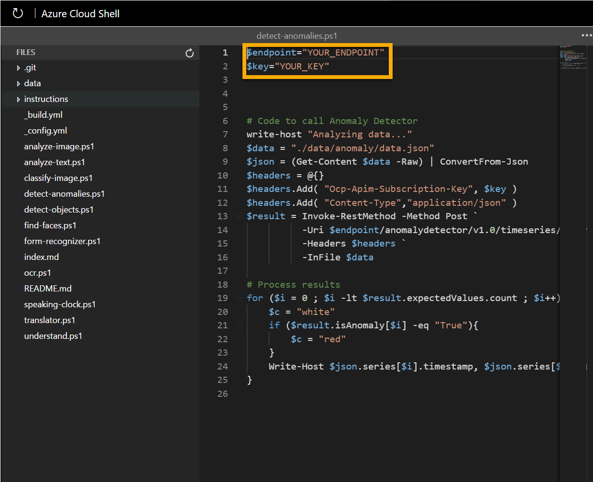

---
lab:
  title: Erkunden von Cognitive Services
  module: Module 1 - Introduction to AI
---

# <a name="explore-cognitive-services"></a>Erkunden von Cognitive Services

> **Hinweis**: Um dieses Lab abzuschließen, benötigen Sie ein [Azure-Abonnement](https://azure.microsoft.com/free?azure-portal=true), in dem Sie über Administratorzugriff verfügen.

Azure Cognitive Services kapselt allgemeine KI-Funktionen, die in vier Hauptpfeiler unterteilt werden können: Sehen, Sprache, Computersprache und Entscheidungsdienste. In dieser Übung werfen Sie einen Blick auf einen der Entscheidungsdienste, um ein allgemeines Verständnis für die Bereitstellung und Verwendung einer Cognitive Services-Ressource in einer Softwareanwendung zu gewinnen.

Die spezifische Cognitive Service-Ressource, die Sie in dieser Übung untersuchen, ist *Anomalieerkennung*. Anomalieerkennung wird verwendet, um Datenwerte im Zeitverlauf zu analysieren und ungewöhnliche Werte zu erkennen, die auf ein Problem oder eine Angelegenheit hindeuten können, die weiter untersucht werden muss. Ein Sensor in einem temperaturgesteuerten Lager kann beispielsweise jede Minute die Temperatur überwachen und die Messwerte protokollieren. Sie können den Anomalieerkennungsdienst verwenden, um die protokollierten Temperaturwerte zu analysieren und alle Werte kennzeichnen, die deutlich außerhalb des normalen Bereichs der erwarteten Temperaturen liegen.

Um die Möglichkeiten des Anomalieerkennungsdiensts zu testen, verwenden wir eine einfache Befehlszeilenanwendung, die in der Cloud Shell ausgeführt wird. Die gleichen Prinzipien und Funktionen gelten auch für reale Lösungen, wie Websites oder Smartphone-Apps.

> **Hinweis**: Das Ziel dieser Übung besteht darin, ein allgemeines Verständnis dafür zu gewinnen, wie Cognitive Services bereitgestellt und verwendet werden. Anomalieerkennung wird als Beispiel verwendet, aber es wird nicht erwartet, dass Sie in dieser Übung umfassendes Wissen über Anomalieerkennung erwerben!

## <a name="create-an-anomaly-detector-resource"></a>Erstellen einer Ressource vom Typ *Anomalieerkennung*

Erstellen Sie zunächst eine Ressource vom Typ **Anomalieerkennung** in Ihrem Azure-Abonnement:

1. Öffnen Sie auf einer anderen Browserregisterkarte das Azure-Portal unter [https://portal.azure.com](https://portal.azure.com?azure-portal=true), und melden Sie sich mit Ihrem Microsoft-Konto an.

1. Klicken Sie auf die Schaltfläche **&#65291;Ressource erstellen**, suchen Sie nach *Anomalieerkennung*, und erstellen Sie eine Ressource vom Typ **Anomalieerkennung** mit folgenden Einstellungen:
    - **Abonnement**: *Ihr Azure-Abonnement*.
    - **Ressourcengruppe**: *Wählen Sie eine vorhandene Ressourcengruppe aus, oder erstellen Sie eine neue.*
    - **Region**: *Wählen Sie eine beliebige verfügbare Region aus*.
    - **Name**: *Geben Sie einen eindeutigen Namen ein*.
    - **Tarif**: Free F0

1. Überprüfen und erstellen Sie die Ressource. Warten Sie, bis die Bereitstellung abgeschlossen ist, und wechseln Sie dann zur bereitgestellten Ressource.

1. Zeigen Sie die Seite **Schlüssel und Endpunkt** für Ihre Anomalieerkennungsressource an. Sie benötigen den Endpunkt und die Schlüssel, um von Clientanwendungen aus eine Verbindung herzustellen.

## <a name="run-cloud-shell"></a>Ausführen von Cloud Shell

Um die Möglichkeiten des Anomalieerkennungsdiensts zu testen, verwenden wir eine einfache Befehlszeilenanwendung, die in Azure Cloud Shell ausgeführt wird.

1. Wählen Sie im Azure-Portal die Schaltfläche **[>_]** (*Cloud Shell*) oben auf der Seite rechts neben dem Suchfeld aus. Dadurch wird am unteren Rand des Portals ein Cloud Shell-Bereich geöffnet.

    

1. Wenn Sie die Cloud Shell zum ersten Mal öffnen, werden Sie möglicherweise aufgefordert, die Art der Shell zu wählen, die Sie verwenden möchten (*Bash* oder *PowerShell*). Wählen Sie **PowerShell** aus. Wenn Sie diese Option nicht sehen, überspringen Sie den Schritt.  

1. Wenn Sie aufgefordert werden, Speicher für Ihre Cloud Shell zu erstellen, stellen Sie sicher, dass Ihr Abonnement angegeben ist, und wählen Sie **Speicher erstellen** aus. Warten Sie dann etwa eine Minute, bis der Speicher erstellt ist.

    

1. Vergewissern Sie sich, dass der oben links im Cloud Shell-Bereich angezeigte Shelltyp zu *PowerShell* gewechselt ist. Wenn *Bash* angezeigt wird, wechseln Sie über das Dropdownmenü zu *PowerShell*.

    

1. Warten Sie, bis PowerShell gestartet wurde. Im Azure-Portal sollte der folgende Bildschirm angezeigt werden:  

    

## <a name="configure-and-run-a-client-application"></a>Konfigurieren und Ausführen einer Clientanwendung

Nachdem Sie nun über eine Cloud Shell-Umgebung verfügen, können Sie eine einfache Anwendung ausführen, die den Dienst Anomalieerkennung verwendet, um Daten zu analysieren.

1. Geben Sie in der Befehlsshell den folgenden Befehl ein, um die Beispielanwendung herunterzuladen und in einem Ordner namens „ai-900“ zu speichern.

    ```PowerShell
    git clone https://github.com/MicrosoftLearning/AI-900-AIFundamentals ai-900
    ```

    >**Tipp**: Wenn Sie diesen Befehl bereits in einem anderen Lab zum Klonen des Repositorys *ai-900* verwendet haben, können Sie diesen Schritt überspringen.

1. Die Dateien werden in einen Ordner namens **ai-900** heruntergeladen. Jetzt möchten wir alle Dateien in Ihrem Cloud Shell-Speicher anzeigen und mit ihnen arbeiten. Geben Sie den folgenden Befehl in die Shell ein:

     ```PowerShell
    code .
    ```

    Beachten Sie, dass sich dadurch ein Editor wie in der Abbildung unten öffnet: 

    

1. Erweitern Sie auf der linken Seite im Bereich **Dateien** die Option **ai-900**, und wählen Sie **detect-anomalies.ps1** aus. Diese Datei enthält Code, der den Anomalieerkennungsdienst verwendet, wie hier zu sehen:

    

1. Machen Sie sich nicht zu viele Gedanken über die Details des Codes. Wichtig ist, dass er die Endpunkt-URL und einen der Schlüssel für Ihre Anomalieerkennungsressource benötigt. Kopieren Sie diese von der Seite **Schlüssel und Endpunkte** für Ihre Ressource (sollte sich noch im oberen Bereich des Browsers befinden), und fügen Sie sie in den Code-Editor ein, indem Sie den Platzhalterwert **YOUR_KEY** bzw. **YOUR_ENDPOINT** ersetzen.

    > **Tipp**: Möglicherweise müssen Sie die Trennlinie verwenden, um den Bildschirmbereich anzupassen, während Sie mit den Bereichen **Schlüssel und Endpunkt** und **Editor** arbeiten.

    Nach dem Einfügen der Schlüssel- und Endpunktwerte sollten die ersten beiden Codezeilen etwa wie folgt aussehen:

    ```PowerShell
    $key="1a2b3c4d5e6f7g8h9i0j...."    
    $endpoint="https..."
    ```

1. Verwenden Sie oben rechts im Editor-Bereich die Schaltfläche **...**, um das Menü zu öffnen, und wählen Sie **Speichern** aus, um Ihre Änderungen zu speichern. Öffnen Sie dann das Menü erneut, und wählen Sie **Editor schließen** aus.

    Sie erinnern sich: Anomalieerkennung ist ein KI-Verfahren (Künstliche Intelligenz), mit dem bestimmt wird, ob Werte in einer Reihe innerhalb der erwarteten Parameter liegen. Die Beispielclientanwendung verwendet den Anomalieerkennungsdienst, um eine Datei zu analysieren, die eine Reihe von Datums-/Uhrzeitwerten und numerischen Werten enthält. Die Anwendung sollte Ergebnisse zurückgeben, die zu jedem Zeitpunkt angeben, ob der numerische Wert innerhalb der erwarteten Parameter liegt.

1. Geben Sie im PowerShell-Bereich die folgenden Befehle ein, um den Code auszuführen:

    ```PowerShell
    cd ai-900
    .\detect-anomalies.ps1
    ```

1. Überprüfen Sie die Ergebnisse, und beachten Sie, dass die letzte Spalte in den Ergebnissen **True** oder **False** ist, um anzugeben, ob der zum jeweiligen Zeitpunkt (Datum/Uhrzeit) erfasste Wert als Anomalie betrachtet wird. Überlegen Sie, wie wir diese Informationen in der Praxis verwenden können. Welche Aktion könnte von der Anwendung ausgelöst werden, wenn bei den Werten von Kühlschranktemperatur oder Bluddruck Anomalien erkannt wurden?  

## <a name="learn-more"></a>Weitere Informationen

Diese einfache App zeigt nur einen Teil der Möglichkeiten des Anomalieerkennungsdiensts. Weitere Informationen zu den Möglichkeiten dieses Diensts finden Sie auf der [Seite für die Anomalieerkennung](https://azure.microsoft.com/services/cognitive-services/anomaly-detector/).

## <a name="clean-up"></a>Bereinigung

Sie sollten am Ende eines Projekts prüfen, ob Sie die Ressourcen, die Sie erstellt haben, noch benötigen. Ressourcen, die weiterhin ausgeführt werden, können Sie Geld kosten. 

Wenn Sie mit anderen Modulen zu KI-Grundlagen fortfahren, können Sie Ihre Ressource in anderen Labs wiederverwenden.

Wenn Sie den Lernpfad abgeschlossen haben, können Sie die Ressourcengruppe oder die einzelnen Ressourcen aus Ihrem Azure-Abonnement löschen.

1. Öffnen Sie im [Azure-Portal](https://portal.azure.com/) auf der Seite **Ressourcengruppen** die Ressourcengruppe, die Sie beim Erstellen Ihrer Ressource angegeben haben.

2. Klicken Sie auf **Ressourcengruppe löschen**, geben Sie den Ressourcengruppennamen ein, um zu bestätigen, dass Sie ihn löschen möchten, und klicken Sie dann auf **Löschen**. Sie können ebenso einzelne Ressourcen löschen, indem Sie die betroffene Ressource bzw. die Ressourcen löschen. Klicken Sie dazu auf die drei Punkte klicken, um weitere Optionen anzuzeigen, und klicken Sie anschließend auf **Löschen**.