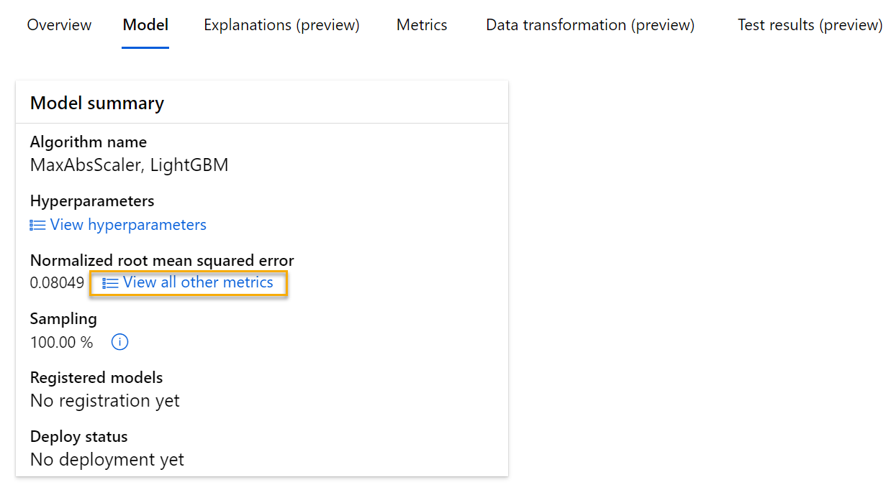
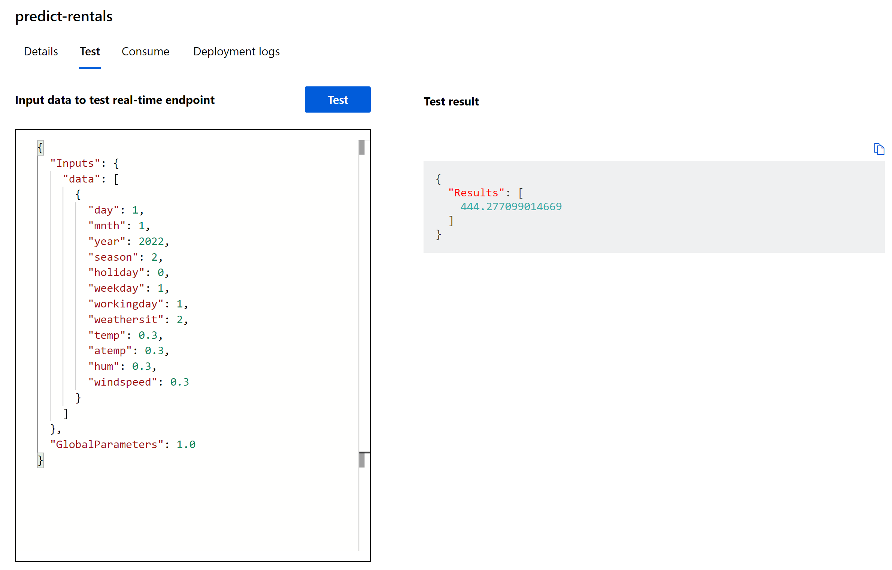

---
lab:
  title: Erkunden des automatisierten maschinellen Lernens in Azure ML
---

# Erkunden des automatisierten maschinellen Lernens in Azure ML

> **Hinweis**: Um dieses Lab abzuschließen, benötigen Sie ein [Azure-Abonnement](https://azure.microsoft.com/free?azure-portal=true), in dem Sie über Administratorzugriff verfügen.

In dieser Übung verwenden Sie ein Dataset mit Verlaufsdetails zu Fahrradvermietungen, um ein Modell zu trainieren, das basierend auf saisonalen und meteorologischen Merkmalen die Anzahl der Fahrradvermietungen vorhersagt, die an einem bestimmten Tag zu erwarten sind.

## Erstellen eines Azure Machine Learning-Arbeitsbereichs  

1. Melden Sie sich mit Ihren Microsoft-Anmeldeinformationen beim [Azure-Portal](https://portal.azure.com?azure-portal=true) an.

1. Klicken Sie auf **+ Ressource erstellen**, suchen Sie nach *Machine Learning*, und erstellen Sie eine neue **Azure Machine Learning**-Ressource mit einem *Azure Machine Learning*-Plan. Verwenden Sie folgende Einstellungen:
    - **Abonnement**: *Ihr Azure-Abonnement*.
    - **Ressourcengruppe**: *Erstellen Sie eine Ressourcengruppe, oder wählen Sie eine Ressourcengruppe aus*.
    - **Arbeitsbereichsname**: *Geben Sie einen eindeutigen Namen für den Arbeitsbereich ein*.
    - **Region**: *Wählen Sie die geografisch nächstgelegene Region aus.*
    - **Speicherkonto**: *Für Ihren Arbeitsbereich wird standardmäßig ein neues Speicherkonto erstellt*.
    - **Schlüsseltresor**: *Für Ihren Arbeitsbereich wird standardmäßig ein neuer Schlüsseltresor erstellt*.
    - **Application Insights**: *Für Ihren Arbeitsbereich wird standardmäßig eine neue Application Insights-Ressource erstellt*.
    - **Containerregistrierung**: Keine (*wird automatisch erstellt, wenn Sie das erste Mal ein Modell in einem Container bereitstellen*).

1. Klicken Sie auf**Überprüfen + erstellen** und dann auf **Erstellen**. Warten Sie, bis Ihr Arbeitsbereich erstellt wurde (dies kann einige Minuten dauern), und wechseln Sie dann zur bereitgestellten Ressource.

1. Wählen Sie **Studio starten** aus (oder öffnen Sie eine neue Browserregisterkarte. Navigieren Sie dann zu [https://ml.azure.com](https://ml.azure.com?azure-portal=true), und melden Sie sich mit Ihrem Microsoft-Konto bei Azure Machine Learning Studio an).

1. Schließen Sie alle angezeigten Nachrichten.

1. In Azure Machine Learning Studio sollte Ihr neu erstellter Arbeitsbereich angezeigt werden. Wenn dies nicht der Fall ist, wählen Sie im linken Menü Ihr Azure-Verzeichnis aus. Wählen Sie dann im neuen Menü auf der linken Seite **Arbeitsbereiche** aus, wo alle Arbeitsbereiche aufgeführt sind, die Ihrem Verzeichnis zugeordnet sind, und wählen Sie den Arbeitsbereich aus, den Sie für diese Übung erstellt haben.

> **Hinweis**: Dieses Modul ist eines von vielen, in denen ein Azure Machine Learning-Arbeitsbereich verwendet wird (einschließlich der anderen Module im Lernpfad [Microsoft Azure KI-Grundlagen: Erkunden visueller Tools für maschinelles Lernen](https://docs.microsoft.com/learn/paths/create-no-code-predictive-models-azure-machine-learning/)). Wenn Sie Ihr eigenes Azure-Abonnement verwenden, sollten Sie den Arbeitsbereich einmal erstellen und in anderen Modulen wiederverwenden. Ihrem Azure-Abonnement wird eine kleine Menge an Datenspeicher in Rechnung gestellt, solange der Azure Machine Learning-Arbeitsbereich in Ihrem Abonnement vorhanden ist. Daher wird empfohlen, den Azure Machine Learning-Arbeitsbereich zu löschen, wenn er nicht mehr benötigt wird.

## Erstellen einer Datenressource

1. Zeigen Sie die durch Trennzeichen getrennten Daten unter [https://aka.ms/bike-rentals](https://aka.ms/bike-rentals?azure-portal=true) in Ihrem Webbrowser an.

1. Erweitern Sie in [Azure Machine Learning Studio](https://ml.azure.com?azure-portal=true) den linken Bereich, indem Sie das Menüsymbol oben links auf dem Bildschirm auswählen. Zeigen Sie die Seite **Daten** an (unter **Ressourcen**). Die Seite „Daten“ enthält bestimmte Datendateien oder Tabellen, mit denen Sie in Azure Machine Learning arbeiten möchten. Sie können auch auf dieser Seite Datasets erstellen.

1. Wählen Sie auf der Seite **Daten** auf der Registerkarte **Datenressourcen** die Option **+Erstellen** aus. Konfigurieren Sie dann eine Datenressource mit den folgenden Einstellungen:
    * **Datentyp**:
        * **Name:** bike-rentals
        * **Beschreibung:** Fahrradverleihdaten
        * **Datasettyp:** Tabellarisch
    * **Datenquelle**: Aus Webdateien
    * **Web-URL:** 
        * **Web-URL**: [https://aka.ms/bike-rentals](https://aka.ms/bike-rentals?azure-portal=true)
        * **Skip data validation** (Datenüberprüfung überspringen): *Nicht auswählen*
    * **Einstellungen**:
        * **Dateiformat:** Zeichengetrennt
        * **Trennzeichen:** Komma
        * **Codierung:** UTF-8
        * **Spaltenüberschriften**: Nur erste Datei enthält Header
        * **Zeilen überspringen:** Keine
        * **Dataset contains multi-line data** (Dataset enthält mehrzeilige Daten): *Nicht auswählen*
    * **Schema:**
        * Alle Spalten einschließen außer **Pfad**
        * Überprüfen der automatisch erkannten Typen
    * **Überprüfung**
        * Klicken Sie auf **Erstellen**.

1. Nachdem das Dataset erstellt wurde, öffnen Sie es, und zeigen Sie die Seite **Erkunden** an, um eine Stichprobe der Daten anzuzeigen. Diese Daten enthalten Verlaufsmerkmale und Bezeichnungen für Fahrradvermietungen.

> **Quellenangaben**: *Diese Daten werden von [Capital Bikeshare](https://www.capitalbikeshare.com/system-data) abgeleitet und in Übereinstimmung mit dem [Lizenzvertrag](https://www.capitalbikeshare.com/data-license-agreement) für veröffentlichte Daten verwendet.*

## Aktivieren des serverlosen Computings

1. Klicken Sie in Azure Machine Learning Studio auf **Previewfunktionen verwalten** (Lautsprechersymbol).


1. Aktivieren Sie die Funktion „Geführte Benutzeroberfläche zum Übermitteln von Trainingsaufträgen mit serverlosem Computing“.


## Ausführen eines Auftrags für automatisiertes maschinelles Lernen

Führen Sie die nächsten Schritte aus, um einen Auftrag auszuführen, der das automatisierte maschinelle Lernen zum Trainieren eines Regressionsmodells verwendet, das Fahrradvermietungen vorhersagt.

1. Zeigen Sie in [Azure Machine Learning Studio](https://ml.azure.com?azure-portal=true) die Seite **Automated ML** (Automatisiertes ML) (unter **Dokumenterstellung**) an.

1. Erstellen Sie einen Auftrag für automatisiertes ML mit den folgenden Einstellungen:
    - **Datenressource auswählen**:
        - **Dataset:** bike-rentals
    - **Auftrag konfigurieren**:
        - **Neuer Experimentname:** mslearn-bike-rental
        - **Zielspalte**: rentals (Vermietungen) (*Dies ist die Bezeichnung, die das Modell durch das Training vorhersagen soll.)*
        - **Azure ML-Computecluster auswählen**: *Zuvor erstellter Computecluster*.
    - **Wählen Sie die Aufgabe und die Einstellungen aus:** 
        - **Aufgabentyp**: Regression *(Das Modell sagt einen numerischen Wert vorher.)* 

    

    Beachten Sie unter dem Aufgabentyp die Einstellungen *Weitere Konfigurationseinstellungen anzeigen* und *Featurisierungseinstellungen anzeigen*. Konfigurieren Sie nun diese Einstellungen.

    - **Zusätzliche Konfigurationseinstellungen**:
        - **Primäre Metrik**: Wählen Sie **Wurzel der mittleren Fehlerquadratsumme** aus.
        - **Explain best model** (Bestes Modell erläutern): Ausgewählt – *Diese Option bewirkt, dass mit dem automatisierten maschinellen Lernen die Relevanz der Merkmale für das beste Modell berechnet wird. So können Sie den Einfluss der einzelnen Merkmale auf die vorhergesagte Bezeichnung ermitteln.*
        - **Alle unterstützten Modelle verwenden**: <u>Nicht</u> ausgewählt. *Sie beschränken den Auftrag darauf, nur einige bestimmte Algorithmen auszuprobieren*.
        - **Zulässige Modelle**: *Wählen Sie nur **RandomForest** und **LightGBM** aus. Normalerweise sollten Sie so viele Modelle wie möglich ausprobieren, aber jedes hinzugefügte Modell verlängert die Zeitspanne, die zum Ausführen des Auftrags benötigt wird*.

        
Unter *Zusätzliche Konfigurationseinstellungen anzeigen* befindet sich der Abschnitt *Grenzwerte*. Erweitern Sie den Abschnitt, um die Einstellungen zu konfigurieren:
        - **Timeout (Minuten)** : 30 – *Beendet den Auftrag nach maximal 30 Minuten.* .
        - **Metrischer Bewertungsschwellenwert**: 0,085. *Wenn ein Modell eine normalisierte Wurzel der mittleren Fehlerquadratsumme von 0,085 oder weniger erreicht, wird der Auftrag beendet*.
        - Klicken Sie auf **Weiter**.
        - **Compute**: Hier sind keine Änderungen erforderlich
        - Klicken Sie auf **Weiter**.
1. Wenn Sie die Übermittlung der Details zum automatisierten ML-Auftrag abgeschlossen haben, wird dieser automatisch gestartet.

1. Warten Sie auf den Abschluss des Auftrags. Dies kann einige Zeit in Anspruch nehmen und ist möglicherweise ein guter Zeitpunkt für eine Kaffeepause.

## Überprüfen des besten Modells

1. Beachten Sie auf der Registerkarte **Übersicht** des automatisierten ML-Auftrags die Zusammenfassung des besten Modells.
    

    > **Hinweis** Möglicherweise wird eine Meldung „Warnung: Vom Benutzer angegebene Exitbewertung wurde erreicht...“ unter dem Status angezeigt. Dies ist eine erwartete Meldung. Fahren Sie mit dem nächsten Schritt fort.  
1. Wählen Sie den Text unter **Algorithmusname**, um das beste Modell und seine Details anzuzeigen.

1. Klicken Sie neben dem Wert *Wurzel der mittleren Fehlerquadratsumme (RMSE), normalisiert* auf **Alle weiteren Metriken anzeigen**, um Werte anderer Auswertungsmetriken für ein Regressionsmodell anzuzeigen.

    

1. Klicken Sie auf die Registerkarte **Metriken**, und wählen Sie die Diagramme **residuals** und **predicted_true** aus, wenn diese nicht bereits ausgewählt sind. 
    

    Überprüfen Sie die Diagramme, die die Leistung des Modells anzeigen. Das erste Diagramm zeigt die *Restwerte*, d. h. die Unterschiede zwischen den vorhergesagten und den tatsächlichen Werten, als Histogramm, das zweite Diagramm vergleicht die vorhergesagten Werte mit den tatsächlichen Werten.

1. Wählen Sie die Registerkarte **Erklärungen** aus. Wählen Sie eine Erklärungs-ID aus, und klicken Sie dann auf **Aggregierte Featurerelevanz**. Dieses Diagramm zeigt, wie stark sich die einzelnen Merkmale im Dataset auf die Bezeichnungsvorhersage auswirken. Beispiel:

    

## Bereitstellen eines Vorhersagediensts

1. Wählen Sie in [Azure Machine Learning Studio](https://ml.azure.com?azure-portal=true) auf der Seite **Automatisiertes ML** die Option zum Starten Ihres Auftrags für automatisiertes maschinelles Lernen aus.

1. Wählen Sie auf der Registerkarte **Übersicht** den Algorithmusnamen des besten Modells aus.

    

1. Wählen Sie auf der Registerkarte **Modelle** die Schaltfläche **Bereitstellen** aus, und verwenden Sie die Option **Webdienst**, um das Modell mit den folgenden Einstellungen bereitzustellen:
    - **Name:** predict-rentals
    - **Beschreibung:** Vorhersage Fahrradvermietung
    - **Computetyp:** Azure Container Instances
    - **Authentifizierung aktivieren:** ausgewählt

1. Warten Sie, bis die Bereitstellung gestartet wurde. Dieser Vorgang kann einige Sekunden in Anspruch nehmen.

1. Wählen Sie in Azure Machine Learning Studio im Menü auf der linken Seite **Endpunkte** aus, und öffnen Sie den Echtzeitendpunkt **predict-rentals**.
1. Warten Sie, bis **Bereitstellungsstatus** in **Fehlerfrei** geändert wird. Dies kann einige Minuten dauern.

## Testen des bereitgestellten Diensts

Jetzt können Sie den bereitgestellten Dienst testen.

1. Zeigen Sie auf der Seite des Echtzeitendpunkts **predict-rentals** die Registerkarte **Test** an.

1. Ersetzen Sie im Bereich **Input data to test endpoint** (Eingabedaten zum Testen des Endpunkts) den JSON-Code der Vorlage durch die folgenden Eingabedaten:

    ```JSON
    {
      "Inputs": { 
        "data": [
          {
            "day": 1,
            "mnth": 1,   
            "year": 2022,
            "season": 2,
            "holiday": 0,
            "weekday": 1,
            "workingday": 1,
            "weathersit": 2, 
            "temp": 0.3, 
            "atemp": 0.3,
            "hum": 0.3,
            "windspeed": 0.3 
          }
        ]    
      },   
      "GlobalParameters": 1.0
    }
    ```

1. Klicken Sie auf die Schaltfläche **Testen**.

1. Überprüfen Sie die Testergebnisse, die eine vorhergesagte Anzahl von Vermietungen basierend auf den Eingabefeatures enthalten. Im Testbereich wurden die Eingabedaten erfasst und das von Ihnen trainierte Modell verwendet, um die vorhergesagte Anzahl von Vermietungen zurückzugeben.

    

Sehen wir uns an, was Sie getan haben. Sie haben ein Dataset mit Fahrradverleih-Verlaufsdaten verwendet, um ein Modell zu trainieren. Das Modell sagt auf der Grundlage von saisonalen und meteorologischen *Merkmalen*F vorher, die ausgeliehen werden. In diesem Fall handelt es sich bei den *Bezeichnungen* um die Anzahl der Fahrradverleihe.

Sie haben gerade einen Dienst getestet, der mit einer Clientanwendung eine Verbindung herstellen kann, indem die Anmeldeinformationen auf der Registerkarte **Consume** (Verbrauchen) verwendet werden. Das Lab endet hier. Sie können gern weiter mit dem Dienst experimentieren, den Sie gerade eingerichtet haben.

## Bereinigung

Der von Ihnen erstellte Webdienst wird in einer *Azure-Containerinstanz* gehostet. Wenn Sie nicht weiter experimentieren möchten, sollten Sie den Endpunkt löschen, um eine unnötige Azure-Nutzung zu vermeiden. Sie sollten auch den Computecluster löschen.

1. Wählen Sie in [Azure Machine Learning Studio](https://ml.azure.com?azure-portal=true) auf der Registerkarte **Endpunkte** den Endpunkt **predict-rentals** aus. Klicken Sie dann auf **Löschen**, und bestätigen Sie, dass Sie den Endpunkt löschen möchten.

> **Hinweis**: Durch das Löschen Ihrer Compute-Instanz wird sichergestellt, dass Ihrem Abonnement keine Computeressourcen in Rechnung gestellt werden. Ihnen wird jedoch eine geringe Datenspeichermenge in Rechnung gestellt, solange der Azure Machine Learning-Arbeitsbereich in Ihrem Abonnement enthalten ist. Wenn Sie mit dem Erkunden von Azure Machine Learning fertig sind, können Sie Ihren Azure Machine Learning-Arbeitsbereich und die zugehörigen Ressourcen löschen. Wenn Sie jedoch andere Labs in dieser Reihe abschließen möchten, müssen Sie ihn neu erstellen.
>
> So löschen Sie Ihren Arbeitsbereich:
> 1. Öffnen Sie im [Azure-Portal](https://portal.azure.com?azure-portal=true) auf der Seite **Ressourcengruppen** die Ressourcengruppe, die Sie beim Erstellen des Azure Machine Learning-Arbeitsbereichs angegeben haben.
> 2. Klicken Sie auf **Ressourcengruppe löschen**, geben Sie den Ressourcengruppennamen ein, um zu bestätigen, dass Sie ihn löschen möchten, und klicken Sie dann auf **Löschen**.
