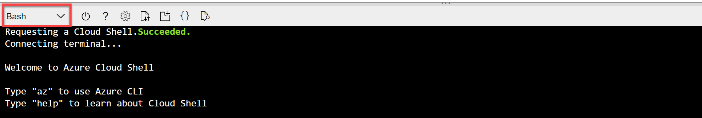

---
lab:
  title: Einstieg in das maschinelle Sehen
---

# Einstieg in das maschinelle Sehen

> **Hinweis**: Um dieses Lab abzuschließen, benötigen Sie ein [Azure-Abonnement](https://azure.microsoft.com/free?azure-portal=true), in dem Sie über Administratorzugriff verfügen.

Der Dienst *Computer Vision* verwendet vorab trainierte Machine Learning-Modelle, um Bilder zu analysieren und Informationen über sie zu extrahieren.

Nehmen wir beispielsweise an, dass das fiktive Einzelhandelsunternehmen *Northwind Traders* beschlossen hat, einen „intelligenten Laden“ einzurichten, in dem KI-Dienste den Laden überwachen, um Kunden zu identifizieren, die Hilfe benötigen, und die Mitarbeiter anweisen, ihnen zu helfen. Mithilfe des Diensts für maschinelles Sehen können Bilder, die von Kameras im gesamten Geschäft aufgenommen wurden, analysiert werden, um aussagekräftige Beschreibungen der abgebildeten Inhalte zu erstellen.

In diesem Lab verwenden Sie eine einfache Befehlszeilenanwendung, um den Dienst für maschinelles Sehen in Aktion zu sehen. Die gleichen Prinzipien und Funktionen gelten auch für reale Lösungen, wie Websites oder Smartphone-Apps.

## Erstellen einer *Azure KI Services*-Ressource

Sie können den Dienst für maschinelles Sehen verwenden, indem Sie entweder eine Ressource für **maschinelles Sehen** oder eine **Azure KI Services**-Ressource erstellen.

Wenn dies noch nicht erfolgt ist, erstellen Sie eine **Azure KI Services**-Ressource in Ihrem Azure-Abonnement.

1. Öffnen Sie auf einer anderen Browserregisterkarte das Azure-Portal unter [https://portal.azure.com](https://portal.azure.com?azure-portal=true), und melden Sie sich mit Ihrem Microsoft-Konto an.

1. Klicken Sie auf die Schaltfläche **＋Ressource erstellen** und suchen Sie nach *Azure KI Services*. Wählen Sie **Erstellen** eines **Azure KI Services**-Plans aus. Sie werden zu einer Seite weitergeleitet, um eine Azure KI Services-Ressource zu erstellen. Konfigurieren Sie sie mit den folgenden Einstellungen:
    - **Abonnement**: *Ihr Azure-Abonnement*.
    - **Ressourcengruppe**: *Wählen Sie eine Ressourcengruppe aus, oder erstellen Sie eine Ressourcengruppe mit einem eindeutigen Namen*.
    - **Region**: *Wählen Sie eine beliebige verfügbare Region aus.*
    - **Name**: *Geben Sie einen eindeutigen Namen ein*.
    - **Tarif**: Standard S0.
    - **Durch Aktivieren dieses Kontrollkästchens bestätige ich, dass ich die folgenden Bedingungen gelesen und verstanden habe**: Aktiviert.

1. Überprüfen und erstellen Sie die Ressource und warten Sie, bis die Bereitstellung abgeschlossen ist. Wechseln Sie dann zur bereitgestellten Ressource.

1. Zeigen Sie die Seite **Schlüssel und Endpunkt** für Ihre Azure KI Services-Ressource an. Sie benötigen den Endpunkt und die Schlüssel, um von Clientanwendungen aus eine Verbindung herzustellen.

## Ausführen von Cloud Shell

Um die Fähigkeiten des Diensts für maschinelles Sehen zu testen, verwenden wir eine einfache Befehlszeilenanwendung, die in der Cloud Shell in Azure ausgeführt wird.

1. Wählen Sie im Azure-Portal die Schaltfläche **[>_]** (*Cloud Shell*) oben auf der Seite rechts neben dem Suchfeld aus. Dadurch wird am unteren Rand des Portals ein Cloud Shell-Bereich geöffnet.

    

1. Wenn Sie die Cloud Shell zum ersten Mal öffnen, werden Sie möglicherweise aufgefordert, die Art der Shell zu wählen, die Sie verwenden möchten (*Bash* oder *PowerShell*). Wählen Sie **PowerShell** aus. Wenn Sie diese Option nicht sehen, überspringen Sie den Schritt.  

1. Wenn Sie aufgefordert werden, Speicher für Ihre Cloud Shell zu erstellen, stellen Sie sicher, dass Ihr Abonnement angegeben ist, und wählen Sie **Speicher erstellen** aus. Warten Sie dann etwa eine Minute, bis der Speicher erstellt ist.

    

1. Vergewissern Sie sich, dass der oben links im Cloud Shell-Bereich angezeigte Shelltyp zu *PowerShell* gewechselt ist. Wenn *Bash* angezeigt wird, wechseln Sie über das Dropdownmenü zu *PowerShell*.

    

1. Warten Sie, bis PowerShell gestartet wurde. Im Azure-Portal sollte der folgende Bildschirm angezeigt werden:  

    

## Konfigurieren und Ausführen einer Clientanwendung

Da Sie nun über eine Cloud Shell-Umgebung verfügen, können Sie eine einfache Anwendung ausführen, die den Dienst für maschinelles Sehen zur Bildanalyse verwendet.

1. Geben Sie in der Befehlsshell den folgenden Befehl ein, um die Beispielanwendung herunterzuladen und in einem Ordner namens „ai-900“ zu speichern.

    ```PowerShell
    git clone https://github.com/MicrosoftLearning/AI-900-AIFundamentals ai-900
    ```

    > **Tipp**: Wenn Sie diesen Befehl bereits in einem anderen Lab zum Klonen des Repositorys *ai-900* verwendet haben, können Sie diesen Schritt überspringen.

1. Die Dateien werden in einen Ordner namens **ai-900** heruntergeladen. Jetzt möchten wir alle Dateien in Ihrem Cloud Shell-Speicher anzeigen und mit ihnen arbeiten. Geben Sie den folgenden Befehl in die Shell ein:

    ```PowerShell
    code .
    ```

    Beachten Sie, dass sich dadurch ein Editor wie in der Abbildung unten öffnet:

    

1. Erweitern Sie im Bereich **Dateien** auf der linken Seite die Option **ai-900**, und wählen Sie **analyze-image.ps1** aus. Diese Datei enthält einen Code, der den Dienst für maschinelles Sehen verwendet, um ein Bild zu analysieren, wie hier gezeigt:

    

1. Machen Sie sich nicht zu viele Gedanken über den Code, wichtig ist, dass er die Endpunkt-URL und einen der Schlüssel für Ihre Azure KI Services-Ressource benötigt. Kopieren Sie diese von der Seite **Schlüssel und Endpunkte** für Ihre Ressource aus dem Azure-Portal, und fügen Sie sie in den Code-Editor ein, wobei Sie die Platzhalterwerte **YOUR_KEY** und **YOUR_ENDPOINT** ersetzen.

    > **Tipp**: Möglicherweise müssen Sie die Trennlinie verwenden, um den Bildschirmbereich anzupassen, während Sie mit den Bereichen **Schlüssel und Endpunkt** und **Editor** arbeiten.

    Nach dem Einfügen der Schlüssel- und Endpunktwerte sollten die ersten beiden Codezeilen etwa wie folgt aussehen:

    ```PowerShell
    $key="1a2b3c4d5e6f7g8h9i0j...."    
    $endpoint="https..."
    ```

1. Verwenden Sie oben rechts im Editor-Bereich die Schaltfläche **...**, um das Menü zu öffnen, und wählen Sie **Speichern** aus, um Ihre Änderungen zu speichern.

    Die Beispielclientanwendung verwendet Ihren Dienst für maschinelles Sehen, um das folgende Bild zu analysieren, das von einer Kamera im Northwind Traders Store aufgenommen wurde:

    

1. Geben Sie im PowerShell-Bereich die folgenden Befehle ein, um den Code auszuführen:

    ```PowerShell
    cd ai-900
    ./analyze-image.ps1 store-camera-1.jpg
    ```

1. Überprüfen Sie die Ergebnisse der Bildanalyse, die Folgendes umfasst:
    - Eine vorgeschlagene Beschriftung, die das Bild beschreibt.
    - Eine Liste der im Bild identifizierten Objekte.
    - Eine Liste von „Tags“, die für das Bild relevant sind.

1. Versuchen wir es nun mit einem anderen Bild:

    

    Geben Sie den folgenden Befehl ein, um das zweite Bild zu analysieren:

    ```PowerShell
    ./analyze-image.ps1 store-camera-2.jpg
    ```

1. Überprüfen Sie die Ergebnisse der Bildanalyse für das zweite Bild.

1. Versuchen wir ein weiteres:

    

    Geben Sie den folgenden Befehl ein, um das dritte Bild zu analysieren:

    ```PowerShell
    ./analyze-image.ps1 store-camera-3.jpg
    ```

1. Überprüfen Sie die Ergebnisse der Bildanalyse für das dritte Bild.

## Weitere Informationen

Diese einfache App veranschaulicht nur einige der Funktionen des Diensts für maschinelles Sehen. Weitere Informationen über die Möglichkeiten dieses Diensts finden Sie auf der [Seite für maschinelles Sehen](https://azure.microsoft.com/products/ai-services?activetab=pivot:visiontab).

