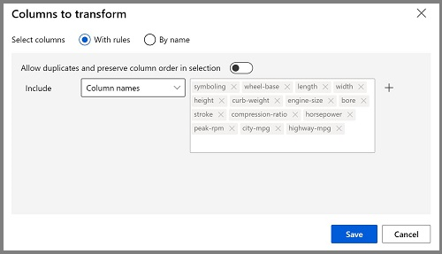
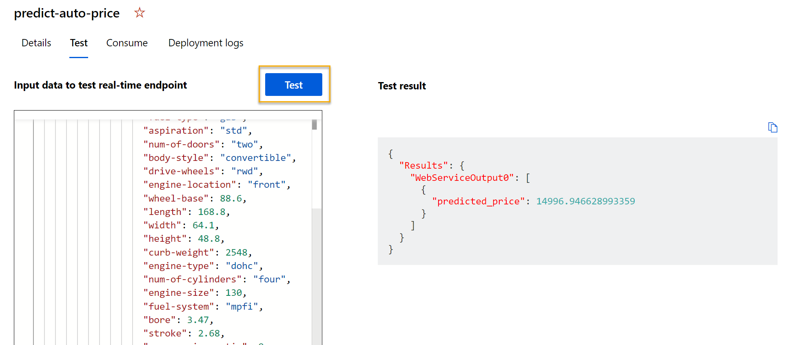

---
lab:
  title: Untersuchen der Regression mit dem Azure Machine Learning-Designer
  module: Module 2 - Machine Learning
---

# <a name="explore-regression-with-azure-machine-learning-designer"></a>Untersuchen der Regression mit dem Azure Machine Learning-Designer

> **Hinweis**: Um dieses Lab abzuschließen, benötigen Sie ein [Azure-Abonnement](https://azure.microsoft.com/free?azure-portal=true), in dem Sie über Administratorzugriff verfügen.

In dieser Übung werden Sie ein Regressionsmodell trainieren, das den Preis eines Autos anhand seiner Merkmale vorhersagt.

## <a name="create-an-azure-machine-learning-workspace"></a>Erstellen eines Azure Machine Learning-Arbeitsbereichs  

1. Melden Sie sich mit Ihren Microsoft-Anmeldeinformationen beim [Azure-Portal](https://portal.azure.com?azure-portal=true) an.

1. Klicken Sie auf **+ Ressource erstellen**, suchen Sie nach *Machine Learning*, und erstellen Sie eine neue **Azure Machine Learning**-Ressource mit einem *Azure Machine Learning*-Plan. Verwenden Sie folgende Einstellungen:
    - **Abonnement**: *Ihr Azure-Abonnement*.
    - **Ressourcengruppe**: *Erstellen Sie eine Ressourcengruppe, oder wählen Sie eine Ressourcengruppe aus*.
    - **Arbeitsbereichsname**: *Geben Sie einen eindeutigen Namen für den Arbeitsbereich ein*.
    - **Region**: *Wählen Sie die geografisch nächstgelegene Region aus.*
    - **Speicherkonto**: *Für Ihren Arbeitsbereich wird standardmäßig ein neues Speicherkonto erstellt*.
    - **Schlüsseltresor**: *Für Ihren Arbeitsbereich wird standardmäßig ein neuer Schlüsseltresor erstellt*.
    - **Application Insights**: *Für Ihren Arbeitsbereich wird standardmäßig eine neue Application Insights-Ressource erstellt*.
    - **Containerregistrierung:** Keine (*wird automatisch erstellt, wenn Sie das erste Mal ein Modell in einem Container bereitstellen*)

1. Klicken Sie auf**Überprüfen + erstellen** und dann auf **Erstellen**. Warten Sie, bis Ihr Arbeitsbereich erstellt wurde (dies kann einige Minuten dauern), und wechseln Sie dann zur bereitgestellten Ressource.

1. Wählen Sie **Studio starten** aus (oder öffnen Sie eine neue Browserregisterkarte. Navigieren Sie dann zu [https://ml.azure.com](https://ml.azure.com?azure-portal=true), und melden Sie sich mit Ihrem Microsoft-Konto bei Azure Machine Learning Studio an).

1. In Azure Machine Learning Studio sollte Ihr neu erstellter Arbeitsbereich angezeigt werden. Wenn dies nicht der Fall ist, klicken Sie im linken Menü auf **Microsoft**. Wählen Sie dann im neuen Menü auf der linken Seite, in dem alle Arbeitsbereiche aufgeführt werden, die Ihrem Abonnement zugeordnet sind, **Arbeitsbereiche** aus. Wählen Sie den für diese Übung erstellten Arbeitsbereich aus. 

> **Hinweis**: Dieses Modul ist eines von vielen, in denen ein Azure Machine Learning-Arbeitsbereich verwendet wird (einschließlich der anderen Module im Lernpfad [Microsoft Azure KI-Grundlagen: Erkunden visueller Tools für maschinelles Lernen](https://docs.microsoft.com/learn/paths/create-no-code-predictive-models-azure-machine-learning/)). Wenn Sie Ihr eigenes Azure-Abonnement verwenden, sollten Sie den Arbeitsbereich einmal erstellen und in anderen Modulen wiederverwenden. Ihrem Azure-Abonnement wird eine kleine Menge an Datenspeicher in Rechnung gestellt, solange der Azure Machine Learning-Arbeitsbereich in Ihrem Abonnement vorhanden ist. Daher wird empfohlen, den Azure Machine Learning-Arbeitsbereich zu löschen, wenn er nicht mehr benötigt wird.

## <a name="create-compute"></a>Erstellen von Computeressourcen

1. Wählen Sie in [Azure Machine Learning Studio](https://ml.azure.com?azure-portal=true) die drei Zeilen oben links aus, um die verschiedenen Seiten in der Benutzeroberfläche anzuzeigen (möglicherweise müssen Sie die Größe des Bildschirms maximieren). Sie können diese Seiten im linken Bereich verwenden, um die Ressourcen in Ihrem Arbeitsbereich zu verwalten. Wählen die Seite **Compute** (unter **Verwalten**) aus.

1. Klicken Sie auf der Seite **Compute** auf die Registerkarte **Computecluster**, und fügen Sie einen neuen Computecluster mit den folgenden Einstellungen hinzu, um ein Machine Learning-Modell zu trainieren:
    - **Standort**: *Wählen Sie denselben Standort wie für Ihren Arbeitsbereich aus. Wenn dieser Standort nicht aufgeführt wird, wählen Sie den nächstgelegenen Standort aus.*
    - **VM-Dienstebene**: Dediziert.
    - **VM-Typ:** CPU
    - **VM-Größe:**
        - Klicken Sie auf **Aus allen Optionen auswählen**.
        - Suchen Sie **Standard_DS11_v2**, und wählen Sie den Eintrag aus.
    - Wählen Sie **Weiter** aus.
    - **Computename:***Geben Sie einen eindeutigen Namen ein.*
    - **Mindestanzahl von Knoten:** 0
    - **Maximale Knotenanzahl:** 2
    - **Leerlauf in Sekunden vor dem Herunterskalieren:** 120
    - **SSH-Zugriff aktivieren**: Deaktiviert.
    - Klicken Sie auf **Erstellen**.

> **Hinweis**: Compute-Instanzen und -cluster basieren auf Azure VM-Standardimages. Für dieses Modul wird das Image *Standard_DS11_v2* empfohlen, um ein optimales Gleichgewicht zwischen Kosten und Leistung zu erzielen. Wenn Ihr Abonnement über ein Kontingent verfügt, das dieses Image nicht enthält, wählen Sie ein alternatives Image aus. Beachten Sie jedoch, dass ein größeres Image höhere Kosten verursachen kann und ein kleineres Image möglicherweise nicht ausreicht, um die Aufgaben auszuführen. Bitten Sie alternativ Ihren Azure-Administrator, Ihr Kontingent zu erhöhen.

Die Erstellung des Computeclusters nimmt einige Zeit in Anspruch. Sie können mit dem nächsten Schritt fortfahren, während Sie warten.

## <a name="create-a-pipeline-in-designer"></a>Erstellen einer Pipeline im Designer 

1. Erweitern Sie im [Azure Machine Learning Studio](https://ml.azure.com?azure-portal=true) den linken Bereich, indem Sie links oben auf dem Bildschirm das Symbol mit den drei Zeilen auswählen. Zeigen Sie die Seite **Designer** (unter **Autor**) an, und wählen Sie **+** aus, um eine neue Pipeline zu erstellen.

1. Wählen Sie oben rechts auf dem Bildschirm **Einstellungen** aus. Wenn der Bereich **Einstellungen** nicht sichtbar ist, wählen Sie das Radsymbol neben dem Pipelinenamen oben.

1. Unter **Einstellungen** müssen Sie ein Computeziel angeben, auf dem die Pipeline ausgeführt werden soll. Wählen Sie unter **Computetyp auswählen** die Option **Computecluster** aus. Wählen Sie dann unter **Azure ML-Computecluster auswählen** den zuvor erstellten Computecluster aus.

1. Ändern Sie in **Einstellungen** unter **Draft Details** (Entwurfsdetails) den Entwurfsnamen (**Pipeline-Created-on-* date***) in **Auto Price Training** (Autopreistraining).

1. Wählen Sie oben rechts im **Einstellungsbereich** das *Symbol zum Schließen* aus, um den Bereich zu schließen. 


## <a name="add-and-explore-a-dataset"></a>Hinzufügen und Untersuchen eines Datasets

Azure Machine Learning enthält ein Beispieldataset, das Sie für Ihr Regressionsmodell verwenden können.

1. Wählen Sie neben dem Pipelinenamen auf der linken Seite das Pfeilsymbol, um das Panel zu erweitern, wenn es nicht bereits erweitert ist. Der Bereich sollte standardmäßig im Bereich **Ressourcenbibliothek** geöffnet werden. Dies wird durch das Büchersymbol am oberen Rand des Bereichs gekennzeichnet. Es gibt eine Suchleiste zum Suchen von Objekten im Bereich und zwei Schaltflächen: **Daten** und **Komponente**.

    

1. Klicken Sie auf **Komponente**. Suchen Sie nach dem Dataset **Automobile price data (Raw)**, und platzieren Sie es auf der Canvas.

1. Klicken Sie mit der rechten Maustaste (auf einem Mac drücken Sie die CTRL-Taste und klicken) auf das Dataset **Automobile price data (Raw)** auf der Canvas, und klicken Sie dann auf **Datenvorschau anzeigen**.

1. Sehen Sie sich das Schema *Datasetausgabe* an. Beachten Sie, dass die Verteilungen der verschiedenen Spalten als Histogramme angezeigt werden.

1. Scrollen Sie im Dataset nach rechts, bis die Spalte **Price** (Preis) angezeigt wird, die die Bezeichnung darstellt, die von Ihrem Modell vorhersagt wird.

1. Scrollen Sie zurück nach links, und wählen Sie die Spaltenüberschrift **normalized-losses** aus. Überprüfen Sie dann die Statistiken für diese Spalte. Beachten Sie, dass in dieser Spalte einige Werte fehlen. Fehlende Werte schränken die Zweckmäßigkeit der Spalte für die Vorhersage der **Preisbezeichnung** ein, deshalb sollten Sie sie aus dem Training ausschließen.

1. Schließen Sie das Fenster mit der **Visualisierung der Ergebnisse von Automobile price data (Raw)**, damit das Dataset wie folgt im Canvas angezeigt wird:

    

## <a name="add-data-transformations"></a>Hinzufügen von Datentransformationen

In der Regel wenden Sie Datentransformationen an, um die Daten für die Modellierung vorzubereiten. Im Fall der Autopreisdaten fügen Sie Transformationen hinzu, um die Probleme zu beheben, die Sie beim Untersuchen der Daten festgestellt haben.

1. Klicken Sie links im Bereich **Ressourcenbibliothek** auf **Komponenten**. Diese enthalten verschiedenste Module, die Sie für Datentransformationen und Modelltrainings verwenden können. Für die schnelle Suche nach Modulen können Sie auch die Suchleiste verwenden.

1. Suchen Sie nach einem Modul vom Typ **Spalten im Dataset auswählen**, und platzieren Sie es auf der Canvas unterhalb des Moduls **Fahrzeugpreisdaten (Rohdaten)**. Verbinden Sie dann wie folgt die Ausgabe unten des Moduls **Automobile price data (Raw)** mit der Eingabe oben des Moduls **Spalten im Dataset auswählen**:

    

1. Doppelklicken Sie auf das Modul **Spalten im Dataset auswählen**, um rechts auf einen Bereich mit Einstellungen zuzugreifen. Wählen Sie **Spalte bearbeiten** aus. Wählen Sie dann im Fenster **Spalten auswählen** die Optionen **Nach Name** und **Alle hinzufügen** aus, um alle Spalten hinzuzufügen. Entfernen Sie die Spalte **normalized-losses**, sodass Ihre endgültige Spaltenauswahl wie folgt aussieht:

    

1. Klicken Sie auf die Schaltfläche **Speichern**.

Im restlichen Teil dieser Übung führen Sie die Schritte zum Erstellen einer Pipeline aus, die wie folgt aussieht:


Führen Sie die restlichen Schritte aus, und verwenden Sie die Abbildung als Referenz für das Hinzufügen und Konfigurieren der erforderlichen Module.

1. Suchen Sie in der **Ressourcenbibliothek** nach einem Modul vom Typ **Fehlende Daten bereinigen**, und platzieren Sie es auf der Canvas unterhalb des Moduls **Spalten im Dataset auswählen**. Verbinden Sie dann die Ausgabe des Moduls **Spalten in Dataset auswählen** mit der Eingabe des Moduls **Fehlende Daten bereinigen**.

1. Wählen Sie das Modul **Fehlende Daten bereinigen** aus, und klicken Sie im Bereich rechts auf **Spalte bearbeiten**. Klicken Sie im Fenster **Zu bereinigende Spalten** auf **Mit Regeln**, wählen Sie in der Liste **Einschließen** die Option **Spaltennamen** aus, und geben Sie folgendermaßen **bore**, **stroke** und **horsepower** in das Feld für Spaltennamen ein:

    

1. Während das Modul **Fehlende Daten bereinigen** noch ausgewählt ist, legen Sie im Bereich auf der rechten Seite die folgenden Konfigurationseinstellungen fest:
    - **Mindestanzahl fehlender Werte:** 0,0
    - **Maximale Anzahl fehlender Werte:** 1,0
    - **Bereinigungsmodus:** Gesamte Zeile entfernen

    >**Tipp**: Wenn Sie sich die Statistiken für die Spalten **bore**, **stroke** und **horsepower** ansehen, werden Sie eine Reihe von fehlenden Werten feststellen. In diesen Spalten fehlen weniger Werte als in **normalized-losses**. Sie können also weiterhin zum Vorhersagen der Bezeichnung **Price** nützlich sein, sobald Sie die Zeilen aus dem Training ausschließen, in denen Werte fehlen.

1. Suchen Sie in der **Ressourcenbibliothek** nach einem Modul vom Typ **Daten normalisieren**, und platzieren Sie es auf der Canvas unter dem Modul **Fehlende Daten bereinigen**. Verbinden Sie dann die Ausgabe ganz links des **Fehlende Daten bereinigen**-Moduls mit der Eingabe des **Daten normalisieren**-Moduls.

1. Doppelklicken Sie auf das Modul **Daten normalisieren**, um den zugehörigen Parameterbereich anzuzeigen. Sie müssen die Transformationsmethode und die zu transformierenden Spalten angeben. Legen Sie die Transformationsmethode auf **MinMax** fest. Wenden Sie eine Regel an, indem Sie **Spalte bearbeiten** auswählen und die folgenden **Spaltennamen** einschließen:
    - **symboling**
    - **wheel-base**
    - **length**
    - **width**
    - **height**
    - **curb-weight**
    - **engine-size**
    - **bore**
    - **stroke**
    - **compression-ratio**
    - **horsepower**
    - **peak-rpm**
    - **city-mpg**
    - **highway-mpg**

    

    >**Tipp**: Wenn Sie sich die Spalten **stroke**, **peak-rpm** und **city-mpg** ansehen, werden Sie feststellen, dass alle in verschiedenen Größenordnungen gemessen werden, und es ist möglich, dass die größeren Werte für **peak-rpm** zu einer Verzerrung des Trainingsalgorithmus und einer übermäßigen Abhängigkeit von dieser Spalte im Vergleich zu Spalten mit niedrigeren Werten wie z. B. **stroke** führen. Data Scientists mindern diese mögliche Abweichung in der Regel, indem sie numerische Spalten *normalisieren*, damit sie eine ähnliche Skalierung aufweisen.

## <a name="run-the-pipeline"></a>Führen Sie die Pipeline aus.

Um Ihre Datentransformationen anzuwenden, müssen Sie die Pipeline ausführen.

1. Stellen Sie sicher, dass Ihre Pipeline in etwa wie in dieser Abbildung aussieht:

    

1. Wählen Sie **Übermitteln** aus. Erstellen Sie dann in Ihrem Computecluster ein neues Experiment mit dem Namen **mslearn-auto-training**.

1. Warten Sie, bis die Ausführung abgeschlossen ist. Dies kann fünf Minuten oder länger dauern.

    

    Beachten Sie, dass sich der linke Bereich jetzt im Bereich **Übermittelte Aufträge** befindet. Sie werden wissen, wann die Ausführung abgeschlossen ist, da sich der Status des Auftrags zu **Abgeschlossen** ändert. 

1. Wenn die Ausführung abgeschlossen ist, klicken Sie auf **Auftragsdetails**. Eine neue Registerkarte wird geöffnet, und Sie sehen wie folgt ein Häkchen für die Komponenten, die abgeschlossen wurden:

    

Das Dataset ist nun für das Modelltraining vorbereitet. Schließen Sie die Registerkarte „Auftragsdetails“, um zur Pipeline zurückzukehren.

## <a name="create-training-pipeline"></a>Erstellen einer Trainingspipeline

Nachdem Sie die Daten mithilfe von Datentransformationen vorbereitet haben, können Sie sie zum Trainieren eines Machine Learning-Modells verwenden. Führen Sie die folgenden Schritte aus, um die Pipeline **Auto Price Training** zu erweitern.

1. Kehren Sie zur Pipeline **Auto Price Training** zurück, die Sie in der vorherigen Lerneinheit erstellt haben, sofern sie nicht bereits geöffnet ist.

1. Suchen Sie im Bereich **Ressourcenbibliothek** auf der linken Seite nach einem Modul vom Typ **Daten teilen**, und platzieren Sie es auf der Canvas unter dem Modul **Daten normalisieren**. Verbinden Sie dann die (linke) Ausgabe *Transformiertes Dataset* des Moduls **Daten normalisieren** mit der Eingabe des Moduls **Daten teilen**.

    >**Tipp**: Für die schnelle Suche nach Modulen verwenden Sie die Suchleiste. 

1. Doppelklicken Sie auf das Modul **Daten teilen**, und konfigurieren Sie seine Einstellungen wie folgt:
    * **Aufteilungsmodus:** Zeilen aufteilen
    * **Bruchteil von Zeilen im ersten Ausgabedataset:** 0,7
    * **Zufällige Aufteilung**: True
    * **Zufälliger Ausgangswert:** 123
    * **Geschichtete Aufteilung:** FALSE

1. Suchen Sie in der **Ressourcenbibliothek** nach einem Modul vom Typ **Modell trainieren**, und platzieren Sie es auf der Canvas unter dem Modul **Daten teilen**. Verbinden Sie dann die (linke) Ausgabe *Ergebnisse Dataset1* des Moduls **Daten teilen** mit der (rechten) Eingabe *Dataset* des Moduls **Modell trainieren**.

1. Das Modell, das Sie trainieren, sagt den Wert von **price** vorher. Wählen Sie also das Modul **Modell trainieren** aus, und ändern Sie seine Einstellungen, um die **Bezeichnungsspalte** auf **price** (achten Sie auf Groß-/Kleinschreibung) festzulegen.

    Die Bezeichnung **price**, die das Modell vorhersagt, ist ein numerischer Wert. Daher müssen Sie das Modell mithilfe eines *Regressionsalgorithmus* trainieren.

1. Suchen Sie in der **Ressourcenbibliothek** nach einem Modul vom Typ **Lineare Regression**, und platzieren Sie es auf der Canvas links neben dem Modul **Daten teilen** und über dem Modul **Modell trainieren**. Verbinden Sie anschließend seinen Ausgang mit dem (linken) Eingang **Untrainiertes Modell** des Moduls **Modell trainieren**.

    > **Hinweis**: Es gibt mehrere Algorithmen, mit denen Sie Regressionsmodelle trainieren können. Wenn Sie Hilfe bei der Auswahl benötigen, sehen Sie sich den [Spickzettel mit Machine Learning-Algorithmen für den Azure Machine Learning-Designer](https://aka.ms/mlcheatsheet?azure-portal=true) an.

    Sie können das trainierte Modell testen, indem Sie es für die *Bewertung* des Validierungsdatasets verwenden, das Sie bei der Aufteilung der ursprünglichen Daten zurückgehalten haben. Sie sollen also die Bezeichnungen für die Features im Validierungsdataset vorhersagen.
 
1. Suchen Sie in der **Ressourcenbibliothek** nach einem Modul vom Typ **Modell bewerten**, und platzieren Sie es auf der Canvas unter dem Modul **Modell trainieren**. Verbinden Sie anschließend die Ausgabe des Moduls **Modell trainieren** mit der (linken) Eingabe **Trainiertes Modell** des Moduls **Modell bewerten**. Ziehen Sie die (rechte) Ausgabe **Ergebnisse Dataset2** des Moduls **Daten teilen** in die (rechte) Eingabe **Dataset** des Moduls **Modell bewerten**.

1. Vergewissern Sie sich, dass Ihre Pipeline wie folgt aussieht:

    

## <a name="run-the-training-pipeline"></a>Ausführen der Trainingspipeline

Nun können Sie die Trainingspipeline ausführen und das Modell trainieren.

1. Wählen Sie **Übermitteln** aus, und führen Sie die Pipeline mithilfe des vorhandenen Experiments **mslearn-auto-training** aus.

1. Das Ausführen des Experiments wird fünf Minuten oder mehr dauern. Klicken Sie nach Abschluss der Experimentausführung auf **Auftragsdetails**. Eine neue Registerkarte wird angezeigt.

1. Klicken Sie in dem neuen Fenster mit der rechten Maustaste auf das Modul **Modell bewerten**, und wählen Sie **Datenvorschau anzeigen** und anschließend **Bewertetes Dataset** aus, um die Ergebnisse anzuzeigen.

1. Wenn Sie nach rechts scrollen, sollte neben der Spalte **price** (die die bekannten TRUE-Werte der Bezeichnung enthält) eine neue Spalte mit dem Namen **Bewertete Bezeichnungen** angezeigt werden, die die vorhergesagten Bezeichnungswerte enthält.

1. Schließen Sie die Registerkarte **Visualisierung der Modellbewertungsergebnisse**.

Das Modell prognostiziert nun Werte für die Bezeichnung **price** – aber wie zuverlässig sind diese Prognosen? Damit Sie dies bewerten können, müssen Sie zunächst das Modell auswerten.

## <a name="evaluate-model"></a>Bewerten eines Modells

Eine Möglichkeit, ein Regressionsmodell zu bewerten, besteht darin, die vorhergesagten Bezeichnungen mit den tatsächlichen Bezeichnungen im Validierungsdataset zu vergleichen, das während des Trainings zurückgehalten wurde. Eine andere Möglichkeit besteht darin, die Leistung mehrerer Modelle zu vergleichen.

1. Öffnen Sie die von Ihnen erstellte Pipeline **Auto Price Training**.

1. Suchen Sie in der **Ressourcenbibliothek** nach einem Modul vom Typ **Modell auswerten** und platzieren Sie es auf der Canvas unter dem Modul **Modell bewerten**. Verbinden Sie die Ausgabe des Moduls **Modell bewerten** mit der Eingabe **Bewertetes Dataset** (links) des Moduls **Modell auswerten**.

1. Vergewissern Sie sich, dass Ihre Pipeline wie folgt aussieht:

    

1. Wählen Sie **Übermitteln** aus, und führen Sie die Pipeline mithilfe des vorhandenen Experiments **mslearn-auto-training** aus.

1. Warten Sie, bis die Experimentausführung abgeschlossen ist.

    

1. Wenn die Experimentausführung abgeschlossen wurde, wählen Sie **Auftragsdetails** aus, wodurch eine weitere Registerkarte geöffnet wird. Suchen Sie nach dem Modul **Evaluate Model**, und klicken Sie mit der rechten Maustaste darauf. Wählen Sie **Datenvorschau anzeigen** und anschließend **Auswertungsergebnisse** aus.

    

1. Überprüfen Sie im Bereich *Evaluation_results* die Leistungsmetriken für die Regression:
    - **Mittlere absolute Abweichung (Mean Absolute Error, MAE)**
    - **Mittlere quadratische Gesamtabweichung (Root Mean Squared Error, RMSE)**
    - **Relative quadratische Abweichung (Relative Squared Error, RSE)**
    - **Relative absolute Abweichung (Relative Absolute Error, RAE)**
    - **Bestimmtheitsmaß (R<sup>2</sup>)**
1. Schließen Sie den Bereich *Evaluation_results*.

Wenn Sie ein Modell mit Bewertungsmetriken ermitteln konnten, dass Ihre Anforderungen erfüllen kann, können Sie die Verwendung dieses Modells mit neuen Daten vorbereiten.

## <a name="create-and-run-an-inference-pipeline"></a>Erstellen und Ausführen einer Rückschlusspipeline

1. Klicken Sie links oben auf dem Bildschirm auf die drei Linien, um in Azure Machine Learning Studio den linken Bereich zu erweitern. Klicken Sie unter **Ressourcen** auf **Aufträge**, um alle von Ihnen ausgeführten Aufträge anzuzeigen. Wählen Sie das Experiment **mslearn-auto-training** und anschließend die Pipeline **mslearn-auto-training** aus. 

    

1. Klicken Sie im Menü oberhalb der Canvas auf **Rückschlusspipeline erstellen**. Möglicherweise müssen Sie hierfür in den Vollbildmodus wechseln und rechts oben auf das Symbol mit den drei Punkten **...** klicken, damit die Option **Rückschlusspipeline erstellen** im Menü angezeigt wird.  

    

1. Klicken Sie in der Dropdownliste **Create inference pipeline** (Rückschlusspipeline erstellen) auf **Real-time inference pipeline** (Echtzeitrückschlusspipeline). Nach einigen Sekunden wird eine neue Version Ihrer Pipeline mit dem Namen **Auto Price Training-real time inference** geöffnet.

    *Wenn die Pipeline keine Module für **Webdiensteingabe** und **Webdienstausgabe** enthält, wechseln Sie zurück zur Seite des **Designers** und öffnen die Pipeline **Auto Price Training-real time inference** noch mal.*

1. Benennen Sie die neue Pipeline in **Predict Auto Price** um, und überprüfen Sie dann die neue Pipeline. Sie enthält eine Webdiensteingabe für neue Daten, die übermittelt werden sollen, sowie eine Webdienstausgabe für die Rückgabe von Ergebnissen. Einige der Transformationen und Trainingsschritte sind Teil dieser Pipeline. Das trainierte Modell wird zur Bewertung der neuen Daten verwendet.

    Nehmen Sie die folgenden Änderungen an der Rückschlusspipeline in den Schritten 5–9 vor:

    

   Verwenden Sie diese Abbildung als Referenz, wenn Sie die Pipeline in den nächsten Schritten ändern.

1. Die Rückschlusspipeline geht davon aus, dass neue Daten dem Schema der ursprünglichen Trainingsdaten entsprechen, sodass das Dataset **Automobile price data (Raw)** aus der Trainingspipeline eingeschlossen wird. Diese Eingabedaten enthalten jedoch die Bezeichnung **Price**, die vom Modell vorhergesagt wird. Diese Bezeichnung in neue Autodaten einzubeziehen, ist nicht intuitiv, da noch keine Preisvorhersage gemacht wurde. Löschen Sie dieses Modul, und ersetzen Sie es durch ein Modul **Daten manuell eingeben** aus dem Abschnitt **Dateneingabe und -ausgabe**, der die folgenden CSV-Daten enthält. Diese umfassen Merkmalwerte ohne Bezeichnungen für drei Autos. Kopieren Sie einfach den gesamten Textblock, und fügen Sie ihn ein:

    ```CSV
    symboling,normalized-losses,make,fuel-type,aspiration,num-of-doors,body-style,drive-wheels,engine-location,wheel-base,length,width,height,curb-weight,engine-type,num-of-cylinders,engine-size,fuel-system,bore,stroke,compression-ratio,horsepower,peak-rpm,city-mpg,highway-mpg
    3,NaN,alfa-romero,gas,std,two,convertible,rwd,front,88.6,168.8,64.1,48.8,2548,dohc,four,130,mpfi,3.47,2.68,9,111,5000,21,27
    3,NaN,alfa-romero,gas,std,two,convertible,rwd,front,88.6,168.8,64.1,48.8,2548,dohc,four,130,mpfi,3.47,2.68,9,111,5000,21,27
    1,NaN,alfa-romero,gas,std,two,hatchback,rwd,front,94.5,171.2,65.5,52.4,2823,ohcv,six,152,mpfi,2.68,3.47,9,154,5000,19,26
    ```

1. Verbinden Sie das neue Modul **Daten manuell eingeben** mit derselben Eingabe des **Datasets** des Moduls **Spalten im Dataset auswählen** wie bei der **Webdiensteingabe**.

1. Da Sie nun das Schema der eingehenden Daten so geändert haben, dass das Feld **Price** ausgeschlossen wird, müssen Sie alle expliziten Verwendungen dieses Felds in den übrigen Modulen entfernen. Klicken Sie auf das Modul **Spalten im Dataset auswählen**, und bearbeiten Sie dann im Bereich „Einstellungen“ die Spalten, um das Feld **Price** zu entfernen.

1. Die Rückschlusspipeline umfasst das Modell **Modul auswerten**, das bei der Vorhersage aus neuen Daten nicht nützlich ist. Löschen Sie daher dieses Modul.

1. Die Ausgabe des Moduls **Modell bewerten** umfasst alle Eingabemerkmale sowie die vorhergesagte Bezeichnung. Führen Sie die folgenden Schritte aus, wenn Sie die Ausgabe so bearbeiten möchten, dass nur die Vorhersage eingeschlossen wird:
    - Löschen Sie die Verbindung zwischen dem Modul **Modell bewerten** und dem **Webdienstausgang**.
    - Fügen Sie das Modul **Python-Skript ausführen** aus dem Abschnitt **Python-Sprache** hinzu. Ersetzen Sie dabei das gesamte Python-Standardskript durch den folgenden Code. Dabei wird nur die Spalte **Scored Labels** ausgewählt, und sie wird in **predicted_price** umbenannt:

```Python
import pandas as pd

def azureml_main(dataframe1 = None, dataframe2 = None):

    scored_results = dataframe1[['Scored Labels']]
    scored_results.rename(columns={'Scored Labels':'predicted_price'},
                        inplace=True)
    return scored_results
```

    - Verbinden Sie die Ausgabe des Moduls **Modell bewerten** mit der (ganz linken) Eingabe **Dataset1** von **Python-Skript ausführen**, und verbinden Sie die Ausgabe des Moduls **Python-Skript ausführen** mit der **Webdienstausgabe**.

1. Ihre Pipeline sollte etwa wie die folgende aussehen:

    

1. Übermitteln Sie die Pipeline als neues Experiment mit dem Namen **mslearn-auto-inference** an Ihren Computecluster. Die Ausführung des Experiments kann einige Minuten dauern.

1. Wenn die Pipeline abgeschlossen ist, wählen Sie **Auftragsdetails** aus. Klicken Sie auf der neuen Registerkarte mit der rechten Maustaste auf das Modul **Python-Skript ausführen**. Wählen Sie **Datenvorschau anzeigen** und anschließend **Ergebnisdataset** aus, um die vorhergesagten Preise für die drei Fahrzeuge aus den Eingabedaten anzuzeigen.

1. Schließen Sie die Visualisierungsregisterkarte.

Ihre Rückschlusspipeline sagt Preise für Autos basierend auf ihren Merkmalen vorher. Sie können die Pipeline nun so veröffentlichen, dass sie von Clientanwendungen verwendet werden kann.

## <a name="deploy-model"></a>Bereitstellen des Modells

Nachdem Sie eine Rückschlusspipeline für Echtzeitrückschlüsse erstellt und getestet haben, können Sie sie als Dienst veröffentlichen, der von Clientanwendungen verwendet werden kann.

> **Hinweis**: In dieser Übung stellen Sie den Webdienst in einer Azure-Containerinstanz bereit. Solche Computeressourcen werden dynamisch erstellt und sind für Entwicklungs- und Testzwecke nützlich. Für Produktionszwecke sollten Sie einen *Rückschlusscluster* erstellen, der einen AKS-Cluster (Azure Kubernetes Service) mit verbesserter Skalierbarkeit und Sicherheit bereitstellt.

## <a name="deploy-a-service"></a>Bereitstellen eines Diensts

1. Zeigen Sie die Rückschlusspipeline **Predict Auto Price** an, die Sie in der vorherigen Einheit erstellt haben.

1. Wählen Sie **Auftragsdetails** im linken Bereich aus, wodurch eine neue Registerkarte geöffnet wird.

    

1. Wählen Sie auf der neuen Registerkarte die Option **Bereitstellen** aus.

    

1. Wählen Sie auf dem Konfigurationsbildschirm die Option **Neuen Echtzeitendpunkt bereitstellen** aus, und legen Sie die folgenden Einstellungen fest:
    -  **Name**: predict-auto-price
    -  **Beschreibung**: Automatische Preisregression
    - **Computetyp:** Azure Container Instances

1. Warten Sie einige Minuten, bis der Webdienst bereitgestellt wird. Der Bereitstellungsstatus wird links oben auf der Benutzeroberfläche des Designers angezeigt.

## <a name="test-the-service"></a>Testen des Diensts

1. Öffnen Sie auf der Seite **Endpunkte** den Echtzeitendpunkt **predict-auto-price**.

    

1. Wenn der Endpunkt **predict-auto-price** geöffnet wird, wählen Sie die Registerkarte **Test** aus. Hier testen wir unser Modell mit neuen Daten. Löschen Sie die vorhandenen Daten unter **Eingabedaten zum Testen des Echtzeitendpunkts**. Kopieren Sie die folgenden Daten, und fügen Sie sie in den Abschnitt „Daten“ ein:  

    ```json
    {
    "Inputs": {
                "WebServiceInput0":
                [
                    {
                        "symboling": 3,
                        "normalized-losses": 1.0,
                        "make": "alfa-romero",
                        "fuel-type": "gas",
                        "aspiration": "std",
                        "num-of-doors": "two",
                        "body-style": "convertible",
                        "drive-wheels": "rwd",
                        "engine-location": "front",
                        "wheel-base": 88.6,
                        "length": 168.8,
                        "width": 64.1,
                        "height": 48.8,
                        "curb-weight": 2548,
                        "engine-type": "dohc",
                        "num-of-cylinders": "four",
                        "engine-size": 130,
                        "fuel-system": "mpfi",
                        "bore": 3.47,
                        "stroke": 2.68,
                        "compression-ratio": 9,
                        "horsepower": 111,
                        "peak-rpm": 5000,
                        "city-mpg": 21,
                        "highway-mpg": 27
                    }
                ]
            },
    "GlobalParameters": {}
    }
    ```

1. Klicken Sie auf **Test**. Auf der rechten Seite des Bildschirms sollte die Ausgabe **predicted_price** angezeigt werden. Die Ausgabe ist der vorhergesagte Preis für ein Fahrzeug mit den in den Daten angegebenen Eingabefeatures. 

    

Sehen wir uns an, was Sie getan haben. Sie haben ein Dataset von Automobildaten bereinigt und transformiert und dann die *Fahrzeugmerkmale* verwendet, um ein Modell zu trainieren. Das Modell prognostiziert den Preis eines Autos, das die *Bezeichnung* darstellt.

Sie haben auch einen Dienst getestet, der mit einer Clientanwendung eine Verbindung herstellen kann, indem die Anmeldeinformationen auf der Registerkarte **Consume** (Verbrauchen) verwendet werden. Das Lab endet hier. Sie können gern weiter mit dem Dienst experimentieren, den Sie gerade eingerichtet haben.

## <a name="clean-up"></a>Bereinigung

Der von Ihnen erstellte Webdienst wird in einer *Azure-Containerinstanz* gehostet. Wenn Sie nicht weiter experimentieren möchten, sollten Sie den Endpunkt löschen, um eine unnötige Azure-Nutzung zu vermeiden. Sie sollten auch die Compute-Instanz beenden, bis Sie sie wieder benötigen.

1. Wählen Sie in [Azure Machine Learning Studio](https://ml.azure.com?azure-portal=true) auf der Registerkarte **Endpunkte** den Endpunkt **predict-auto-price** aus. Klicken Sie dann auf **Löschen**, und bestätigen Sie, dass Sie den Endpunkt löschen möchten.

1. Wählen Sie auf der Seite **Compute** auf der Registerkarte **Computecluster** Ihren Computecluster aus, und klicken Sie dann auf **Löschen**.

>**Hinweis**: Durch das Beenden Ihrer Compute-Instanz wird sichergestellt, dass Ihrem Abonnement keine Computeressourcen in Rechnung gestellt werden. Ihnen wird jedoch eine geringe Datenspeichermenge in Rechnung gestellt, solange der Azure Machine Learning-Arbeitsbereich in Ihrem Abonnement enthalten ist. Wenn Sie mit dem Erkunden von Azure Machine Learning fertig sind, können Sie Ihren Azure Machine Learning-Arbeitsbereich und die zugehörigen Ressourcen löschen. Wenn Sie jedoch andere Labs in dieser Reihe abschließen möchten, müssen Sie ihn neu erstellen.
>
> So löschen Sie Ihren Arbeitsbereich:
>
> 1. Öffnen Sie im [Azure-Portal](https://portal.azure.com?azure-portal=true) auf der Seite **Ressourcengruppen** die Ressourcengruppe, die Sie beim Erstellen des Azure Machine Learning-Arbeitsbereichs angegeben haben.
> 1. Klicken Sie auf **Ressourcengruppe löschen**, geben Sie den Ressourcengruppennamen ein, um zu bestätigen, dass Sie ihn löschen möchten, und klicken Sie dann auf **Löschen**.
