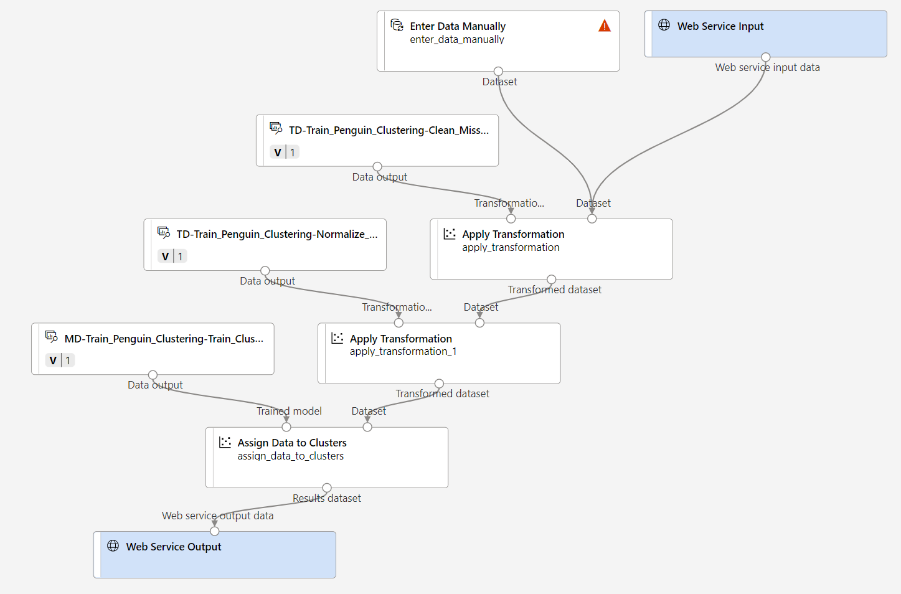

---
lab:
  title: Erkunden des Clusterings mit dem Azure Machine Learning-Designer
---

# Erkunden des Clusterings mit dem Azure Machine Learning-Designer

> **Hinweis**: Um dieses Lab abzuschließen, benötigen Sie ein [Azure-Abonnement](https://azure.microsoft.com/free?azure-portal=true), in dem Sie über Administratorzugriff verfügen.

## Erstellen eines Azure Machine Learning-Arbeitsbereichs  

1. Melden Sie sich mit Ihren Microsoft-Anmeldeinformationen beim [Azure-Portal](https://portal.azure.com?azure-portal=true) an.

1. Klicken Sie auf **+ Ressource erstellen**, suchen Sie nach *Machine Learning*, und erstellen Sie eine neue **Azure Machine Learning**-Ressource mit einem *Azure Machine Learning*-Plan. Verwenden Sie folgende Einstellungen:
    - **Abonnement**: *Ihr Azure-Abonnement*.
    - **Ressourcengruppe**: *Erstellen Sie eine Ressourcengruppe, oder wählen Sie eine Ressourcengruppe aus*.
    - **Arbeitsbereichsname**: *Geben Sie einen eindeutigen Namen für den Arbeitsbereich ein*.
    - **Region**: *Wählen Sie die geografisch nächstgelegene Region aus.*
    - **Speicherkonto**: *Für Ihren Arbeitsbereich wird standardmäßig ein neues Speicherkonto erstellt*.
    - **Schlüsseltresor**: *Für Ihren Arbeitsbereich wird standardmäßig ein neuer Schlüsseltresor erstellt*.
    - **Application Insights**: *Für Ihren Arbeitsbereich wird standardmäßig eine neue Application Insights-Ressource erstellt*.
    - **Containerregistrierung:** Keine (*wird automatisch erstellt, wenn Sie das erste Mal ein Modell in einem Container bereitstellen*)

1. Klicken Sie auf**Überprüfen + erstellen** und dann auf **Erstellen**. Warten Sie, bis Ihr Arbeitsbereich erstellt wurde (dies kann einige Minuten dauern), und wechseln Sie dann zur bereitgestellten Ressource.

1. Wählen Sie **Studio starten** aus (oder öffnen Sie eine neue Browserregisterkarte. Navigieren Sie dann zu [https://ml.azure.com](https://ml.azure.com?azure-portal=true), und melden Sie sich mit Ihrem Microsoft-Konto bei Azure Machine Learning Studio an).

1. In Azure Machine Learning Studio sollte Ihr neu erstellter Arbeitsbereich angezeigt werden. Wenn dies nicht der Fall ist, wählen Sie im linken Menü Ihr Azure-Verzeichnis aus. Wählen Sie dann im neuen Menü auf der linken Seite **Arbeitsbereiche** aus, wo alle Arbeitsbereiche aufgeführt sind, die Ihrem Verzeichnis zugeordnet sind, und wählen Sie den Arbeitsbereich aus, den Sie für diese Übung erstellt haben.

> **Hinweis**: Dieses Modul ist eines von vielen, in denen ein Azure Machine Learning-Arbeitsbereich verwendet wird (einschließlich der anderen Module im Lernpfad [Microsoft Azure KI-Grundlagen: Erkunden visueller Tools für maschinelles Lernen](https://docs.microsoft.com/learn/paths/create-no-code-predictive-models-azure-machine-learning/)). Wenn Sie Ihr eigenes Azure-Abonnement verwenden, sollten Sie den Arbeitsbereich einmal erstellen und in anderen Modulen wiederverwenden. Ihrem Azure-Abonnement wird eine kleine Menge an Datenspeicher in Rechnung gestellt, solange der Azure Machine Learning-Arbeitsbereich in Ihrem Abonnement vorhanden ist. Daher wird empfohlen, den Azure Machine Learning-Arbeitsbereich zu löschen, wenn er nicht mehr benötigt wird.

## Erstellen von Computeressourcen

1. Wählen Sie in [Azure Machine Learning Studio](https://ml.azure.com?azure-portal=true) das Symbol **&#8801;** aus (ein Menüsymbol, dass wie drei übereinander angeordnete Linien aussieht), um die verschiedenen Seiten auf der Benutzeroberfläche anzuzeigen (möglicherweise müssen Sie die Größe des Bildschirms maximieren). Sie können diese Seiten im linken Bereich verwenden, um die Ressourcen in Ihrem Arbeitsbereich zu verwalten. Wählen die Seite **Compute** (unter **Verwalten**) aus.

2. Wählen Sie auf der Seite **Compute** die Registerkarte **Computecluster** aus, und fügen Sie einen neuen Computecluster mit den folgenden Einstellungen hinzu. Sie verwenden diesen zum Trainieren eines Machine Learning-Modells:
    - **Standort**: *Wählen Sie denselben Standort wie für Ihren Arbeitsbereich aus. Wenn dieser Standort nicht aufgeführt wird, wählen Sie den nächstgelegenen Standort aus*.
    - **VM-Dienstebene**: Dediziert.
    - **VM-Typ:** CPU
    - **VM-Größe:**
        - Klicken Sie auf **Aus allen Optionen auswählen**.
        - Suchen Sie **Standard_DS11_v2**, und wählen Sie den Eintrag aus.
    - Wählen Sie **Weiter** aus.
    - **Computename**: *Geben Sie einen eindeutigen Namen ein*.
    - **Mindestanzahl von Knoten:** 0
    - **Maximale Knotenanzahl:** 2
    - **Leerlauf in Sekunden vor dem Herunterskalieren:** 120
    - **SSH-Zugriff aktivieren**: Deaktiviert.
    - Klicken Sie auf **Erstellen**.

> **Hinweis**: Compute-Instanzen und -cluster basieren auf Azure VM-Standardimages. Für dieses Modul wird das Image *Standard_DS11_v2* empfohlen, um ein optimales Gleichgewicht zwischen Kosten und Leistung zu erzielen. Wenn Ihr Abonnement über ein Kontingent verfügt, das dieses Image nicht enthält, wählen Sie ein alternatives Image aus. Beachten Sie jedoch, dass ein größeres Image höhere Kosten verursachen kann und ein kleineres Image möglicherweise nicht ausreicht, um die Aufgaben auszuführen. Bitten Sie alternativ Ihren Azure-Administrator, Ihr Kontingent zu erhöhen.

Die Erstellung des Computeclusters nimmt einige Zeit in Anspruch. Sie können mit dem nächsten Schritt fortfahren, während Sie warten.

## Erstellen einer Pipeline und Hinzufügen eines Datasets

Sie müssen zunächst eine Pipeline erstellen, um mit Azure Machine Learning Designer arbeiten zu können.

1. Erweitern Sie in [Azure Machine Learning Studio](https://ml.azure.com?azure-portal=true) den linken Bereich, indem Sie das Menüsymbol oben links auf dem Bildschirm auswählen. Zeigen Sie die Seite **Designer** (unter **Erstellung**) an, und wählen Sie **+** aus, um eine neue Pipeline zu erstellen.

1. Ändern Sie den Entwurfsnamen (**Pipeline-Created-on-* Datum***) in **Train Penguin Clustering**.

    In Azure Machine Learning werden Daten für das Trainieren von Modellen und andere Vorgänge normalerweise in einem Objekt gekapselt, das als *Dataset* bezeichnet wird. In diesem Modul verwenden Sie ein Dataset, das Beobachtungen von drei Pinguinarten enthält.

1. Zeigen Sie die Seite **Daten** an (unter **Ressourcen**). Die Seite „Daten“ enthält bestimmte Datendateien oder Tabellen, mit denen Sie in Azure Machine Learning arbeiten möchten.

1. Wählen Sie auf der Seite **Daten** auf der Registerkarte **Datenressourcen** die Option **+Erstellen** aus. Konfigurieren Sie dann eine Datenressource mit den folgenden Einstellungen:
    - **Datentyp**:
        - **Name:** penguin-data
        - **Beschreibung:** Daten zu Pinguinen
        - **Datasettyp:** Tabellarisch
    - **Datenquelle**: Aus Webdateien
    - **Web-URL:**
        - **Web-URL:** https://aka.ms/penguin-data
        - **Skip data validation** (Datenüberprüfung überspringen): *Nicht auswählen*
    - **Einstellungen**:
        - **Dateiformat:** Zeichengetrennt
        - **Trennzeichen:** Komma
        - **Codierung:** UTF-8
        - **Spaltenüberschriften**: Nur erste Datei enthält Header
        - **Zeilen überspringen:** Keine
        - **Dataset contains multi-line data** (Dataset enthält mehrzeilige Daten): *Nicht auswählen*
    - **Schema:**
        - Alle Spalten einschließen außer **Pfad**
        - Überprüfen der automatisch erkannten Typen
    - **Überprüfung**
        - Klicken Sie auf **Erstellen**.

1. Nachdem das Dataset erstellt wurde, öffnen Sie es, und zeigen Sie die Seite **Erkunden** an, um eine Stichprobe der Daten anzuzeigen. Diese Daten stellen Messungen der Schnabelrückenlänge und -tiefe, Flossenlänge und Körpermasse für mehrere Beobachtungen von Pinguinen dar. Dieses Dataset enthält Daten zu drei Pinguinarten: *Adelie* (Adeliepinguin), *Gentoo* (Eselspinguin) und *Chinstrap* (Zügelpinguin).

> **Hinweis**: Das in dieser Übung verwendete Pinguin-Dataset ist eine Teilmenge der Daten, die von [Dr. Kristen Gorman](https://www.uaf.edu/cfos/people/faculty/detail/kristen-gorman.php) und der [Palmer-Station, Antarctica LTER](https://pal.lternet.edu/) (Antarktis-Forschungsstation), einem Mitglied des [Long Term Ecological Research Network](https://lternet.edu/) (Netzwerk für ökologische und ökosystemare Langzeitforschung), gesammelt und zur Verfügung gestellt werden.

### Laden Sie Daten im Canvas-Panel,

1. Navigieren Sie zurück zu Ihrer Pipeline, indem Sie im Menü auf der linken Seite auf **Designer** klicken. Wählen Sie auf der Seite **Designer** den Pipelineentwurf **Train Penguin Clustering** aus.

1. Wählen Sie neben dem Pipelinenamen auf der linken Seite das Pfeilsymbol, um das Panel zu erweitern, wenn es nicht bereits erweitert ist. Der Bereich sollte standardmäßig im Bereich **Ressourcenbibliothek** geöffnet werden. Dies wird durch das Büchersymbol am oberen Rand des Bereichs gekennzeichnet. Beachten Sie, dass eine Suchleiste für die Suche nach Objekten vorhanden ist. Beachten Sie die beiden Schaltflächen **Daten** und **Komponente**.

    

1. Suchen Sie nach **Daten**, suchen Sie nach dem Dataset **penguin-data**, und platzieren Sie ihn im Canvas-Panel.

1. Klicken Sie mit der rechten Maustaste (auf einem Mac drücken Sie die CTRL-Taste und klicken) auf das Dataset **penguin-data** auf der Canvas, und klicken Sie dann auf **Datenvorschau anzeigen**.

1. Wählen Sie die Registerkarte *Profil* aus. Beachten Sie, dass die Verteilungen der verschiedenen Spalten als Histogramme angezeigt werden.

1. Beachten Sie die folgenden Merkmale des Datasets:

    - Das Dataset umfasst die folgenden Spalten:
        - **CulmenLength:** Die Länge des Pinguinschnabels in Millimeter
        - **CulmenDepth:** Tiefe des Pinguinschnabels in Millimetern.
        - **FlipperLength:** Die Länge der Pinguinflosse in Millimeter
        - **BodyMass:** Das Gewicht des Pinguins in Gramm
        - **Species**: Indikator für die Art (0: Adeliepinguin, 1: Eselspinguin, 2: Zügelpinguin)
    - Es fehlen zwei Werte in der Spalte **CulmenLength** (die Spalten **CulmenDepth**, **FlipperLength** und **BodyMass** weisen ebenfalls zwei fehlende Werte auf).
    - Die Messwerte liegen in verschiedenen Skalen vor (von zehn Millimetern bis mehrere Tausend Gramm).

1. Schließen Sie die Seite **DataOutput**, damit Sie das Dataset im Canvas-Panel der Pipeline betrachten können.

## Anwenden von Transformationen

1. Wählen Sie links im Bereich **Ressourcenbibliothek** die Option **Komponente** aus. Diese enthält verschiedenste Module, die Sie für Datentransformationen und Modelltrainings verwenden können. Für die schnelle Suche nach Modulen können Sie auch die Suchleiste verwenden.

    

1. Zum Gruppieren der Pinguinbeobachtungen verwenden Sie lediglich die Messungen, daher ignorieren Sie die Spalte „Species“. Suchen Sie nach einem Modul vom Typ **Spalten im Dataset auswählen**, platzieren Sie es auf der Canvas unter dem Modul **penguin-data**, und verbinden Sie die Ausgabe unten am Modul **penguin-data** mit der Eingabe oben am Modul **Spalten im Dataset auswählen**:

    

1. Doppelklicken Sie auf das Modul **Spalten im Dataset auswählen**, und wählen Sie im Bereich auf der rechten Seite die Option **Spalte bearbeiten** aus. Wählen Sie dann im Fenster **Spalten auswählen** die Option **Nach Namen** aus, und verwenden Sie die **+**-Verknüpfungen, um wie folgt die Spaltennamen **CulmenLength**, **CulmenDepth**, **FlipperLength** und **BodyMass** auszuwählen:

    

1. Wählen Sie **Speichern** aus, und schließen Sie dann das Menü **Spalten im Dataset auswählen**, um zum Canvas-Panel des Designers zurückzukehren.

1. Suchen Sie in der **Ressourcenbibliothek** nach dem Modul **Fehlende Daten bereinigen**, platzieren Sie es im Canvas-Panel unter dem Modul **Spalten im Dataset auswählen**, und verbinden Sie sie wie folgt:

    

1. Doppelklicken Sie auf das Modul **Fehlende Daten bereinigen**, und klicken Sie rechts im Einstellungsbereich auf **Spalte bearbeiten**. Klicken Sie dann im Fenster **Zu deaktivierende Spalten** auf **Mit Regeln**, und schließen Sie wie folgt **alle Spalten** ein:

    

1. Wählen Sie **Speichern** aus, und legen Sie dann im Einstellungsbereich die folgenden Konfigurationseinstellungen fest:
    - **Mindestanzahl fehlender Werte:** 0,0
    - **Maximale Anzahl fehlender Werte:** 1,0
    - **Bereinigungsmodus:** Gesamte Zeile entfernen

1. Suchen Sie in der **Ressourcenbibliothek** nach einem Modul vom Typ **Daten normalisieren**, und platzieren Sie es auf der Canvas unter dem Modul **Fehlende Daten bereinigen**. Verbinden Sie dann die Ausgabe ganz links des **Fehlende Daten bereinigen**-Moduls mit der Eingabe des **Daten normalisieren**-Moduls.

    

1. Doppelklicken Sie auf das Modul **Daten normalisieren**, legen Sie im Bereich auf der rechten Seite die **Transformationsmethode** auf **MinMax** fest, und wählen Sie dann **Spalte bearbeiten** aus. Klicken Sie dann im Fenster **Zu transformierende Spalten** auf **Mit Regeln**, und schließen Sie wie folgt **alle Spalten** ein:

    

1. Wählen Sie **Speichern** aus, und schließen Sie die Einstellungen des Moduls **Daten normalisieren**, um zum Canvas-Panel des Designers zurückzukehren.

## Führen Sie die Pipeline aus.

Zum Anwenden der Datentransformationen müssen Sie die Pipeline als Experiment ausführen.

1. Wählen Sie oben auf der Seite **Konfigurieren und Übermitteln** aus, um das Dialogfeld **Pipelineauftrag einrichten** zu öffnen.

1. Wählen Sie auf der Seite **Grundlagen** die Option **Neu erstellen** aus, und legen Sie den Namen des Experiments auf **mslearn-penguin-training** fest. Wählen Sie dann **Weiter** aus.

1. Wählen Sie auf der Seite **Eingaben und Ausgaben** die Option **Weiter** aus, ohne Änderungen vorzunehmen.

1. Auf der Seite **Laufzeiteinstellungen** wird ein Fehler angezeigt, da Sie nicht über eine Standardcomputeressource für die Ausführung der Pipeline verfügen. Wählen Sie in der Dropdownliste **Computetyp auswählen** die Option *Computecluster* und in der Dropdownliste **Azure ML Computecluster auswählen** Ihren kürzlich erstellten Computecluster aus.

1. Wählen Sie **Weiter** aus, um den Pipelineauftrag zu überprüfen, und wählen Sie dann **Übermitteln** aus, um die Trainingspipeline auszuführen.

1. Warten Sie, bis die Ausführung beendet ist. Dies kann 5 Minuten oder länger dauern. Sie können den Status des Auftrags überprüfen, indem Sie unter **Ressourcen** die Option **Aufträge** auswählen. Wählen Sie dort den Auftrag **Train Penguin Clustering** aus.


## Anzeigen der transformierten Daten

1. Wenn die Ausführung abgeschlossen ist, sehen die Module folgendermaßen aus:

    

1. Klicken Sie mit der rechten Maustaste auf das Modul **Daten normalisieren**, und wählen Sie **Datenvorschau anzeigen** und dann **Transformiertes Dataset** aus, um die Ergebnisse anzuzeigen.

1. Sehen Sie sich die Daten an. Beachten Sie, dass die Spalte **Species** entfernt wurde, dass keine Werte fehlen und dass die Werte für alle vier Merkmale mit einer gemeinsamen Skala normalisiert wurden.

1. Schließen Sie die Seite **Transformed_dataset**, um zur Pipelineausführung zurückzukehren.

Da Sie nun die Merkmale ausgewählt und vorbereitet haben, die Sie aus dem Dataset verwenden möchten, können Sie sie zum Trainieren eines Clustermodells verwenden.

Nachdem Sie die Daten mithilfe von Datentransformationen vorbereitet haben, können Sie sie zum Trainieren eines Machine Learning-Modells verwenden.

## Hinzufügen von Trainingsmodulen

Führen Sie die folgenden Schritte aus, um die Pipeline **Train Pinguin Clustering** wie hier gezeigt zu erweitern:


Führen Sie die folgenden Schritte aus, und verwenden Sie die obige Abbildung als Referenz zum Hinzufügen und Konfigurieren der erforderlichen Module.

1. Kehren Sie zur Seite **Designer** zurück, und öffnen Sie den Pipelineentwurf **Train Penguin Clustering**.

1. Suchen Sie im Bereich **Ressourcenbibliothek** auf der linken Seite nach einem Modul vom Typ **Daten teilen**, und platzieren Sie es auf der Canvas unter dem Modul **Daten normalisieren**. Verbinden Sie dann die linke Ausgabe des Moduls **Daten normalisieren** mit der Eingabe des Moduls **Daten teilen**.

    >**Tipp**: Für die schnelle Suche nach Modulen verwenden Sie die Suchleiste.

1. Wählen Sie das Modul **Daten teilen** aus, und konfigurieren Sie dessen Einstellungen wie folgt:
    - **Aufteilungsmodus:** Zeilen aufteilen
    - **Bruchteil von Zeilen im ersten Ausgabedataset:** 0,7
    - **Zufällige Aufteilung**: True
    - **Zufälliger Ausgangswert:** 123
    - **Geschichtete Aufteilung:** FALSE

1. Suchen Sie in der **Objektibliothek** nach dem **Clustering-Modell-Modul** trainieren und platzieren Sie es auf dem Canvas unter dem Modul **Daten aufteilen**. Verbinden Sie dann die linke Ausgabe *Results dataset1* (Ergebnisse von Dataset1) des Moduls **Daten teilen** mit der rechten Eingabe *Dataset* des Moduls **Clustermodell trainieren**.

1. Das Clustermodell sollte den Datenelementen mithilfe der Merkmale, die Sie aus dem ursprünglichen Dataset ausgewählt haben, Cluster zuweisen. Doppelklicken Sie auf das Modul **Clustermodell trainieren**, und wählen Sie im rechten Bereich **Spalten bearbeiten** aus. Verwenden Sie die Option **Mit Regeln**, um alle Spalten einzuschließen; etwa so:

    

1. Das zu trainierende Modell nutzt die Merkmale, um die Daten in Cluster zu gruppieren. Daher müssen Sie das Modell mit einem *Clusteringalgorithmus* trainieren. Suchen Sie in der **Ressourcenbibliothek** nach einem Modul vom Typ **K-Means Clustering**, und platzieren Sie es im Canvas-Panel links neben dem Modul **Daten teilen** und über dem Modul **Clustermodell trainieren**. Verbinden Sie dann die zugehörige Ausgabe mit der Eingabe von **Untrained model** (nicht trainiertes Modell) links neben dem Modul **Clustermodell trainieren**.

1. Der *K-Means*-Algorithmus gruppiert Objekte in die von Ihnen angegebene Anzahl von Clustern. Dieser Wert wird als ***K*** bezeichnet. Wählen Sie das Modul **K-Means Clustering** und setzen Sie im rechten Fenster den Parameter **Number of centroids (Anzahl der Schwerpunkte)** auf **3**.

    > **Hinweis**: Sie können sich Datenbeobachtungen wie die Pinguinmessungen als mehrdimensionale Vektoren vorstellen. Der K-Means-Algorithmus funktioniert folgendermaßen:
    > 1. *K*-Koordinaten werden als zufällig ausgewählte Punkte namens *centroids* (Schwerpunkte) im *n*-dimensionalen Bereich initialisiert (dabei entspricht *n* der Anzahl von Dimensionen in den Merkmalsvektoren).
    > 2. Die Merkmalsvektoren werden in Form von Punkten in denselben Bereich eingezeichnet, und jedem Punkt wird dem nächstgelegenen Schwerpunkt zugeordnet.
    > 3. Die Schwerpunkte werden in die Mitte der ihnen zugeordneten Punkte verschoben (basierend auf der *durchschnittlichen* Entfernung).
    > 4. Nach der Verschiebung werden die Punkte erneut den nächstgelegenen Schwerpunkten zugeordnet.
    > 5. Die Schritte c und d werden wiederholt, bis die Clusterzuweisungen stabilisiert werden oder die angegebene Anzahl von Iterationen durchlaufen wurde.

   Nachdem 70 % der Daten zum Trainieren des Clustermodells verwendet wurden, können Sie die restlichen 30 % zum Testen des Modells verwenden, indem Sie es nutzen, um Daten Clustern zuzuweisen.

1. Suchen und platzieren Sie in der **Objektbibliothek** ein Modul **Daten zu Clustern zuweisen** im Canvas, unterhalb des Moduls **Clustering Model trainieren**. Verbinden Sie dann die linke Ausgabe **Trained model** (Trainiertes Modell) des Moduls **Clustermodell trainieren** mit der linken Eingabe **Trained model** (Trainiertes Modell) des Moduls **Daten Clustern zuweisen**. Verbinden Sie außerdem die rechte Ausgabe **Results dataset2** (Ergebnisse von Dataset2) des Moduls **Daten teilen** mit der rechten Eingabe **Dataset** des Moduls **Daten Clustern zuweisen**.

## Ausführen der Trainingspipeline

Nun können Sie die Trainingspipeline ausführen und das Modell trainieren.

1. Vergewissern Sie sich, dass Ihre Pipeline wie folgt aussieht:

    

1. Wählen Sie **Konfigurieren und Übermitteln** aus, und führen Sie die Pipeline mithilfe des vorhandenen Experiments **mslearn-penguin-training** auf Ihrem Computecluster aus.

1. Warten Sie, bis die Ausführung beendet ist. Dies kann 5 Minuten oder länger dauern. Sie können den Status des Auftrags überprüfen, indem Sie unter **Ressourcen** die Option **Aufträge** auswählen. Wählen Sie dort den aktuellen **Train Penguin Clustering**-Auftrag aus.

1. Wenn der Experimentdurchlauf abgeschlossen wurde, klicken Sie mit der rechten Maustaste auf das Modul **Daten Clustern zuweisen**, und wählen Sie **Datenvorschau** und dann **Ergebnisdatensatz** aus, um die Ergebnisse anzuzeigen.

1. Scrollen Sie nach unten, und beachten Sie die Spalte **Zuweisungen**, die den Cluster (0, 1 oder 2) enthält, der jede Zeile zugeordnet ist. Außerdem gibt es nun zwei neue Spalten, die die Entfernung zwischen den Punkten, die die Zeile darstellen, und den Mittelpunkten der einzelnen Cluster (der Cluster, der dem Punkt am nächsten liegt, wird zugeordnet).

1. Schließen Sie die Visualisierung **Results_dataset**, um zur Pipelineausführung zurückzukehren.

Das Modell prognostiziert Cluster für die Pinguinbeobachtungen, doch wie zuverlässig sind die Vorhersagen? Sie müssen das Modell auswerten, um dies zu beurteilen.

Die Auswertung von Clustermodellen wird dadurch erschwert, dass keine zuvor bekannten *TRUE*-Werte für die Clusterzuordnungen vorliegen. Ein erfolgreiches Clustermodell erzielt ein gutes Maß an Trennung zwischen den Elementen in allen Clustern, daher benötigen Sie Metriken, die Sie beim Messen dieser Trennung unterstützen.

## Hinzufügen eines Moduls „Modell bewerten“

1. Öffnen Sie auf der Seite **Designer** den Pipelineentwurf **Train Penguin Clustering**.

1. Suchen Sie in der **Objektibliothek** nach dem Modul **Auswertungsmodell** und platzieren Sie es auf der Arbeitsfläche unter dem Modul **Daten zu Clustern zuweisen**. Verbinden Sie die Ausgabe des Moduls **Daten zu Clustern zuweisen** mit dem Eingang **Bewerteter Datensatz** (links) des Moduls **Modell auswerten**.

1. Vergewissern Sie sich, dass Ihre Pipeline wie folgt aussieht:

    

1. Wählen Sie **Konfigurieren und Übermitteln** aus, und führen Sie die Pipeline mithilfe des vorhandenen Experiments **mslearn-penguin-training** auf Ihrem Computecluster aus.

1. Warten Sie, bis die Experimentausführung abgeschlossen ist. Um den Status zu überprüfen, wechseln Sie zur Seite **Aufträge**, und wählen Sie den neuesten **Train Penguin Clustering**-Auftrag aus.

1. Klicken Sie mit der rechten Maustaste auf das Modul **Modell auswerten**, und wählen Sie **Datenvorschau** und dann **Auswertungsergebnisse** aus. Überprüfen Sie die Metriken in jeder Zeile:
    - **Average Distance to Other Center** (Durchschnittliche Entfernung zu anderen Mittelpunkten):
    - **Average Distance to Cluster Center** (Durchschnittliche Entfernung zum Mittelpunkt des Clusters):
    - **Number of Points** (Anzahl der Punkte)
    - **Maximal Distance to Cluster Center** (Maximale Entfernung zum Mittelpunkt des Clusters)

1. Schließen Sie die Registerkarte **Evaluation_results**.

Da Sie nun über ein funktionierendes Clustermodell verfügen, können Sie dieses verwenden, um Clustern neue Daten in einer *Rückschlusspipeline* zuzuweisen.

Nachdem Sie eine Pipeline zum Trainieren des Clustermodells erstellt und ausgeführt haben, können Sie nun eine *Rückschlusspipeline* erstellen. Die Rückschlusspipeline verwendet das Modell, um Clustern neue Datenbeobachtungen zuzuweisen. Dieses Modell bildet die Grundlage für einen Vorhersagedienst, den Sie veröffentlichen können, damit er von Anwendungen genutzt werden kann.

## Erstellen einer Rückschlusspipeline

1. Wählen Sie im Menü oberhalb des Canvas-Panels **Rückschlusspipeline erstellen** aus. Möglicherweise müssen Sie hierfür in den Vollbildmodus wechseln und rechts oben auf das Symbol **...** klicken, damit die Option **Rückschlusspipeline erstellen** im Menü angezeigt wird.  

    

1. Klicken Sie in der Dropdownliste **Rückschlusspipeline erstellen** auf **Echtzeit-Rückschlusspipeline**. Nach einigen Sekunden wird eine neue Version Ihrer Pipeline mit dem Namen **Train Penguin Clustering-real time inference** geöffnet.

1. Benennen Sie die neue Pipeline in **Predict Penguin Clusters** um, und überprüfen Sie dann die neue Pipeline. Die Transformationen und das Clustermodell aus Ihrer Trainingspipeline sind in dieser Pipeline enthalten. Das trainierte Modell wird zur Bewertung der neuen Daten verwendet. Die Pipeline enthält auch eine Webdienstausgabe zum Zurückgeben von Ergebnissen.

    Nehmen Sie an der Rückschlusspipeline die folgenden Änderungen vor:

    

    - Fügen Sie eine **Webdiensteingabekomponente** für neue Daten hinzu, die übermittelt werden sollen.
    - Ersetzen Sie das Dataset **penguin-data** durch die Komponente **Daten manuell eingeben**, die die Spalte **Species** nicht enthält.
    - Entfernen Sie die nun redundante Komponente **Spalten im Dataset auswählen**.
    - Verbinden Sie die Komponenten **Webdiensteingabe** und **Daten manuell eingeben** (die Eingaben für zu gruppierende Daten darstellen) mit der Komponente **Transformation anwenden**.

    Führen Sie die restlichen Schritte unten aus, und verwenden Sie dabei die Abbildung und die Informationen von oben als Referenz für das Ändern der Pipeline.

1. Die Pipeline enthält nicht automatisch eine **Webdiensteingabekomponente** für Modelle, die aus benutzerdefinierten Datasets erstellt werden. Suchen Sie in der Ressourcenbibliothek nach einer **Webdiensteingabekomponente**, und platzieren Sie diese oben in der Pipeline.  Verbinden Sie die Ausgabe der Komponente **Webdiensteingabe** mit der Eingabe *Dataset* (rechts) der Komponente **Transformation anwenden**, die sich bereits im Canvas-Panel befindet.  

1. Die Rückschlusspipeline geht davon aus, dass neue Daten dem Schema der ursprünglichen Trainingsdaten entsprechen, sodass das Dataset **penguin-data** aus der Trainingspipeline eingeschlossen wird. Allerdings enthalten diese Eingabedaten eine Spalte für die Pinguinspezies, die das Modell nicht verwendet. Löschen Sie sowohl das Dataset **penguin-data** und die Module unter **Spalten im Dataset auswählen**, und ersetzen Sie diese durch ein **Enter Data Manually**-Modul (Daten manuell eingeben) aus der **Objektbibliothek**.

1. Ändern Sie dann die Einstellungen des Moduls **Daten manuell eingeben**, sodass die folgende CSV-Eingabe verwendet wird, die Merkmalwerte für drei neue Pinguinbeobachtungen (einschließlich Spaltenüberschriften) enthält:

    ```CSV
    CulmenLength,CulmenDepth,FlipperLength,BodyMass
    39.1,18.7,181,3750
    49.1,14.8,220,5150
    46.6,17.8,193,3800
    ```

1. Verbinden Sie die Ausgaben des Moduls **Manuelle Eingabe von Daten** mit der Eingabe *Dataset* (rechts) des ersten Moduls **Apply Transformation** (Transformation anwenden).

1. Löschen Sie das Modul **Modell auswerten**.

1. Ihre Pipeline sollte etwa wie die folgende aussehen:

    

1. Übermitteln Sie die Pipeline als neues Experiment mit dem Namen **mslearn-penguin-inference** an Ihren Computecluster. Die Ausführung des Experiments kann einige Minuten dauern.

1. Wechseln Sie zu **Aufträge**, und wählen Sie den neuesten **Predict Penguin Clusters**-Auftrag mit dem Experimentnamen **mslearn-penguin-inference** aus.

1. Wenn die Pipeline abgeschlossen wurde, klicken Sie mit der rechten Maustaste auf das Modul **Daten Clustern zuweisen**, und wählen Sie **Datenvorschau** und **Ergebnisdataset** aus, um die vorhergesagten Clusterzuweisungen und Metriken für die drei Pinguinbeobachtungen in den Eingabedaten anzuzeigen.

Ihre Rückschlusspipeline weist Pinguinbeobachtungen anhand ihrer Merkmale zu Clustern zu. Sie können die Pipeline nun so veröffentlichen, dass sie von Clientanwendungen verwendet werden kann.

## Bereitstellen eines Diensts

In dieser Übung stellen Sie den Webdienst in Azure Container Instances (ACI) bereit. Solche Computeressourcen werden dynamisch erstellt und sind für Entwicklungs- und Testzwecke nützlich. Für Produktionszwecke sollten Sie einen *Rückschlusscluster* erstellen, der einen AKS-Cluster (Azure Kubernetes Service) mit verbesserter Skalierbarkeit und Sicherheit bereitstellt.

1. Wählen Sie auf der Seite der Rückschlussausführung für **Predict Penguin Clusters** die Option **Bereitstellen** in der oberen Menüleiste aus.

    

1. Wählen Sie **Deploy a new real-time endpoint** (Neuen Echtzeitendpunkt bereitstellen) aus, und verwenden Sie die folgenden Einstellungen:
    - **Name:** predict-penguin-clusters
    - **Beschreibung:** Clusterpinguine
    - **Computetyp:** Azure Container Instances

1. Warten Sie, bis der Webdienst bereitgestellt wurde. Dieser Vorgang kann einige Minuten in Anspruch nehmen. 

1. Um den Bereitstellungsstatus anzuzeigen, erweitern Sie den linken Bereich, indem Sie das Menüsymbol oben links auf dem Bildschirm auswählen. Zeigen Sie die Seite **Endpunkte** (unter **Ressourcen**) an, und wählen Sie **predict-penguin-clusters** aus. Wenn die Bereitstellung abgeschlossen ist, ändert sich der **Bereitstellungsstatus** in **Fehlerfrei**.

## Testen des Diensts

1. Öffnen Sie auf der Seite **Endpunkte** den Echtzeitendpunkt **predict-penguin-clusters**, und wählen Sie die Registerkarte **Test** aus.

    

1. Wir verwenden sie, um unser Modell mit neuen Daten zu testen. Löschen Sie die vorhandenen Daten unter **Eingabedaten zum Testen des Echtzeitendpunkts**. Kopieren Sie die folgenden Daten, und fügen Sie sie in den Abschnitt „Daten“ ein:

    ```JSON
    {
        "Inputs": {
            "input1": [
                {
                    "CulmenLength": 49.1,
                    "CulmenDepth": 4.8,
                    "FlipperLength": 1220,
                    "BodyMass": 5150
                }
            ]
        },
        "GlobalParameters":  {}
    }
    ```

    > **Hinweis**: Der JSON-Code oben definiert lediglich Merkmale für einen Pinguin und verwendet den Dienst **predict-penguin-clusters**, den Sie zum Vorhersagen einer Clusterzuweisung erstellt haben.

1. Klicken Sie auf **Test**. Auf der rechten Seite des Bildschirms sollte die Ausgabe **'Assignments'** angezeigt werden. Beachten Sie, dass der zugewiesene Cluster den kürzesten Abstand zum Clusterzentrum aufweist.

    

Sie haben gerade einen Dienst getestet, der mit einer Clientanwendung eine Verbindung herstellen kann, indem die Anmeldeinformationen auf der Registerkarte **Consume** (Verbrauchen) verwendet werden. Das Lab endet hier. Sie können gern weiter mit dem Dienst experimentieren, den Sie gerade eingerichtet haben.

## Bereinigung

Der von Ihnen erstellte Webdienst wird in einer *Azure-Containerinstanz* gehostet. Wenn Sie nicht weiter experimentieren möchten, sollten Sie den Endpunkt löschen, um eine unnötige Azure-Nutzung zu vermeiden. Sie sollten auch den Computecluster löschen.

1. Wählen Sie in [Azure Machine Learning Studio](https://ml.azure.com?azure-portal=true) auf der Registerkarte **Endpunkte** den Endpunkt **predict-penguin-clusters** aus. Klicken Sie dann auf **Löschen** (&#128465;), und bestätigen Sie, dass Sie den Endpunkt löschen möchten.

1. Wählen Sie auf der Seite **Compute** auf der Registerkarte **Computecluster** Ihren Computecluster aus, und klicken Sie dann auf **Löschen**.

>**Hinweis**: Durch das Löschen Ihrer Compute-Instanz wird sichergestellt, dass Ihrem Abonnement keine Computeressourcen in Rechnung gestellt werden. Ihnen wird jedoch eine geringe Datenspeichermenge in Rechnung gestellt, solange der Azure Machine Learning-Arbeitsbereich in Ihrem Abonnement enthalten ist. Wenn Sie mit dem Erkunden von Azure Machine Learning fertig sind, können Sie Ihren Azure Machine Learning-Arbeitsbereich und die zugehörigen Ressourcen löschen. Wenn Sie jedoch andere Labs in dieser Reihe abschließen möchten, müssen Sie ihn neu erstellen.
>
> So löschen Sie Ihren Arbeitsbereich:
>
> 1. Öffnen Sie im [Azure-Portal](https://portal.azure.com?azure-portal=true) auf der Seite **Ressourcengruppen** die Ressourcengruppe, die Sie beim Erstellen des Azure Machine Learning-Arbeitsbereichs angegeben haben.
> 1. Klicken Sie auf **Ressourcengruppe löschen**, geben Sie den Ressourcengruppennamen ein, um zu bestätigen, dass Sie ihn löschen möchten, und klicken Sie dann auf **Löschen**.
