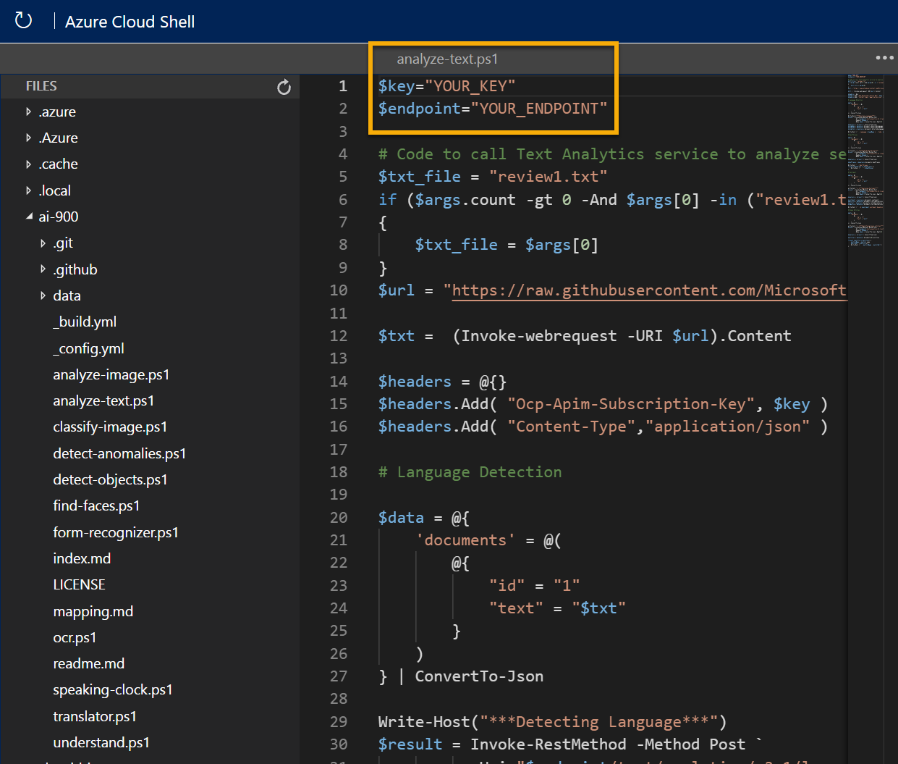

---
lab:
  title: Erkunden der Textanalyse
---

# Erkunden der Textanalyse

> **Hinweis**: Um dieses Lab abzuschließen, benötigen Sie ein [Azure-Abonnement](https://azure.microsoft.com/free?azure-portal=true), in dem Sie über Administratorzugriff verfügen.

Die Verarbeitung natürlicher Sprache (Natural Language Processing, NLP) ist ein Teilgebiet der künstlichen Intelligenz (KI), das sich mit geschriebener und gesprochener Sprache beschäftigt. Sie können NLP verwenden, um Lösungen zu entwickeln, die semantische Bedeutung aus Text oder Sprache extrahieren oder sinnvolle Antworten in natürlicher Sprache formulieren.

Microsoft *Azure KI Services* umfasst die Textanalysefunktionen im *Sprachdienst*, der einige sofort einsatzbereite NLP-Funktionen bietet, darunter die Identifizierung von Schlüsselbegriffen in Texten und die Klassifizierung von Texten auf der Grundlage der Stimmung.

Nehmen wir z. B. an, das fiktive Unternehmen *Margie's Travel* ermutigt Kunden, Bewertungen für Hotelaufenthalte abzugeben. Sie können den Sprachdienst nutzen, um die Bewertungen durch Extraktion von Schlüsselbegriffen zusammenzufassen, um festzustellen, welche Bewertungen positiv und welche negativ sind, oder um den Bewertungstext auf die Erwähnung bekannter Entitäten wie Orte oder Personen zu analysieren.

Um die Fähigkeiten des Sprachdiensts zu testen, verwenden wir eine einfache Befehlszeilenanwendung, die in der Cloud Shell ausgeführt wird. Die gleichen Prinzipien und Funktionen gelten auch für reale Lösungen, wie Websites oder Smartphone-Apps.

## Erstellen einer *Azure KI Services*-Ressource

Sie können den Sprachdienst nutzen, indem Sie entweder eine **Language**- oder eine **Azure KI Services**-Ressource erstellen.

Wenn dies noch nicht erfolgt ist, erstellen Sie eine **Azure KI Services**-Ressource in Ihrem Azure-Abonnement.

1. Öffnen Sie auf einer anderen Browserregisterkarte das Azure-Portal unter [https://portal.azure.com](https://portal.azure.com?azure-portal=true), und melden Sie sich mit Ihrem Microsoft-Konto an.

1. Klicken Sie auf die Schaltfläche **&#65291;Ressource erstellen** und suchen Sie nach *Azure KI-Dienste*. Wählen Sie **Erstellen** und dann **Azure KI Services**-Plan aus. Sie werden zu einer Seite weitergeleitet, um eine Azure KI Services-Ressource zu erstellen. Konfigurieren Sie sie mit den folgenden Einstellungen:
    - **Abonnement**: *Ihr Azure-Abonnement*.
    - **Ressourcengruppe**: *Wählen Sie eine Ressourcengruppe aus, oder erstellen Sie eine Ressourcengruppe mit einem eindeutigen Namen*.
    - **Region**: *Wählen Sie eine beliebige verfügbare Region aus.*
    - **Name**: *Geben Sie einen eindeutigen Namen ein*.
    - **Tarif**: Standard S0.
    - **Durch Aktivieren dieses Kontrollkästchens bestätige ich, dass ich die folgenden Bedingungen gelesen und verstanden habe**: Aktiviert.

1. Überprüfen und erstellen Sie die Ressource.

### Abrufen von Schlüssel und Endpunkt für Ihre Azure KI Services-Ressource

1. Warten Sie, bis die Bereitstellung abgeschlossen ist. Wechseln Sie dann zu Ihrer Azure KI Services-Ressource und wählen Sie auf der Seite **Übersicht** den Link zur Verwaltung der Schlüssel für den Dienst aus. Sie benötigen den Endpunkt und die Schlüssel, um von Clientanwendungen aus eine Verbindung mit Ihrer Azure KI Services-Ressource herzustellen.

1. Zeigen Sie die Seite **Schlüssel und Endpunkt** für Ihre Ressource an. Sie benötigen den **Schlüssel** und den **Endpunkt**, um von Clientanwendungen aus eine Verbindung herzustellen.

## Ausführen von Cloud Shell

Um die Fähigkeiten der Textanalysefunktionen des Sprachdiensts zu testen, verwenden wir eine einfache Befehlszeilenanwendung, die in der Cloud Shell in Azure ausgeführt wird.

1. Wählen Sie im Azure-Portal die Schaltfläche **[>_]** (*Cloud Shell*) oben auf der Seite rechts neben dem Suchfeld aus. Dadurch wird am unteren Rand des Portals ein Cloud Shell-Bereich geöffnet.

    

1. Wenn Sie die Cloud Shell zum ersten Mal öffnen, werden Sie möglicherweise aufgefordert, die Art der Shell zu wählen, die Sie verwenden möchten (*Bash* oder *PowerShell*). Wählen Sie **PowerShell** aus. Wenn Sie diese Option nicht sehen, überspringen Sie den Schritt.  

1. Wenn Sie aufgefordert werden, Speicher für Ihre Cloud Shell zu erstellen, stellen Sie sicher, dass Ihr Abonnement angegeben ist, und wählen Sie **Speicher erstellen** aus. Warten Sie dann etwa eine Minute, bis der Speicher erstellt ist.

    

1. Vergewissern Sie sich, dass der oben links im Cloud Shell-Bereich angezeigte Shelltyp zu *PowerShell* gewechselt ist. Wenn *Bash* angezeigt wird, wechseln Sie über das Dropdownmenü zu *PowerShell*.

    

1. Warten Sie, bis PowerShell gestartet wurde. Im Azure-Portal sollte der folgende Bildschirm angezeigt werden:  

    

## Konfigurieren und Ausführen einer Clientanwendung

Nachdem Sie nun über ein benutzerdefiniertes Modell verfügen, können Sie eine einfache Clientanwendung ausführen, die den Sprachdienst nutzt.

1. Geben Sie in der Befehlsshell den folgenden Befehl ein, um die Beispielanwendung herunterzuladen und in einem Ordner namens „ai-900“ zu speichern.

    ```PowerShell
    git clone https://github.com/MicrosoftLearning/AI-900-AIFundamentals ai-900
    ```

    >**Tipp**: Wenn Sie diesen Befehl bereits in einem anderen Lab zum Klonen des Repositorys *ai-900* verwendet haben, können Sie diesen Schritt überspringen.

1. Die Dateien werden in einen Ordner namens **ai-900** heruntergeladen. Jetzt möchten wir alle Dateien in Ihrem Cloud Shell-Speicher anzeigen und mit ihnen arbeiten. Geben Sie den folgenden Befehl in die Shell ein:

     ```PowerShell
    code .
    ```

    Beachten Sie, dass sich dadurch ein Editor wie in der Abbildung unten öffnet:

    

1. Erweitern Sie im Bereich **Dateien** auf der linken Seite die Option **ai-900**, und wählen Sie **analyze-text.ps1** aus. Diese Datei enthält Code, der den Sprachdienst nutzt:

    

1. Machen Sie sich nicht zu viele Gedanken über die Details des Codes. Navigieren Sie im Azure-Portal zu Ihrer Azure KI Services-Ressource. Wählen Sie dann im linken Bereich die Seite **Schlüssel und Endpunkte** aus. Kopieren Sie den Schlüssel und den Endpunkt von der Seite, und fügen Sie sie in den Code-Editor ein, indem Sie die Platzhalterwerte **YOUR_KEY** und **YOUR_ENDPOINT** ersetzen.

    > **Tipp**: Möglicherweise müssen Sie die Trennlinie verwenden, um den Bildschirmbereich anzupassen, während Sie mit den Bereichen **Schlüssel und Endpunkt** und **Editor** arbeiten.

    

    Nachdem Sie die Schlüssel- und Endpunktwerte ersetzt haben, sollten die ersten Codezeilen etwa wie folgt aussehen:

    ```PowerShell
    $key="1a2b3c4d5e6f7g8h9i0j...."
    $endpoint="https..."
    ```

1. Verwenden Sie oben rechts im Editor-Bereich die Schaltfläche **...**, um das Menü zu öffnen, und wählen Sie **Speichern** aus, um Ihre Änderungen zu speichern. Öffnen Sie dann das Menü erneut, und wählen Sie **Editor schließen** aus.

    Die Beispielclientanwendung verwendet den Sprachdienst von Azure KI Services, um Sprache zu erkennen, Schlüsselbegriffe zu extrahieren, die Stimmung zu bestimmen und bekannte Entitäten für Bewertungen zu extrahieren.

1. Geben Sie in der Cloud Shell den folgenden Befehl ein, um den Code auszuführen:

    ```PowerShell
    cd ai-900
    ./analyze-text.ps1 review1.txt
    ```

    Sie werden diesen Text überprüfen:

    >Nettes Hotel und Personal The Royal Hotel, London, UK 2.3.2018 Saubere Zimmer, guter Service, tolle Lage in der Nähe des Buckingham Palace und der Westminster Abbey, usw. Wir haben unseren Aufenthalt sehr genossen. Der Innenhof ist sehr ruhig und wir gingen in ein Restaurant, das zur gleichen Gruppe gehört und indische Gerichte bietet (Westküste, also viel Fisch) sowie einen Michelin-Stern hat. Wir hatten das Schnuppermenü, das fabelhaft war. Die Zimmer waren sehr gut ausgestattet mit einer Küche, einem Wohnzimmer, einem Schlafzimmer und einem riesigen Badezimmer. Unbedingt empfehlenswert.

1. Überprüfen Sie die Ausgabe.

1. Geben Sie im PowerShell-Bereich den folgenden Befehl ein, um den Code auszuführen:

    ```PowerShell
    ./analyze-text.ps1 review2.txt
    ```

    Sie werden diesen Text überprüfen:

    >Glanzloses Hotel mit schlechtem Service The Royal Hotel, London, Vereinigtes Königreich 6.5.2018 Dies ist ein altes Hotel (gibt es seit den 1950er Jahren) und die Zimmereinrichtung ist durchschnittlich – ein bisschen alt geworden und muss geändert werden. Das Internet funktionierte nicht und ich musste mich in einem ihrer Büroräume für meinen Rückflug einchecken. Auf der Website steht, dass es in der Nähe des British Museum liegt, aber es ist zu weit, um zu Fuß zu gehen.

1. Überprüfen Sie die Ausgabe.

1. Geben Sie im PowerShell-Bereich den folgenden Befehl ein, um den Code auszuführen:

    ```PowerShell
    ./analyze-text.ps1 review3.txt
    ```

    Sie werden diesen Text überprüfen:

    >Gute Lage und hilfsbereites Personal, aber an einer stark befahrenen Straße.
    The Lombard Hotel, San Francisco, USA 16.8.2018 Wir waren im August hier, nachdem wir die Bewertungen gelesen hatten. Wir waren sehr zufrieden mit der Lage, gleich hinter der Chestnut Street, einer kosmopolitischen und trendigen Gegend mit vielen Restaurants. Es war schön, durch das Marina-Viertel zu spazieren, mit sehr interessanten Häusern. Gehen Sie unbedingt zum San Francisco Museum of Fine Arts und zum Yachthafen, um einen guten Blick auf die Golden Gate Bridge und die Stadt zu haben. An einer Buslinie gelegen und es ist leicht, das Zentrum zu erreichen. Die Zimmer waren sauber mit viel Platz und das Personal war freundlich und hilfsbereit. Der einzige Nachteil war der Lärm der Lombard Street, daher sollte man sich ein Zimmer suchen, das am weitesten vom Verkehrslärm entfernt ist.

1. Überprüfen Sie die Ausgabe.

1. Geben Sie im PowerShell-Bereich den folgenden Befehl ein, um den Code auszuführen:

    ```PowerShell
    ./analyze-text.ps1 review4.txt
    ```

    Sie werden diesen Text überprüfen:

    >Sehr laut und die Zimmer sind winzig The Lombard Hotel, San Francisco, USA 5.9.2018 Das Hotel befindet sich in der Lombard Street, einer sehr belebten sechsspurigen Straße direkt an der Golden Gate Bridge. Verkehr vom frühen Morgen bis spät in die Nacht, vor allem an Wochenenden. Der Lärm wäre nicht so schlimm, wenn die Zimmer besser isoliert wären, aber das sind sie nicht. Ich musste mir Watte in die Ohren stecken, um schlafen zu können – ich war zu müde, um die Stadt am nächsten Tag zu genießen. Die Zimmer sind WINZIG. Ich wählte das Zimmer, weil es zwei Doppelbetten hatte – aber das Zimmer hatte kaum Platz für sie. Mit einer vierköpfigen Familie im Zimmer war es eng. Trotzdem sind die Zimmer sauber und man hat sich bemüht, sie zu modernisieren. Das Hotel liegt im Yachthafenviertel mit vielen guten Restaurants und in Gehweite zum Presidio. Kann ein gutes Hotel für junge Erwachsene mit kleinem Budget sein.

1. Überprüfen Sie die Ausgabe.

## Weitere Informationen

Diese einfache App zeigt nur einen Teil der Möglichkeiten des Sprachdiensts. Weitere Informationen über die Möglichkeiten dieses Diensts erfahren Sie auf der [Sprachdienst-Seite](https://azure.microsoft.com/services/cognitive-services/language-service/).

