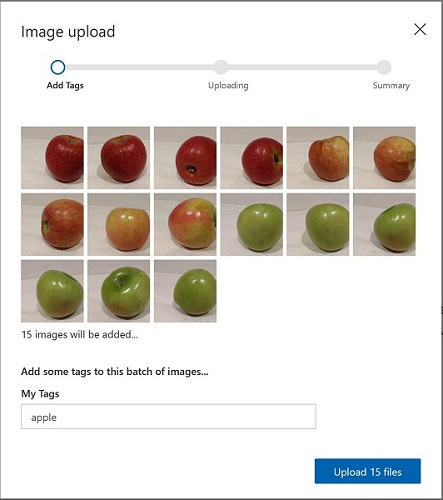

---
lab:
  title: Erkunden der Bildklassifizierung
---

# <a name="explore-image-classification"></a>Erkunden der Bildklassifizierung

> **Hinweis**: Um dieses Lab abzuschließen, benötigen Sie ein [Azure-Abonnement](https://azure.microsoft.com/free?azure-portal=true), in dem Sie über Administratorzugriff verfügen.

Der Cognitive Service *Maschinelles Sehen* bietet nützliche vorgefertigte Modelle für das Arbeiten mit Bildern, aber oft müssen Sie Ihr eigenes Modell für maschinelles Sehen trainieren. Angenommen, das Einzelhandelsunternehmen Northwind Traders möchte ein automatisches Kassensystem entwickeln, das anhand eines von einer Kamera an der Kasse aufgenommenen Bilds die Lebensmittel identifiziert, die Kunden kaufen möchten. Dazu müssen Sie ein Klassifizierungsmodell trainieren, das die Bilder so klassifiziert, dass der gekaufte Artikel identifiziert werden kann.

In Azure können Sie den Cognitive Service ***Custom Vision*** verwenden, um ein Bildklassifizierungsmodell auf Grundlage vorhandener Bilder zu trainieren. Die Erstellung einer Bildklassifizierungslösung besteht aus zwei Elementen. Zunächst müssen Sie ein Modell trainieren, das anhand vorhandener Bilder verschiedene Klassen erkennt. Wenn das Modell dann trainiert ist, müssen Sie es als Dienst veröffentlichen, der von Anwendungen genutzt werden kann.

Um die Fähigkeiten von Custom Vision zu testen, verwenden wir eine einfache Befehlszeilenanwendung, die in Cloud Shell ausgeführt wird. Die gleichen Prinzipien und Funktionen gelten auch für reale Lösungen, wie Websites oder Smartphone-Apps.

## <a name="create-a-cognitive-services-resource"></a>Erstellen einer *Cognitive Services*-Ressource

Sie können den Custom Vision-Dienst verwenden, indem Sie entweder eine **Custom Vision**-Ressource oder eine **Cognitive Services**-Ressource erstellen.

>**Hinweis**: Nicht jede Ressource ist in jeder Region verfügbar. Unabhängig davon, ob Sie eine Custom Vision- oder eine Cognitive Services-Ressource erstellen, können nur Ressourcen, die in [bestimmten Regionen](https://azure.microsoft.com/global-infrastructure/services/?products=cognitive-services) erstellt wurden, für den Zugriff auf Custom Vision-Dienste verwendet werden. Der Einfachheit halber wird in den folgenden Konfigurationsanweisungen eine Region für Sie vorausgewählt.

Erstellen Sie eine **Cognitive Services**-Ressource in Ihrem Azure-Abonnement.

1. Öffnen Sie auf einer anderen Browserregisterkarte das Azure-Portal unter [https://portal.azure.com](https://portal.azure.com?azure-portal=true), und melden Sie sich mit Ihrem Microsoft-Konto an.

1. Klicken Sie auf die Schaltfläche **&#65291;Ressource erstellen**, suchen Sie nach *Cognitive Services*, und erstellen Sie eine **Cognitive Services**-Ressource mit den folgenden Einstellungen:
    - **Abonnement**: *Ihr Azure-Abonnement*.
    - **Ressourcengruppe**: *Wählen Sie eine Ressourcengruppe aus, oder erstellen Sie eine Ressourcengruppe mit einem eindeutigen Namen*.
    - **Region**: East US
    - **Name**: *Geben Sie einen eindeutigen Namen ein*.
    - **Tarif**: Standard S0.
    - **Durch Aktivieren dieses Kontrollkästchens bestätige ich, dass ich die folgenden Bedingungen gelesen und verstanden habe**: Aktiviert.

1. Überprüfen und erstellen Sie die Ressource und warten Sie, bis die Bereitstellung abgeschlossen ist. Wechseln Sie dann zur bereitgestellten Ressource.

1. Zeigen Sie die Seite **Schlüssel und Endpunkt** für Ihre Cognitive Services-Ressource an. Sie benötigen den Endpunkt und die Schlüssel, um von Clientanwendungen aus eine Verbindung herzustellen.

## <a name="create-a-custom-vision-project"></a>Erstellen eines Custom Vision-Projekts

Um ein Objekterkennungsmodell zu trainieren, müssen Sie ein Custom Vision-Projekt auf der Grundlage Ihrer Trainingsressource erstellen. Dazu verwenden Sie das Custom Vision-Portal.

1. Laden Sie die Trainingsbilder von https://aka.ms/fruit-images herunter und extrahieren Sie sie. Diese Bilder werden in einem gezippten Ordner bereitgestellt, der beim Entpacken Unterordner mit den Namen **apple**, **banana** und **orange** enthält.

1. Öffnen Sie auf einer anderen Browserregisterkarte das Custom Vision-Portal unter [https://customvision.ai](https://customvision.ai?azure-portal=true). Falls Sie dazu aufgefordert werden, melden Sie sich mit dem Microsoft-Konto an, das Ihrem Azure-Abonnement zugeordnet ist, und stimmen Sie den Nutzungsbedingungen zu.

1. Erstellen Sie im Custom Vision-Portal ein neues Projekt mit den folgenden Einstellungen:

    - **Name**: Lebensmittelkasse
    - **Beschreibung**: Bildklassifizierung für Lebensmittel
    - **Ressource**: *Die Custom Vision-Ressource, die Sie zuvor erstellt haben*
    - **Projekttypen:** Klassifizierung
    - **Klassifizierungstypen**: Multiklassen-Klassifizierung (einzelnes Tag pro Bild)
    - **Domänen**: Lebensmittel

1. Klicken Sie auf **Bilder hinzufügen**, und wählen Sie alle Dateien im Ordner **apple** aus, den Sie zuvor extrahiert haben. Laden Sie anschließend die Bilddateien mit dem Tag *Apfel* hoch:

    

1. Wiederholen Sie den vorherigen Schritt, um die Bilder im Ordner **banana** mit dem Tag *Banane* und die Bilder im Ordner **orange** mit dem Tag *Orange* hochzuladen.

1. Sehen Sie sich die Bilder an, die Sie in Ihrem Custom Vision-Projekt hochgeladen haben. Sie sollten 15 Bilder pro Klasse haben, wie hier gezeigt:

    

1. Klicken Sie im Custom Vision-Projekt über den Bildern auf **Trainieren**, um ein Klassifizierungsmodell mit den markierten Bildern zu trainieren. Wählen Sie die Option **Schnelltraining** aus, und warten Sie, bis die Trainingsiteration abgeschlossen wurde (dieser Vorgang kann etwa eine Minute dauern).

1. Warten Sie, bis die Modelliteration trainiert wurde, und überprüfen Sie die Leistungsmetriken *Genauigkeit*, *Abruf* und *AP*. Diese Metriken messen die Vorhersagegenauigkeit des Klassifizierungsmodells und sollten jeweils den Wert „Hoch“ haben.

## <a name="test-the-model"></a>Testen des Modells

Bevor Sie diese Iteration des Modells zur Verwendung durch Anwendungen veröffentlichen, sollten Sie es testen.

1. Klicken Sie über den Leistungsmetriken auf **Schnelltest**.

1. Geben Sie `https://aka.ms/apple-image` im Feld **Bild-URL** ein, und klicken Sie auf „&#10132;“.

1. Sehen Sie sich die von Ihrem Modell zurückgegebenen Vorhersagen an. *Apfel* sollte den höchsten Wahrscheinlichkeitswert haben, wie hier gezeigt:

    

1. Schließen Sie das Fenster **Schelltest**.

## <a name="publish-the-image-classification-model"></a>Veröffentlichen des Bildklassifizierungsmodells

Jetzt können Sie Ihr trainiertes Modell veröffentlichen und in einer Clientanwendung verwenden.

1. Klicken Sie auf **&#128504; Publish** (Veröffentlichen), um das trainierte Modell mit den folgenden Einstellungen zu veröffentlichen:
    - **Modellname**: Lebensmittel
    - **Vorhersageressource**: *Die Vorhersageressource, die Sie zuvor erstellt haben*.

1. Nach der Veröffentlichung klicken Sie auf das Symbol für die *Vorhersage-URL* (&#127760;), um die für die Verwendung des veröffentlichten Modells erforderlichen Informationen anzuzeigen. Später benötigen Sie die entsprechenden Werte für die URL und den Vorhersageschlüssel, um eine Vorhersage von einer Bild-URL zu erhalten, lassen Sie also dieses Dialogfeld geöffnet, und fahren Sie mit der nächsten Aufgabe fort. 

## <a name="run-cloud-shell"></a>Ausführen von Cloud Shell

Um die Fähigkeiten des Custom Vision-Diensts zu testen, verwenden wir eine einfache Befehlszeilenanwendung, die in der Cloud Shell in Azure ausgeführt wird.

1. Wählen Sie im Azure-Portal die Schaltfläche **[>_]** (*Cloud Shell*) oben auf der Seite rechts neben dem Suchfeld aus. Dadurch wird am unteren Rand des Portals ein Cloud Shell-Bereich geöffnet. 

    

1. Wenn Sie die Cloud Shell zum ersten Mal öffnen, werden Sie möglicherweise aufgefordert, die Art der Shell zu wählen, die Sie verwenden möchten (*Bash* oder *PowerShell*). Wählen Sie **PowerShell** aus. Wenn Sie diese Option nicht sehen, überspringen Sie den Schritt.  

1. Wenn Sie aufgefordert werden, Speicher für Ihre Cloud Shell zu erstellen, stellen Sie sicher, dass Ihr Abonnement angegeben ist, und wählen Sie **Speicher erstellen** aus. Warten Sie dann etwa eine Minute, bis der Speicher erstellt ist.

    [](media/create-image-classification-system/powershell-portal-guide-2.png#lightbox)

1. Vergewissern Sie sich, dass der oben links im Cloud Shell-Bereich angezeigte Shelltyp zu *PowerShell* gewechselt ist. Wenn *Bash* angezeigt wird, wechseln Sie über das Dropdownmenü zu *PowerShell*.

    

1. Warten Sie, bis PowerShell gestartet wurde. Im Azure-Portal sollte der folgende Bildschirm angezeigt werden:  

    

## <a name="configure-and-run-a-client-application"></a>Konfigurieren und Ausführen einer Clientanwendung

Da Sie nun über eine Cloud Shell-Umgebung verfügen, können Sie eine einfache Anwendung ausführen, die den Dienst Custom Vision zur Bildanalyse verwendet.

1. Geben Sie in der Befehlsshell den folgenden Befehl ein, um die Beispielanwendung herunterzuladen und in einem Ordner namens „ai-900“ zu speichern. 

    ```PowerShell
    git clone https://github.com/MicrosoftLearning/AI-900-AIFundamentals ai-900
    ```

    >**Tipp**: Wenn Sie diesen Befehl bereits in einem anderen Lab zum Klonen des Repositorys *ai-900* verwendet haben, können Sie diesen Schritt überspringen.

1. Die Dateien werden in einen Ordner namens **ai-900** heruntergeladen. Jetzt möchten wir alle Dateien in Ihrem Cloud Shell-Speicher anzeigen und mit ihnen arbeiten. Geben Sie den folgenden Befehl in die Shell ein:

    ```PowerShell
    code .
    ```

    Beachten Sie, dass sich dadurch ein Editor wie in der Abbildung unten öffnet: 

    

1. Erweitern Sie im Bereich **Dateien** auf der linken Seite die Option **ai-900**, und wählen Sie **classify-image.ps1** aus. Diese Datei enthält einen Code, der das Custom Vision-Modell verwendet, um ein Bild zu analysieren, wie hier gezeigt:

     

1. Machen Sie sich nicht zu viele Gedanken über die Details des Codes. Wichtig ist nur, dass er die Vorhersage-URL und den Schlüssel für Ihr Custom Vision-Modell benötigt, wenn Sie eine Bild-URL verwenden. 

   Sie erhalten die *Vorhersage-URL* aus dem Dialogfeld in Ihrem Custom Vision-Projekt. 

   >**Hinweis**: Sie haben die *Vorhersage-URL* überprüft, nachdem Sie das Bildklassifizierungsmodell veröffentlicht haben. Um die *Vorhersage-URL* zu finden, navigieren Sie in Ihrem Projekt zur Registerkarte **Leistung**, und klicken Sie dann auf **Vorhersage-URL**. (Wenn der Bildschirm komprimiert ist, wird eventuell nur ein Globussymbol angezeigt.) Ein Dialogfeld wird angezeigt. Kopieren Sie die URL für **Wenn Sie über eine Bild-URL verfügen**. Fügen Sie sie in den Code-Editor ein, und ersetzen Sie den Platzhalterwert **YOUR_PREDICTION_URL**.

    Verwenden Sie dasselbe Dialogfeld, um den *Vorhersageschlüssel* abzurufen. Kopieren Sie den Vorhersageschlüssel, der nach *Set Prediction-Key Header to* (Header des Vorhersageschlüssels festlegen auf) angezeigt wird. Fügen Sie ihn in den Code-Editor ein, und ersetzen Sie den Platzhalterwert **YOUR_PREDICTION_KEY**.

    

    Nach dem Einfügen der Werte für die Vorhersage-URL und den Vorhersageschlüssel sollten die ersten beiden Codezeilen in etwa wie folgt aussehen:

    ```PowerShell
    $predictionUrl="https..."
    $predictionKey ="1a2b3c4d5e6f7g8h9i0j...."
    ```

1. Verwenden Sie oben rechts im Editor-Bereich die Schaltfläche **...**, um das Menü zu öffnen, und wählen Sie **Speichern** aus, um Ihre Änderungen zu speichern. Öffnen Sie dann das Menü erneut, und wählen Sie **Editor schließen** aus.

    Sie verwenden die exemplarische Clientanwendung, um mehrere Bilder in die Kategorie Apfel, Banane oder Orange einzuordnen.

1. Wir klassifizieren dieses Bild:

    

    Geben Sie im PowerShell-Bereich die folgenden Befehle ein, um den Code auszuführen:

    ```PowerShell
    cd ai-900
    ./classify-image.ps1 1
    ```

1. Überprüfen Sie die Vorhersage, die **Apfel** lauten sollte.

1. Versuchen wir es nun mit einem anderen Bild:

    

    Führen Sie den folgenden Befehl aus:

    ```PowerShell
    ./classify-image.ps1 2
    ```

1. Stellen Sie sicher, dass das Modell dieses Bild als **Banane** klassifiziert.

1. Zum Schluss probieren wir das dritte Testbild aus:

    

    Führen Sie den folgenden Befehl aus:

    ```PowerShell
    ./classify-image.ps1 3
    ```

1. Stellen Sie sicher, dass das Modell dieses Bild als **Orange** klassifiziert.

## <a name="learn-more"></a>Weitere Informationen

Diese einfache App veranschaulicht nur einige der Funktionen des Custom Vision-Diensts. Weitere Informationen über die Möglichkeiten dieses Diensts finden Sie auf der [Custom Vision-Seite](https://azure.microsoft.com/services/cognitive-services/custom-vision-service/).
