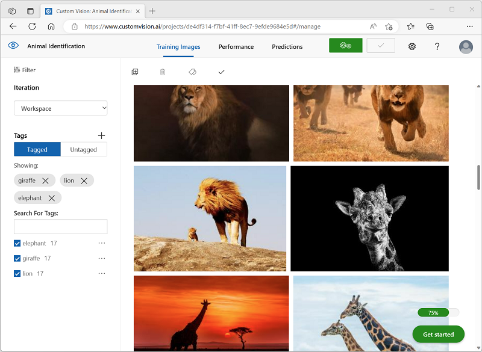
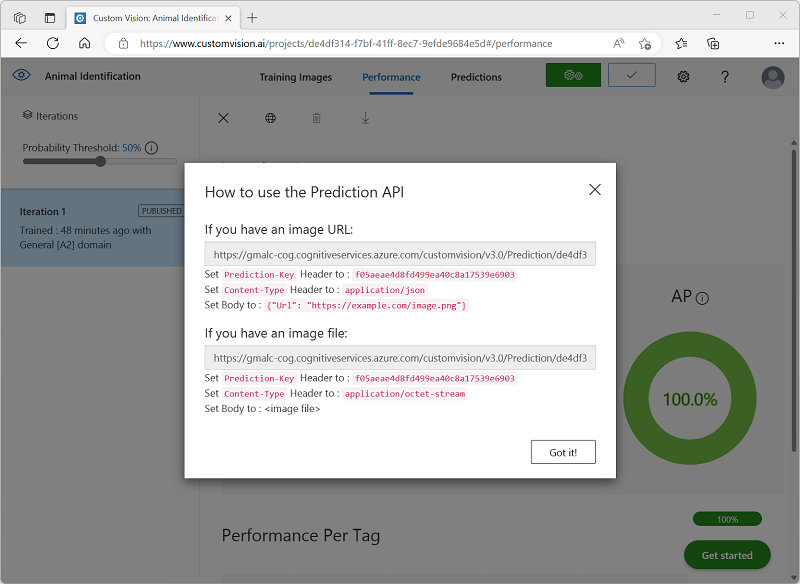

---
lab:
  title: Erkunden der Bildklassifizierung
---

# Erkunden der Bildklassifizierung

Der Dienst *Azure KI Vision* bietet nützliche vorgefertigte Modelle für das Arbeiten mit Bildern, aber oft müssen Sie Ihr eigenes Modell für maschinelles Sehen trainieren. Angenommen, eine Naturschutzorganisation möchte Tiersichtungen mit bewegungsempfindlichen Kameras verfolgen. Die von den Kameras aufgenommenen Bilder könnten dann verwendet werden, um das Vorhandensein bestimmter Arten in einem bestimmten Gebiet zu überprüfen und die Erhaltungsbemühungen für gefährdete Arten zu unterstützen. Um dies zu erreichen, würde die Organisation von einem *Bildklassifizierungsmodell* profitieren, das dafür trainiert wird, verschiedene Tierarten in den aufgenommenen Fotos zu erkennen.

In Azure können Sie den Dienst ***Custom Vision*** verwenden, um ein Bildklassifizierungsmodell auf der Grundlage vorhandener Bilder zu trainieren. Die Erstellung einer Bildklassifizierungslösung besteht aus zwei Elementen. Zunächst müssen Sie ein Modell trainieren, das anhand vorhandener Bilder verschiedene Klassen erkennt. Wenn das Modell dann trainiert ist, müssen Sie es als Dienst veröffentlichen, der von Anwendungen genutzt werden kann.

Um die Fähigkeiten von Custom Vision zu testen, verwenden wir eine einfache Befehlszeilenanwendung, die in Cloud Shell ausgeführt wird. Die gleichen Prinzipien und Funktionen gelten auch für reale Lösungen, wie Websites oder mobile Apps.

## Vorbereitung

Um dieses Lab abzuschließen, benötigen Sie ein [Azure-Abonnement](https://azure.microsoft.com/free?azure-portal=true), in dem Sie über Administratorzugriff verfügen.

## Erstellen einer *Azure KI Services*-Ressource

Sie können den Custom Vision-Dienst verwenden, indem Sie entweder eine Ressource für **Custom Vision** oder eine für **Azure KI Services** erstellen.

>**Hinweis**: Nicht jede Ressource ist in jeder Region verfügbar. Unabhängig davon, ob Sie eine Custom Vision- oder eine Azure KI Services-Ressource erstellen, können nur Ressourcen, die in [bestimmten Regionen](https://azure.microsoft.com/global-infrastructure/services/?products=cognitive-services) erstellt wurden, für den Zugriff auf Custom Vision-Dienste verwendet werden. Der Einfachheit halber wird in den folgenden Konfigurationsanweisungen eine Region für Sie vorausgewählt.

Erstellen Sie eine Ressource für **Azure KI Services** in Ihrem Azure-Abonnement.

1. Öffnen Sie das Azure-Portal unter [https://portal.azure.com](https://portal.azure.com?azure-portal=true), und melden Sie sich mit Ihrem Microsoft-Konto an.

1. Klicken Sie auf die Schaltfläche **＋Ressource erstellen** und suchen Sie nach *Azure KI Services*. Wählen Sie **Erstellen** eines **Azure KI Services**-Plans aus. Sie werden zu einer Seite weitergeleitet, um eine Azure KI Services-Ressource zu erstellen. Konfigurieren Sie sie mit den folgenden Einstellungen:
    - **Abonnement**: *Ihr Azure-Abonnement*.
    - **Ressourcengruppe**: *Wählen Sie eine Ressourcengruppe aus, oder erstellen Sie eine Ressourcengruppe mit einem eindeutigen Namen*.
    - **Region**: East US
    - **Name**: *Geben Sie einen eindeutigen Namen ein*.
    - **Tarif**: Standard S0.
    - **Durch Aktivieren dieses Kontrollkästchens bestätige ich, dass ich die folgenden Bedingungen gelesen und verstanden habe**: Aktiviert.

1. Überprüfen und erstellen Sie die Ressource und warten Sie, bis die Bereitstellung abgeschlossen ist. Wechseln Sie dann zur bereitgestellten Ressource.

1. Zeigen Sie die Seite **Schlüssel und Endpunkt** für Ihre Azure KI Services-Ressource an. Sie benötigen den Endpunkt und die Schlüssel, um von Clientanwendungen aus eine Verbindung herzustellen.

## Erstellen eines Custom Vision-Projekts

Um ein Objekterkennungsmodell zu trainieren, müssen Sie ein Custom Vision-Projekt auf der Grundlage Ihrer Trainingsressource erstellen. Dazu verwenden Sie das Custom Vision-Portal.

1. Laden Sie die Trainingsbilder von [https://aka.ms/animal-images](https://aka.ms/animal-images) herunter, und extrahieren Sie sie. Diese Bilder werden in einem gezippten Ordner bereitgestellt, der beim Entpacken Unterordner mit den Namen **elephant**, **giraffe** und **lion** enthält.

1. Öffnen Sie eine neue Browserregisterkarte, und rufen Sie das Custom Vision-Portal unter [https://customvision.ai](https://customvision.ai?azure-portal=true) auf. Falls Sie dazu aufgefordert werden, melden Sie sich mit dem Microsoft-Konto an, das Ihrem Azure-Abonnement zugeordnet ist, und stimmen Sie den Nutzungsbedingungen zu.

1. Erstellen Sie im Custom Vision-Portal ein neues Projekt mit den folgenden Einstellungen:

    - **Name**: Tiererkennung
    - **Beschreibung**: Bildklassifizierung für Tiere
    - **Ressource**: *Die Azure KI Services- oder Custom Vision-Ressource, die Sie zuvor erstellt haben*
    - **Projekttypen:** Klassifizierung
    - **Klassifizierungstypen**: Multiklassen-Klassifizierung (einzelnes Tag pro Bild)
    - **Domänen**: Allgemein \[A2]

1. Klicken Sie auf **Bilder hinzufügen**, und wählen Sie alle Dateien im Ordner **elephant** aus, den Sie zuvor extrahiert haben. Laden Sie anschließend die Bilddateien mit dem Tag *elephant* hoch:

    

1. Verwenden Sie die Schaltfläche **Bilder hinzufügen** ([+]), um die Bilder im Ordner **giraffe** mit dem Tag *giraffe* und die Bilder im Ordner **lion** mit dem Tag *lion* hochzuladen.

1. Sehen Sie sich die Bilder an, die Sie in Ihrem Custom Vision-Projekt hochgeladen haben. Sie sollten 17 Bilder pro Klasse haben, wie hier gezeigt:

    

1. Klicken Sie im Custom Vision-Projekt über den Bildern auf **Trainieren**, um ein Klassifizierungsmodell mit den markierten Bildern zu trainieren. Wählen Sie die Option **Schnelltraining** aus, und warten Sie, bis die Trainingsiteration abgeschlossen wurde.

    > **Hinweis:** Der Trainingsvorgang kann einige Minuten dauern. Während Sie warten, können Sie sich ansehen, [wie Schneeleoparden-Selfies und KI helfen können, die Art vor dem Aussterben zu retten](https://news.microsoft.com/transform/snow-leopard-selfies-ai-save-species/). Dort geht es um ein echtes Projekt, das das maschinelle Sehen verwendet, um gefährdete Tiere in der freien Natur zu verfolgen.

1. Warten Sie, bis die Modelliteration trainiert wurde, und überprüfen Sie die Leistungsmetriken *Genauigkeit*, *Abruf* und *AP*. Diese Metriken messen die Vorhersagegenauigkeit des Klassifizierungsmodells und sollten jeweils den Wert „Hoch“ haben.

## Testen des Modells

Bevor Sie diese Iteration des Modells zur Verwendung durch Anwendungen veröffentlichen, sollten Sie es testen.

1. Klicken Sie über den Leistungsmetriken auf **Schnelltest**.

1. Geben Sie im Feld **Bild-URL** die URL `https://aka.ms/giraffe` ein, und klicken Sie auf die Schaltfläche **Schnelltestbild (&#10132;)** .

1. Sehen Sie sich die von Ihrem Modell zurückgegebenen Vorhersagen an. *giraffe* sollte den höchsten Wahrscheinlichkeitswert haben, wie hier gezeigt:

    

1. Schließen Sie das Fenster **Schelltest**.

## Veröffentlichen des Bildklassifizierungsmodells

Jetzt können Sie Ihr trainiertes Modell veröffentlichen und in einer Clientanwendung verwenden.

1. Klicken Sie auf **&#128504; Publish** (Veröffentlichen), um das trainierte Modell mit den folgenden Einstellungen zu veröffentlichen:
    - **Modellname**: animals
    - **Vorhersageressource**: *Die Azure KI Services- oder Custom Vision-Vorhersageressource, die Sie zuvor erstellt haben*.

1. Nach der Veröffentlichung klicken Sie auf das Symbol für die *Vorhersage-URL* (&#127760;), um die für die Verwendung des veröffentlichten Modells erforderlichen Informationen anzuzeigen.

    

Später benötigen Sie die entsprechenden Werte für die URL und den Vorhersageschlüssel, um eine Vorhersage von einer Bild-URL zu erhalten, lassen Sie also dieses Dialogfeld geöffnet, und fahren Sie mit der nächsten Aufgabe fort.

## Vorbereiten einer Clientanwendung

Um die Funktionen des Custom Vision-Diensts zu testen, verwenden wir eine einfache Befehlszeilenanwendung, die in Cloud Shell in Azure ausgeführt wird.

1. Wechseln Sie zurück zur Browserregisterkarte mit dem Azure-Portal, und wählen Sie oben auf der Seite rechts neben dem Suchfeld die Schaltfläche **Cloud Shell** ( **[>_]** ) aus. Dadurch wird am unteren Rand des Portals ein Cloud Shell-Bereich geöffnet.

    Wenn Sie die Cloud Shell zum ersten Mal öffnen, werden Sie möglicherweise aufgefordert, die Art der Shell zu wählen, die Sie verwenden möchten (*Bash* oder *PowerShell*). Wählen Sie in diesem Fall **PowerShell** aus.

    Wenn Sie aufgefordert werden, Speicher für Ihre Cloud Shell zu erstellen, achten Sie darauf, dass Ihr Abonnement ausgewählt ist, und wählen Sie **Speicher erstellen** aus. Warten Sie dann etwa eine Minute, bis der Speicher erstellt ist.

    Wenn die Cloud Shell bereit ist, sollte sie in etwa wie folgt aussehen:
    
    

    > **Hinweis:** Vergewissern Sie sich, dass der oben links im Cloud Shell-Bereich angezeigte Shelltyp *PowerShell* lautet. Wenn *Bash* angezeigt wird, wechseln Sie über das Dropdownmenü zu *PowerShell*.

    Beachten Sie, dass Sie die Größe der Cloud Shell durch Ziehen der Trennzeichenleiste oben im Bereich ändern können, oder den Bereich mithilfe der Symbole **&#8212;** , **&#9723;** und **X** oben rechts minimieren, maximieren und schließen können. Weitere Informationen zur Verwendung von Azure Cloud Shell finden Sie in der [Azure Cloud Shell-Dokumentation](https://docs.microsoft.com/azure/cloud-shell/overview).

2. Geben Sie in der Befehlsshell die folgenden Befehle ein, um die Dateien für diese Übung herunterzuladen, und speichern Sie sie in einem Ordner namens **ai-900** (nachdem Sie diesen Ordner entfernt haben, falls er bereits vorhanden ist).

    ```PowerShell
    rm -r ai-900 -f
    git clone https://github.com/MicrosoftLearning/AI-900-AIFundamentals ai-900
    ```

3. Nachdem die Dateien heruntergeladen wurden, geben Sie die folgenden Befehle ein, um zum Verzeichnis **ai-900** zu wechseln und die Codedatei für diese Übung zu bearbeiten:

    ```PowerShell
    cd ai-900
    code classify-image.ps1
    ```

    Dadurch öffnet sich ein Editor wie in der Abbildung unten:

     

     > **Tipp**: Sie können die Trennlinie zwischen der Cloud Shell-Befehlszeile und dem Code-Editor verschieben, um die Größe der Bereiche zu ändern.

4. Machen Sie sich nicht zu viele Gedanken über die Details des Codes. Wichtig ist, dass er mit Code beginnt, um die Vorhersage-URL und den Schlüssel für Ihr Custom Vision-Modell anzugeben. Sie müssen diese aktualisieren, damit der restliche Code Ihr Modell verwendet.

    Rufen Sie die *Vorhersage-URL* und den *Vorhersageschlüssel* aus dem Dialogfeld ab, das Sie in der Browserregisterkarte für Ihr Custom Vision-Projekt geöffnet haben. **Sie benötigen die zu verwendenden Versionen *, wenn Sie über eine Bild-URL* verfügen.**

    Verwenden Sie diese Werte, um die Platzhalter **YOUR_PREDICTION_URL** und **YOUR_PREDICTION_KEY** in der Codedatei zu ersetzen.

    Nach dem Einfügen der Werte für die Vorhersage-URL und den Vorhersageschlüssel sollten die ersten beiden Codezeilen in etwa wie folgt aussehen:

    ```PowerShell
    $predictionUrl="https..."
    $predictionKey ="1a2b3c4d5e6f7g8h9i0j...."
    ```

5. Nachdem Sie die Änderungen an den Variablen im Code vorgenommen haben, drücken Sie **STRG+S**, um die Datei zu speichern. Drücken Sie anschließend **STRG+Q**, um den Code-Editor zu schließen.

## Testen der Clientanwendung

Jetzt können Sie die Beispielclientanwendung verwenden, um Bilder basierend auf dem darin enthaltenen Tier zu klassifizieren.

1. Geben Sie im PowerShell-Bereich den folgenden Befehl ein, um den Code auszuführen:

    ```PowerShell
    ./classify-image.ps1 1
    ```

    Dieser Code verwendet Ihr Modell, um das folgende Bild zu klassifizieren:

    

1. Überprüfen Sie die Vorhersage, die **giraffe** lauten sollte.

1. Versuchen wir es nun mit einem anderen Bild. Führen Sie den folgenden Befehl aus:

    ```PowerShell
    ./classify-image.ps1 2
    ```

    Dieses Mal wird das folgende Bild klassifiziert:

    

1. Vergewissern Sie sich, dass das Modell dieses Bild als **elephant** klassifiziert.

1. Probieren wir ein weiteres aus. Führen Sie den folgenden Befehl aus:

    ```PowerShell
    ./classify-image.ps1 3
    ```

    Das letzte Bild sieht wie folgt aus:

    

1. Vergewissern Sie sich, dass das Modell dieses Bild als **lion** klassifiziert.

Hoffentlich hat Ihr Bildklassifizierungsmodell alle drei Bilder richtig klassifiziert.


