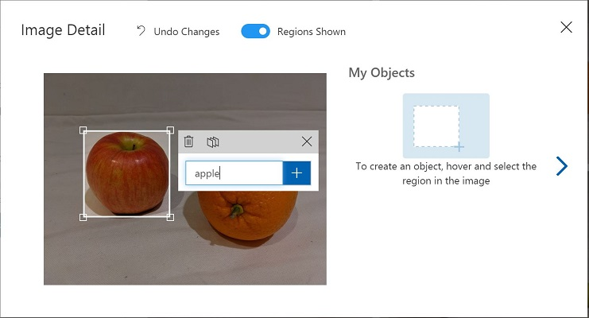

---
lab:
  title: Erkunden der Objekterkennung
  module: Module 3 - Computer Vision
---

# <a name="explore-object-detection"></a>Erkunden der Objekterkennung

> **Hinweis**: Um dieses Lab abzuschließen, benötigen Sie ein [Azure-Abonnement](https://azure.microsoft.com/free?azure-portal=true), in dem Sie über Administratorzugriff verfügen.

*Objekterkennung* ist eine Form des maschinellen Sehens, bei der ein Machine Learning-Modell trainiert wird, um einzelne Instanzen von Objekten in einem Bild zu klassifizieren und einen *Begrenzungsrahmen* zu markieren, der ihre Position kennzeichnet. Sie können sich dies als eine Entwicklung von der *Bildklassifizierung* (bei der das Modell die Frage „Was zeigt dieses Bild?“ beantwortet) bis zum Erstellen von Lösungen vorstellen, bei denen wir das Modell Folgendes fragen können: „Welche Objekte befinden sich auf diesem Bild und wo befinden sie sich?“.

Ein Lebensmittelgeschäft könnte z. B. ein Objekterkennungsmodell verwenden, um ein automatisches Kassensystem zu implementieren, das ein Förderband mit einer Kamera abtastet und bestimmte Artikel identifizieren kann, ohne dass jeder Artikel auf das Band gelegt und einzeln gescannt werden muss.

Der kognitive **Custom Vision**-Dienst in Microsoft Azure bietet eine cloudbasierte Lösung zur Erstellung und Veröffentlichung von benutzerdefinierten Objekterkennungsmodellen. In Azure können Sie den Custom Vision-Dienst verwenden, um ein Bildklassifizierungsmodell auf der Grundlage vorhandener Bilder zu trainieren. Die Erstellung einer Bildklassifizierungslösung besteht aus zwei Elementen. Zunächst müssen Sie ein Modell trainieren, das anhand vorhandener Bilder verschiedene Klassen erkennt. Wenn das Modell dann trainiert ist, müssen Sie es als Dienst veröffentlichen, der von Anwendungen genutzt werden kann.

Um die Fähigkeiten des Custom Vision-Diensts zur Erkennung von Objekten in Bildern zu testen, verwenden wir eine einfache Befehlszeilenanwendung, die in der Cloud Shell ausgeführt wird. Die gleichen Prinzipien und Funktionen gelten auch für reale Lösungen, wie Websites oder Smartphone-Apps.

## <a name="create-a-cognitive-services-resource"></a>Erstellen einer *Cognitive Services*-Ressource

Sie können den Custom Vision-Dienst verwenden, indem Sie entweder eine **Custom Vision**-Ressource oder eine **Cognitive Services**-Ressource erstellen.

> **Hinweis**: Nicht jede Ressource ist in jeder Region verfügbar. Unabhängig davon, ob Sie eine Custom Vision- oder eine Cognitive Services-Ressource erstellen, können nur Ressourcen, die in [bestimmten Regionen](https://azure.microsoft.com/global-infrastructure/services/?products=cognitive-services) erstellt wurden, für den Zugriff auf Custom Vision-Dienste verwendet werden. Der Einfachheit halber wird in den folgenden Konfigurationsanweisungen eine Region für Sie vorausgewählt.

Erstellen Sie eine **Cognitive Services**-Ressource in Ihrem Azure-Abonnement.

1. Öffnen Sie auf einer anderen Browserregisterkarte das Azure-Portal unter [https://portal.azure.com](https://portal.azure.com?azure-portal=true), und melden Sie sich mit Ihrem Microsoft-Konto an.

1. Klicken Sie auf die Schaltfläche **&#65291;Ressource erstellen**, suchen Sie nach *Cognitive Services*, und erstellen Sie eine **Cognitive Services**-Ressource mit den folgenden Einstellungen:
    - **Abonnement**: *Ihr Azure-Abonnement*.
    - **Ressourcengruppe**: *Wählen Sie eine Ressourcengruppe aus, oder erstellen Sie eine Ressourcengruppe mit einem eindeutigen Namen*.
    - **Region**: East US
    - **Name**: *Geben Sie einen eindeutigen Namen ein*.
    - **Tarif**: Standard S0.
    - **Durch Aktivieren dieses Kontrollkästchens bestätige ich, dass ich die folgenden Bedingungen gelesen und verstanden habe**: Aktiviert.

1. Überprüfen und erstellen Sie die Ressource und warten Sie, bis die Bereitstellung abgeschlossen ist. Wechseln Sie dann zur bereitgestellten Ressource.

1. Zeigen Sie die Seite **Schlüssel und Endpunkt** für Ihre Cognitive Services-Ressource an. Sie benötigen den Endpunkt und die Schlüssel, um von Clientanwendungen aus eine Verbindung herzustellen.

## <a name="create-a-custom-vision-project"></a>Erstellen eines Custom Vision-Projekts

Um ein Objekterkennungsmodell zu trainieren, müssen Sie ein Custom Vision-Projekt auf der Grundlage Ihrer Trainingsressource erstellen. Dazu verwenden Sie das Custom Vision-Portal.

1. Öffnen Sie auf einer neuen Browserregisterkarte das Custom Vision-Portal unter [https://customvision.ai](https://customvision.ai?azure-portal=true), und melden Sie sich mit dem Microsoft-Konto an, das Ihrem Azure-Abonnement zugeordnet ist.

1. Erstellen Sie ein neues Projekt mit den folgenden Einstellungen:
    - **Name**: „Grocery Detection“ (Erkennung von Lebensmitteln).
    - **Beschreibung**: Objekterkennung für Lebensmittel.
    - **Ressource**: *Die Ressource, die Sie zuvor erstellt haben*.
    - **Projekttypen**: Objekterkennung.
    - **Domänen:** Allgemein

1. Warten Sie, bis das Projekt erstellt und im Browser geöffnet wurde.

## <a name="add-and-tag-images"></a>Hinzufügen und Markieren von Bildern

Um ein Objekterkennungsmodell zu trainieren, müssen Sie Bilder hochladen, die die Klassen enthalten, die das Modell identifizieren soll, und sie mit Tags versehen, um Begrenzungsrahmen für jede Objektinstanz anzugeben.

1. Laden Sie die Trainingsbilder von https://aka.ms/fruit-objects herunter und extrahieren Sie sie. Der extrahierte Ordner enthält eine Sammlung von Bildern von Früchten.

1. Vergewissern Sie sich im Custom Vision-Portal [https://customvision.ai](https://customvision.ai?azure-portal=true), dass Sie in Ihrem Objekterkennungsprojekt _Grocery Detection_ (Erkennung von Lebensmitteln) arbeiten. Wählen Sie dann **Bilder hinzufügen** aus, und laden Sie alle Bilder aus dem extrahierten Ordner hoch.

    

1. Nachdem die Bilder hochgeladen wurden, wählen Sie das erste Bild aus, um es zu öffnen.

1. Halten Sie den Mauszeiger über ein beliebiges Objekt im Bild, bis ein automatisch erkannter Bereich wie in der folgenden Abbildung angezeigt wird. Wählen Sie dann das Objekt aus, und ändern Sie gegebenenfalls die Größe des Bereichs, um es zu umranden.

    

    Alternativ können Sie auch einfach einen Rahmen um das Objekt herum ziehen, um einen Bereich zu erstellen.

1. Wenn der Bereich das Objekt umgibt, fügen Sie ein neues Tag mit dem entsprechenden Objekttyp (*Apfel*, *Banane* oder *Orange*) hinzu, wie hier gezeigt:

    

1. Wählen Sie jedes andere Objekt im Bild aus und markieren Sie es, indem Sie die Größe der Bereiche ändern und bei Bedarf neue Tags hinzufügen.

    

1. Verwenden Sie den Link **>** auf der rechten Seite, um zum nächsten Bild zu wechseln und dessen Objekte zu markieren. Gehen Sie dann die gesamte Bildersammlung durch und markieren Sie jeden Apfel, jede Banane und jede Orange.

1. Wenn Sie mit dem Markieren des letzten Bilds fertig sind, schließen Sie den Editor für **Bilddetails** und wählen auf der Seite **Training Images** (Trainingsbilder) unter **Tags** die Option **Tagged** (Markiert) aus, um alle markierten Bilder anzuzeigen:

    

## <a name="train-and-test-a-model"></a>Trainieren und Testen eines Modells

Nachdem Sie nun die Bilder in Ihrem Projekt markiert haben, können Sie ein Modell trainieren.

1. Klicken Sie im Custom Vision-Projekt auf **Train** (Trainieren), um ein Objekterkennungsmodell anhand der markierten Bilder zu trainieren. Wählen Sie die Option **Quick Training** (Schnelles Training) aus.

1. Warten Sie, bis das Training abgeschlossen ist (das kann etwa zehn Minuten dauern), und überprüfen Sie dann die Leistungsmetriken *Precision* (Genauigkeit), *Recall* (Abruf) und *mAP* – diese messen die Vorhersagequalität des Objekterkennungsmodells und sollten alle hoch sein.

1. Klicken Sie oben rechts auf der Seite auf **Quick Test** (Schnelltest), geben Sie dann in das Feld **Image URL** (Bild-URL) `https://aka.ms/apple-orange` ein, und sehen Sie sich die generierte Vorhersage an. Schließen Sie dann das Fenster **Quick Test** (Schnelltest).

## <a name="publish-the-object-detection-model"></a>Veröffentlichen des Objekterkennungsmodells

Jetzt können Sie Ihr trainiertes Modell veröffentlichen und in einer Clientanwendung verwenden.

1. Klicken Sie auf **&#128504; Publish** (Veröffentlichen), um das trainierte Modell mit den folgenden Einstellungen zu veröffentlichen:
    - **Modellname**: detect-produce.
    - **Vorhersageressource**: *Die Ressource, die Sie zuvor erstellt haben*.

1. Nach der Veröffentlichung klicken Sie auf das Symbol für die *Vorhersage-URL* (&#127760;), um die für die Verwendung des veröffentlichten Modells erforderlichen Informationen anzuzeigen. Später benötigen Sie die entsprechenden Werte für die URL und den Vorhersageschlüssel, um eine Vorhersage von einer Bild-URL zu erhalten, lassen Sie also dieses Dialogfeld geöffnet, und fahren Sie mit der nächsten Aufgabe fort.

## <a name="run-cloud-shell"></a>Ausführen von Cloud Shell

Um die Fähigkeiten des Custom Vision-Diensts zu testen, verwenden wir eine einfache Befehlszeilenanwendung, die in der Cloud Shell in Azure ausgeführt wird.

1. Wählen Sie im Azure-Portal die Schaltfläche **[>_]** (*Cloud Shell*) oben auf der Seite rechts neben dem Suchfeld aus. Dadurch wird am unteren Rand des Portals ein Cloud Shell-Bereich geöffnet. 

    

1. Wenn Sie die Cloud Shell zum ersten Mal öffnen, werden Sie möglicherweise aufgefordert, die Art der Shell zu wählen, die Sie verwenden möchten (*Bash* oder *PowerShell*). Wählen Sie **PowerShell** aus. Wenn Sie diese Option nicht sehen, überspringen Sie den Schritt.  

1. Wenn Sie aufgefordert werden, Speicher für Ihre Cloud Shell zu erstellen, stellen Sie sicher, dass Ihr Abonnement angegeben ist, und wählen Sie **Speicher erstellen** aus. Warten Sie dann etwa eine Minute, bis der Speicher erstellt ist.

    

1. Vergewissern Sie sich, dass der oben links im Cloud Shell-Bereich angezeigte Shelltyp zu *PowerShell* gewechselt ist. Wenn *Bash* angezeigt wird, wechseln Sie über das Dropdownmenü zu *PowerShell*.

     

1. Warten Sie, bis PowerShell gestartet wurde. Im Azure-Portal sollte der folgende Bildschirm angezeigt werden:  

     

## <a name="configure-and-run-a-client-application"></a>Konfigurieren und Ausführen einer Clientanwendung

Nachdem Sie nun ein benutzerdefiniertes Modell erstellt haben, können Sie eine einfache Clientanwendung ausführen, die den Custom Vision-Dienst verwendet, um Objekte in einem Bild zu erkennen.

1. Geben Sie in der Befehlsshell den folgenden Befehl ein, um die Beispielanwendung herunterzuladen und in einem Ordner namens „ai-900“ zu speichern.

    ```PowerShell
    git clone https://github.com/MicrosoftLearning/AI-900-AIFundamentals ai-900
    ```

    >**Hinweis**: Wenn Sie diesen Befehl bereits in einem anderen Lab zum Klonen des Repositorys *ai-900* verwendet haben, können Sie diesen Schritt überspringen.

1. Die Dateien werden in einen Ordner namens **ai-900** heruntergeladen. Jetzt möchten wir alle Dateien in Ihrem Cloud Shell-Speicher anzeigen und mit ihnen arbeiten. Geben Sie den folgenden Befehl in die Shell ein:

    ```PowerShell
    code .
    ```

    Beachten Sie, dass sich dadurch ein Editor wie in der Abbildung unten öffnet: 

    

1. Erweitern Sie im Bereich **Dateien** auf der linken Seite die Option **ai-900**, und wählen Sie **detect-objects.ps1** aus. Diese Datei enthält einen Code, der den Custom Vision-Dienst verwendet, um Objekte in einem Bild zu erkennen, wie hier gezeigt:

    

1. Machen Sie sich nicht zu viele Gedanken über die Details des Codes. Wichtig ist nur, dass er die Vorhersage-URL und den Schlüssel für Ihr Custom Vision-Modell benötigt, wenn Sie eine Bild-URL verwenden. 

    Sie erhalten die *Vorhersage-URL* aus dem Dialogfeld in Ihrem Custom Vision-Projekt. 

    >**Hinweis**: Sie haben die *Vorhersage-URL* überprüft, nachdem Sie das Bildklassifizierungsmodell veröffentlicht haben. Um die *Vorhersage-URL* zu finden, navigieren Sie in Ihrem Projekt zur Registerkarte **Leistung**, und klicken Sie dann auf **Vorhersage-URL**. (Wenn der Bildschirm komprimiert ist, wird eventuell nur ein Globussymbol angezeigt.) Ein Dialogfeld wird angezeigt. Kopieren Sie die URL für **Wenn Sie über eine Bild-URL verfügen**. Fügen Sie sie in den Code-Editor ein, und ersetzen Sie den Platzhalterwert **YOUR_PREDICTION_URL**. 

    Verwenden Sie dasselbe Dialogfeld, um den *Vorhersageschlüssel* abzurufen. Kopieren Sie den Vorhersageschlüssel, der nach *Set Prediction-Key Header to* (Header des Vorhersageschlüssels festlegen auf) angezeigt wird. Fügen Sie ihn in den Code-Editor ein, und ersetzen Sie den Platzhalterwert **YOUR_PREDICTION_KEY**. 

    

    Nach dem Einfügen der Werte für die Vorhersage-URL und den Vorhersageschlüssel sollten die ersten beiden Codezeilen in etwa wie folgt aussehen:

    ```PowerShell
    $predictionUrl="https..."
    $predictionKey ="1a2b3c4d5e6f7g8h9i0j...."
    ```

1. Verwenden Sie oben rechts im Editor-Bereich die Schaltfläche **...**, um das Menü zu öffnen, und wählen Sie **Speichern** aus, um Ihre Änderungen zu speichern. Öffnen Sie dann das Menü erneut, und wählen Sie **Editor schließen** aus.

    Sie verwenden die Beispielclientanwendung, um Objekte in diesem Bild zu erkennen:

    

1. Geben Sie im PowerShell-Bereich den folgenden Befehl ein, um den Code auszuführen:

    ```PowerShell
    cd ai-900
    ./detect-objects.ps1 
    ```

1. Überprüfen Sie die Vorhersage, die *apple orange banana* (Apfel Orange Banane) lauten sollte.

## <a name="learn-more"></a>Weitere Informationen

Diese einfache App veranschaulicht nur einige der Funktionen des Custom Vision-Diensts. Weitere Informationen über die Möglichkeiten dieses Diensts finden Sie auf der [Custom Vision-Seite](https://azure.microsoft.com/services/cognitive-services/custom-vision-service/).
