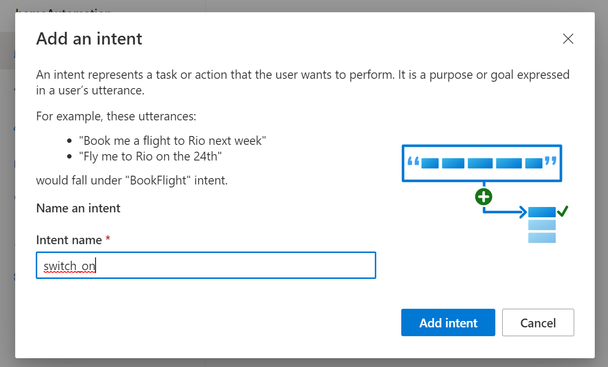
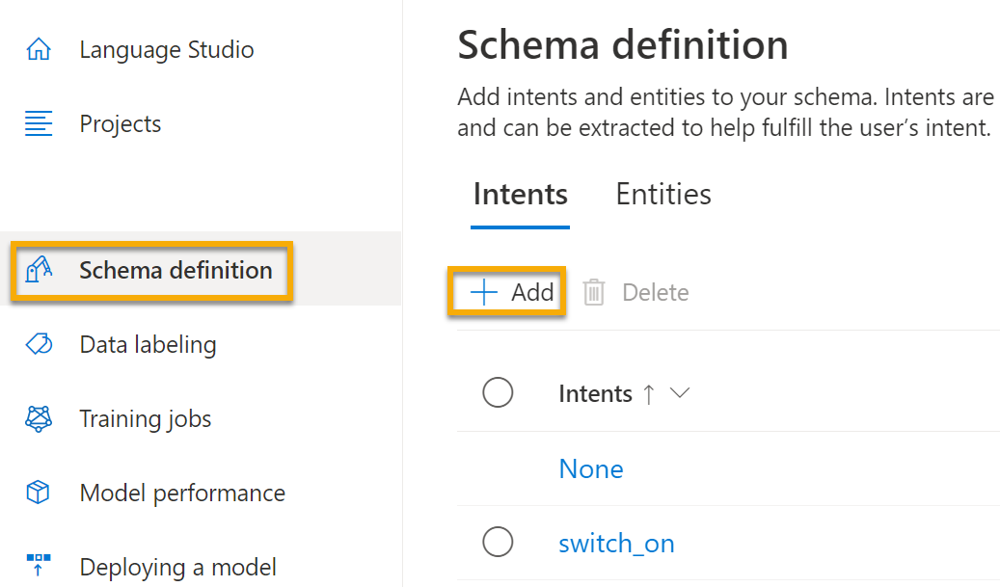
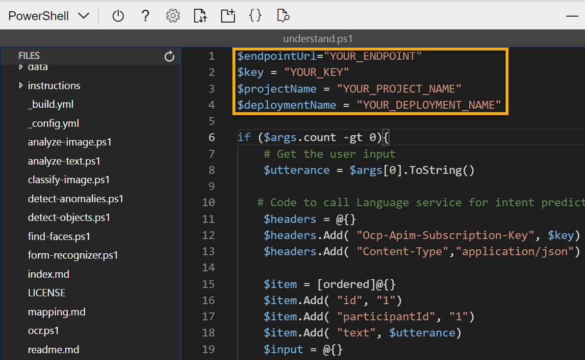

---
lab:
  title: Erkunden von Language Understanding
---

# <a name="explore-language-understanding"></a>Erkunden von Language Understanding

> **Hinweis**: Um dieses Lab abzuschließen, benötigen Sie ein [Azure-Abonnement](https://azure.microsoft.com/free?azure-portal=true), in dem Sie über Administratorzugriff verfügen.

Wir erwarten in zunehmendem Maße, dass Computer in der Lage sind, KI zu nutzen, um gesprochene oder eingegebene Befehle in natürlicher Sprache zu verstehen. Sie könnten z. B. ein Hausautomatisierungssystem implementieren, das es Ihnen ermöglicht, Geräte in Ihrem Haus mit Sprachbefehlen wie „Licht einschalten“ oder „Lüftung einschalten“ zu steuern, und ein KI-gesteuertes Gerät den Befehl verstehen und die entsprechenden Maßnahmen ergreifen zu lassen.

Verwenden Sie zum Testen der Funktionen des Diensts Conversational Language Understanding eine Befehlszeilenanwendung, die in Cloud Shell ausgeführt wird. Die gleichen Prinzipien und Funktionen gelten auch für reale Lösungen, wie Websites oder Smartphone-Apps.

## <a name="create-a-language-service-resource"></a>Erstellen einer Ressource vom Typ *Sprachdienst*

Wenn Sie den Dienst Conversational Language Understanding nutzen möchten, müssen Sie eine Ressource vom Typ **Sprachdienst** erstellen.

Falls noch nicht vorhanden, erstellen Sie in Ihrem Azure-Abonnement eine Ressource vom Typ **Sprachdienst**.

1. Öffnen Sie auf einer anderen Browserregisterkarte das Azure-Portal unter [https://portal.azure.com](https://portal.azure.com?azure-portal=true), und melden Sie sich mit Ihrem Microsoft-Konto an.

1. Klicken Sie auf die Schaltfläche **&#65291;Ressource erstellen**. Suchen Sie nach *Sprachdienst*, und erstellen Sie eine **Sprachdienst**-Ressource mit den folgenden Einstellungen:
    - Wählen Sie zusätzliche Features aus: *Behalten Sie die Standardfeatures bei, und klicken Sie auf „Weiter“, um Ihre Ressource zu erstellen.*  
    - **Abonnement**: *Ihr Azure-Abonnement*.
    - **Ressourcengruppe**: *Wählen Sie eine Ressourcengruppe aus, oder erstellen Sie eine Ressourcengruppe mit einem eindeutigen Namen*.
    - **Region**: USA, Osten 2
    - **Name**: *Geben Sie einen eindeutigen Namen ein*.
    - **Tarif**: S (1.000 Aufrufe pro Minute)
    - **Durch Aktivieren dieses Kontrollkästchens bestätige ich, dass ich die Bedingungen im Hinweis zu verantwortungsvoller KI überprüft habe und diese anerkenne.** : Ausgewählt.

1. Überprüfen und erstellen Sie die Ressource und warten Sie, bis die Bereitstellung abgeschlossen ist.

### <a name="create-a-conversational-language-understanding-app"></a>Erstellen einer Conversational Language Understanding-App

Um das Verstehen natürlicher Sprache mit Conversational Language Understanding zu implementieren, erstellen Sie eine App und fügen dann Entitäten, Absichten und Äußerungen hinzu, um die Befehle zu definieren, die die Anwendung ausführen soll.

1. Öffnen Sie auf einer neuen Browserregisterkarte das Language Studio-Portal unter [https://language.azure.com](https://language.azure.com?azure-portal=true), und melden Sie sich mit dem Microsoft-Konto an, das Ihrem Azure-Abonnement zugeordnet ist.

1. Wenn Sie zur Auswahl einer Sprachressource aufgefordert werden, wählen Sie die folgenden Einstellungen aus:
    - **Azure-Verzeichnis**: Das Azure-Verzeichnis, das Ihr Abonnement enthält.
    - **Azure-Abonnement**: Ihr Azure-Abonnement.
    - **Sprachressource**: Die Sprachressource, die Sie zuvor erstellt haben.

    >**Tipp**: Sollten Sie ***nicht*** zur Auswahl einer Sprachressource aufgefordert werden, kann dies daran liegen, dass Ihr Abonnement mehrere Sprachressourcen enthält. Gehen Sie in diesem Fall folgendermaßen vor:
    >1. Klicken Sie auf der Leiste oben auf die Schaltfläche **Einstellungen (&#9881;)**.
    >1. Gehen Sie auf der Seite **Einstellungen** zur Registerkarte **Ressourcen**.
    >1. Wählen Sie Ihre Sprachressource aus, und klicken Sie auf **Ressource wechseln**.
    >1. Klicken Sie oben auf der Seite auf **Language Studio**, um zur Startseite von Language Studio zurückzukehren.

1. Klicken Sie oben im Portal im Menü **Neu erstellen** auf die Option **Conversational Language Understanding**.

1. Geben Sie im Dialogfeld **Projekt erstellen** auf der Seite **Enter basic information** (Grundlegende Informationen eingeben) die folgenden Details ein, und klicken Sie auf **Weiter**:
    - **Name**: *Erstellen Sie einen eindeutigen Namen.*
    - **Beschreibung**: Einfache Gebäudeautomatisierung.
    - **Utterances primary language** (Primäre Sprache für Äußerungen): Englisch
    - **Enable multiple languages in project** (Mehrere Sprachen im Projekt aktivieren): *Nicht auswählen*

    

    >**Tipp**: Schreiben Sie ihren *Projektnamen* auf, da Sie ihn später noch verwenden werden.

1. Klicken Sie auf der Seite *Review and finish* (Überprüfen und Fertigstellen) auf **Create** (Erstellen).

### <a name="create-intents-utterances-and-entities"></a>Erstellen von Absichten, Äußerungen und Entitäten

Eine *Absicht* ist eine Aktion, die Sie ausführen möchten. Angenommen, Sie möchten ein Licht einschalten und einen Ventilator ausschalten. In diesem Fall definieren Sie zwei Absichten: eine zum Einschalten und eine zum Ausschalten eines Geräts. Für jede Absicht geben Sie Beispiele für *Äußerungen* an, die die Art der Sprache angeben, mit der die Absicht ausgedrückt wird.

1. Vergewissern Sie sich, dass im Bereich **Schemadefinition** die Option **Absichten** ausgewählt ist. Wählen Sie dann **Hinzufügen** aus, fügen Sie eine Absicht namens **switch_on** (einschalten; in Kleinbuchstaben) hinzu, und klicken Sie auf **Absicht hinzufügen**.

    
    

1. Wählen Sie die Absicht **switch_on** (einschalten) aus. Dadurch werden Sie auf die Seite **Datenbeschriftung** weitergeleitet. Wählen Sie in der Dropdownliste **Absicht** die Option **switch_on** aus. Geben Sie neben der Absicht **switch_on** die Äußerung ***turn the light on*** (Licht einschalten) ein, und drücken Sie die **Eingabetaste**, um diese Äußerung in die Liste aufzunehmen.

    

1. Der Sprachdienst benötigt mindestens fünf verschiedene Beispieläußerungen für jede Absicht, um das Sprachmodell genügend zu trainieren. Fügen Sie der Absicht **switch_on** (einschalten) fünf weitere Beispieläußerungen hinzu:  
    - ***switch on the fan (Ventilator einschalten)***
    - ***put the fan on*** (Ventilator anmachen)
    - ***put the light on*** (Licht an)
    - ***switch on the light*** (Licht einschalten)
    - ***turn the fan on*** (Ventilator anschalten)

1. Wählen Sie im Bereich **Entitäten für Training bezeichnen** auf der rechten Seite des Bildschirms die Option **Bezeichnungen** und dann **Entität hinzufügen** aus. Geben Sie **device** (Gerät; in Kleinbuchstaben) ein, und wählen Sie **List** (Auflisten) und dann **Add entity** (Entität hinzufügen) aus.

     
    

1. Markieren Sie in der Äußerung ***turn the fan on*** (Ventilator einschalten) das Wort „fan“ (Ventilator). Wählen Sie dann in der angezeigten Liste im Feld *Search for an entity* (Nach einer Entität suchen) **device** aus.

    

1. Führen Sie die gleichen Schritte für alle Ausdrücke aus. Bezeichnen Sie den Rest der Äußerungen *fan* (Ventilator) oder *light* (Licht) mit der Entität **device** (Gerät). Überprüfen Sie anschließend, ob die folgenden Äußerungen vorhanden sind, und wählen Sie **Save changes** (Änderungen speichern) aus:

    | **Absicht** | **Äußerung** | **Entität** |
    | --------------- | ------------------ | ------------------ |
    | switch_on   | Put on the fan („Mach den Ventilator an.“)      | Gerät: *Ventilator auswählen* |
    | switch_on   | Put on the light („Mach das Licht an.“)    | Gerät: *Licht auswählen* |
    | switch_on   | Switch on the light („Schalte das Licht ein.“) | Gerät: *Licht auswählen* |
    | switch_on   | Turn the fan on („Schalte den Ventilator an.“)     | Gerät: *Ventilator auswählen* |
    | switch_on   | Switch on the fan („Schalte den Ventilator ein.“)   | Gerät: *Ventilator auswählen* |
    | switch_on   | Turn the light on („Schalte das Licht an.“)   | Gerät: *Licht auswählen* |

     

1. Klicken Sie im linken Bereich auf **Schemadefinition**, und überprüfen Sie, ob Ihre Absicht **switch_on** aufgeführt ist. Klicken Sie dann auf **Add** (Hinzufügen), und fügen Sie eine neue Absicht mit dem Namen **switch_off** (ausschalten [in Kleinbuchstaben]) hinzu.

     

1. Klicken Sie auf die Absicht **switch_off**. Dadurch werden Sie auf die Seite **Datenbeschriftung** weitergeleitet. Wählen Sie in der Dropdownliste **Absicht** die Option **switch_off** aus. Fügen Sie neben der Absicht **switch_off** (ausschalten) die Äußerung ***turn the light off*** (Licht ausschalten) hinzu.

1. Fügen Sie der Absicht **switch_off** (ausschalten) fünf weitere Beispieläußerungen hinzu.
    - ***switch off the fan (Ventilator ausschalten)***
    - ***put the fan off*** (Lüfter aus)
    - ***put the light off*** (Licht ausmachen)
    - ***turn off the light*** (Licht ausschalten)
    - ***switch the fan off*** (Ventilator ausschalten)

1. Bezeichnen Sie die Wörter *light* (Licht) oder *fan* (Ventilator) mit der Entität **device** (Gerät). Überprüfen Sie anschließend, ob die folgenden Äußerungen vorhanden sind, und wählen Sie **Save changes** (Änderungen speichern) aus:  

    | **Absicht** | **Äußerung** | **Entität** | 
    | --------------- | ------------------ | ------------------ |
    | switch_off   | Put the fan off („Mach den Ventilator aus.“)    | Gerät: *Ventilator auswählen* | 
    | switch_off   | Put the light off („Mach das Licht aus.“)  | Gerät: *Licht auswählen* |
    | switch_off   | Turn off the light („Schalte das Licht aus.“) | Gerät: *Licht auswählen* |
    | switch_off   | Switch the fan off („Schalte den Ventilator aus.“) | Gerät: *Ventilator auswählen* |
    | switch_off   | Switch off the fan („Stell den Ventilator aus.“) | Gerät: *Ventilator auswählen* |
    | switch_off   | Turn the light off („Schalte das Licht aus.“) | Gerät: *Licht auswählen* |

### <a name="train-the-model"></a>Trainieren des Modells

Jetzt können Sie die von Ihnen definierten Absichten und Entitäten verwenden, um das Conversational Language Understanding-Modells für Ihre App zu trainieren.

1. Wählen Sie auf der linken Seite von Language Studio **Trainingsaufträge** aus, und wählen Sie dann **Trainingsauftrag starten** aus. Verwenden Sie folgende Einstellungen: 
    - **Train a new model** (Neues Modell trainieren): *Ausgewählt und einen Modellnamen wählen*
    - **Trainingsmodus**: Standardtraining (kostenlos)
    - **Datenaufteilung**: *Wählen Sie „Automatisches Aufteilen des Testsatzes aus Trainingsdaten“ aus, und behalten Sie die Standardprozentsätze bei.*
    - Klicken Sie unten auf der Seite auf **Train** (Trainieren).

1. Warten Sie, bis das Training abgeschlossen ist. 

### <a name="deploy-and-test-the-model"></a>Bereitstellen und Testen des Modells

Wenn Sie Ihr trainiertes Modell in einer Clientanwendung verwenden möchten, müssen Sie es als Endpunkt bereitstellen, an den die Clientanwendungen neue Äußerungen senden können. Aus diesen werden Absichten und Entitäten vorhergesagt.

1. Klicken Sie in Language Studio auf der linken Seite auf **Bereitstellen eines Modells.**

1. Wählen Sie den Namen Ihres Modells aus, und klicken Sie auf **Add deployment** (Bereitstellung hinzufügen). Verwenden Sie die folgenden Einstellungen:
    - **Erstellen oder Auswählen eines vorhandenen Bereitstellungsnamens**: *Wählen Sie „Neuen Bereitstellungsnamen erstellen“ aus. Fügen Sie einen eindeutigen Namen hinzu*.
    - **Zuweisen des trainierten Modells zu Ihrem Bereitstellungsnamen**; *Wählen Sie den Namens des trainierten Modells aus.*
    - Klicken Sie auf **Bereitstellen**.

    >**Tipp**: Notieren Sie sich ihren *Bereitstellungsnamen*, da Sie ihn später noch verwenden werden. 

1. Klicken Sie nach dem Bereitstellen des Modells links auf der Seite auf **Testen von Bereitstellungen**, und wählen Sie dann Ihr bereitgestelltes Modell unter **Bereitstellungsname** aus.

1. Geben Sie den folgenden Text ein, und wählen Sie dann **Test ausführen** aus:

    *switch the light on* (Licht einschalten)

     

    Das zurückgegebene Ergebnis sollte nun die vorhergesagte Absicht (**switch_on**) und die vorhergesagte Entität (**device**) mit einer Zuverlässigkeitsbewertung enthalten. Diese gibt die Wahrscheinlichkeit an, die das Modell für die vorhergesagte Absicht und die vorhergesagte Entität berechnet hat. Auf der JSON-Registerkarte sehen Sie die Zuverlässigkeit der jeweiligen potenziellen Absicht (wobei die vorhergesagte Absicht die höchste Zuverlässigkeitsbewertung aufweist).

1. Löschen Sie den Inhalt des Textfelds, und testen Sie das Modell mit den folgenden Äußerungen unter *Eigenen Text eingeben oder ein Textdokument hochladen*:
    - *turn off the fan* (Lüfter ausschalten)
    - *put the light on* (Licht an)
    - *put the fan off* (Lüfter aus)

## <a name="run-cloud-shell"></a>Ausführen von Cloud Shell

Testen Sie nun Ihr bereitgestelltes Modell. Verwenden Sie hierfür eine Befehlszeilenanwendung, die in Cloud Shell in Azure ausgeführt wird. 

1. Lassen Sie die Browserregisterkarte mit Language Studio geöffnet, und wechseln Sie zurück zur Browserregisterkarte mit dem Azure-Portal.

1. Wählen Sie im Azure-Portal die Schaltfläche **[>_]** (*Cloud Shell*) oben auf der Seite rechts neben dem Suchfeld aus. Dadurch wird am unteren Rand des Portals ein Cloud Shell-Bereich geöffnet.

    

1. Wenn Sie die Cloud Shell zum ersten Mal öffnen, werden Sie möglicherweise aufgefordert, die Art der Shell zu wählen, die Sie verwenden möchten (*Bash* oder *PowerShell*). Wählen Sie **PowerShell** aus. Wenn Sie diese Option nicht sehen, überspringen Sie den Schritt.  

1. Wenn Sie aufgefordert werden, Speicher für Ihre Cloud Shell zu erstellen, stellen Sie sicher, dass Ihr Abonnement angegeben ist, und wählen Sie **Speicher erstellen** aus. Warten Sie dann etwa eine Minute, bis der Speicher erstellt ist. 

    

1. Vergewissern Sie sich, dass der oben links im Cloud Shell-Bereich angezeigte Shelltyp zu *PowerShell* gewechselt ist. Wenn *Bash* angezeigt wird, wechseln Sie über das Dropdownmenü zu *PowerShell*.

     

1. Warten Sie, bis PowerShell gestartet wurde. Im Azure-Portal sollte der folgende Bildschirm angezeigt werden:  

     

## <a name="configure-and-run-a-client-application"></a>Konfigurieren und Ausführen einer Clientanwendung

Öffnen und bearbeiten Sie nun ein vordefiniertes Skript, das die Clientanwendung ausführen soll.

1. Geben Sie in der Befehlsshell den folgenden Befehl ein, um die Beispielanwendung herunterzuladen und in einem Ordner namens „ai-900“ zu speichern.

    ```PowerShell
    git clone https://github.com/MicrosoftLearning/AI-900-AIFundamentals ai-900
    ```

    >**Hinweis**: Wenn Sie diesen Befehl bereits in einem anderen Lab zum Klonen des Repositorys *ai-900* verwendet haben, können Sie diesen Schritt überspringen.

1. Die Dateien werden in einen Ordner namens **ai-900** heruntergeladen. Zeigen Sie nun alle Dateien in diesem Ordner an, um mit ihnen zu arbeiten. Geben Sie die folgenden Befehle in Cloud Shell ein:

     ```PowerShell
    cd ai-900
    code .
    ```

    Das Skript öffnet einen Editor wie in der folgenden Abbildung: 

    

1. Wählen Sie im Bereich **Dateien** auf der linken Seite im Ordner **ai-900** die Datei **understand.ps1** aus. Diese Datei enthält Code, der Ihr Conversational Language Understanding-Modell verwendet. 

    

    Machen Sie sich nicht zu viele Gedanken über die Details des Codes. Wichtig ist, dass Sie die nachstehenden Anweisungen verwenden, um die Datei so zu ändern, dass Sie das von Ihnen trainierte Sprachmodell angeben. 

1. Wechseln Sie zurück zur Browserregisterkarte mit **Language Studio**. Öffnen Sie in Language Studio die Seite **Bereitstellen eines Modells**, und wählen Sie Ihr Modell aus. Klicken Sie anschließend auf die Schaltfläche **Vorhersage-URL abrufen**. Die Informationen, die Sie benötigen, befinden sich in diesem Dialogfeld:
    - Der Endpunkt für Ihr Modell: Kopieren Sie den Endpunkt im Feld **Vorhersage-URL**.
    - Der Schlüssel für Ihr Modell: Der Schlüssel befindet sich in der **Beispielanforderung** als Wert des Parameters **Ocp-Apim-Subscription-Key**. Er sieht in etwa wie folgt aus: ***0ab1c23de4f56gh7i8901234jkl567m8***.

1. Kopieren Sie den Wert des Endpunkts. Wechseln Sie zurück zur Browserregisterkarte mit Cloud Shell, und fügen Sie den Wert in den Code-Editor ein. Ersetzen Sie dabei **YOUR_ENDPOINT** (innerhalb der Anführungszeichen). Wiederholen Sie diesen Vorgang für den Schlüssel, und ersetzen Sie dabei **YOUR_KEY**.

1. Ersetzen Sie als Nächstes **YOUR_PROJECT_NAME** durch den Namen Ihres Projekts, und ersetzen Sie **YOUR_DEPLOYMENT_NAME** durch den Namen Ihres bereitgestellten Modells. Die ersten Codezeilen sollten etwa wie folgt aussehen:

    ```PowerShell
    $endpointUrl="https://some-name.cognitiveservices.azure.com/language/..."
    $key = "0ab1c23de4f56gh7i8901234jkl567m8"
    $projectName = "name"
    $deploymentName = "name"
    ```

1. Verwenden Sie oben rechts im Editor-Bereich die Schaltfläche **...**, um das Menü zu öffnen, und wählen Sie **Speichern** aus, um Ihre Änderungen zu speichern. Öffnen Sie dann das Menü erneut, und wählen Sie **Editor schließen** aus.

1. Geben Sie im PowerShell-Bereich den folgenden Befehl ein, um den Code auszuführen:

    ```PowerShell
    ./understand.ps1 "Turn on the light"
    ```

1. Überprüfen Sie die Ergebnisse. Die App sollte vorhergesagt haben, dass die beabsichtigte Aktion das Einschalten des Lichts ist.

1. Versuchen Sie nun einen anderen Befehl:

    ```PowerShell
    ./understand.ps1 "Switch the fan off"
    ```

1. Überprüfen Sie die Ergebnisse dieses Befehls. Die App sollte vorhergesagt haben, dass die beabsichtigte Aktion das Ausschalten des Lüfters ist.

1. Experimentieren Sie mit einigen weiteren Befehlen, auch mit Befehlen, für die das Modell nicht trainiert wurde, z. B. „Hallo“ oder „Ofen einschalten“. Die Anwendung sollte in der Regel Befehle verstehen, für die ihr Sprachmodell definiert ist, und bei anderen Eingaben ordnungsgemäß abbrechen.

>**Hinweis**: Sie müssen jedes Mal mit **./understand.ps1** beginnen, gefolgt vom Ausdruck. Schließen Sie Ihren Ausdruck in Anführungszeichen ein.

## <a name="learn-more"></a>Weitere Informationen

Diese App veranschaulicht nur einen Teil der Funktionen des Features Conversational Language Understanding des Sprachdiensts. Weitere Informationen über die Möglichkeiten dieses Diensts erfahren Sie auf der Seite [Conversational Language Understanding](https://docs.microsoft.com/azure/cognitive-services/language-service/conversational-language-understanding/overview). 
