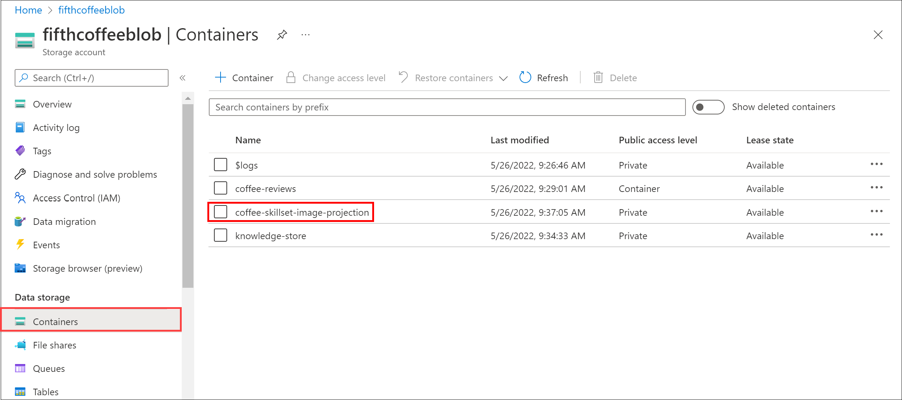

---
lab:
  title: Erkunden von Knowledge Mining
  module: Module 5 - Conversational AI
---

# Erkunden von Knowledge Mining

> **Hinweis**: Um dieses Lab abzuschließen, benötigen Sie ein [Azure-Abonnement](https://azure.microsoft.com/free?azure-portal=true), in dem Sie über Administratorzugriff verfügen.

Angenommen, Sie arbeiten für Fourth Coffee, eine nationale Kaffeekette. Sie werden gebeten, beim Erstellen einer Wissensgewinnungslösung zu helfen, die die Suche nach Erkenntnissen zu Kundenerfahrungen erleichtert. Sie entscheiden sich dafür, einen Azure Cognitive Search-Index mithilfe der Daten zu verwenden, die aus Kundenbewertungen extrahiert wurden.  

In diesem Lab werden Sie Folgendes tun:

- Erstellen von Azure-Ressourcen
- Extrahieren von Daten aus einer Datenquelle
- Anreichern von Daten mit KI-Skills
- Verwenden des Azure-Indexers im Azure-Portal
- Abfragen des Suchindex
- Überprüfen der in einer Wissensdatenbank gespeicherten Ergebnisse

## Erforderliche Azure-Ressourcen

Die Lösung, die Sie für Fourth Coffee erstellen, erfordert die folgenden Ressourcen in Ihrem Azure-Abonnement:

- Eine **Azure Cognitive Search**-Ressource, die die Indizierung und Abfrage verwaltet
- Eine **Cognitive Services**-Ressource, die KI-Dienste für Skills bereitstellt, die Ihre Suchlösung verwenden kann, um die Daten in der Datenquelle mit KI-generierten Erkenntnissen anzureichern

    > **Hinweis**: Ihre Azure Cognitive Search- und Cognitive Services-Ressourcen müssen sich am selben Speicherort befinden.

- Ein **Speicherkonto** mit Blobcontainern, in dem unformatierte Dokumente und andere Sammlungen von Tabellen, Objekten oder Dateien gespeichert werden.

### Erstellen einer Ressource vom Typ *Azure Cognitive Search*

1. Melden Sie sich beim [Azure-Portal](https://portal.azure.com/learn.docs.microsoft.com?azure-portal=true) an.

1. Klicken Sie auf die Schaltfläche **+ Ressource erstellen**, suchen Sie nach *Azure Cognitive Search*, und erstellen Sie eine Ressource vom Typ **Azure Cognitive Search** mit den folgenden Einstellungen:

    - **Abonnement**: *Ihr Azure-Abonnement*.
    - **Ressourcengruppe**: *Wählen Sie eine Ressourcengruppe aus, oder erstellen Sie eine Ressourcengruppe mit einem eindeutigen Namen*.
    - **Dienstname**: *Ein eindeutiger Name*.
    - **Standort**: *Wählen Sie eine beliebige verfügbare Region aus*.
    - **Tarif**: Basic

1. Wählen Sie **Überprüfen + erstellen** aus, und wählen Sie nach der Anzeige der Antwort **Überprüfung erfolgreich** die Option **Erstellen** aus.

1. Klicken Sie nach Abschluss der Bereitstellung auf **Zu Ressource wechseln**. Auf der Azure Cognitive Search-Übersichtsseite können Sie Indizes hinzufügen, Daten importieren und erstellte Indizes durchsuchen.

### Erstellen einer Cognitive Services-Ressource

Sie müssen eine **Cognitive Services**-Ressource bereitstellen, die sich am gleichen Standort wie Ihre Azure Cognitive Search-Ressource befindet. Ihre Suchlösung verwendet diese Ressource, um die Daten im Datenspeicher mit KI-generierten Erkenntnissen anzureichern.

1. Kehren Sie zur Startseite des Azure-Portals zurück. Klicken Sie dann auf die Schaltfläche **+ Ressource erstellen**, suchen Sie nach *Cognitive Services*, und erstellen Sie eine **Cognitive Services**-Ressource mit den folgenden Einstellungen: 
    - **Abonnement**: *Ihr Azure-Abonnement*.
    - **Ressourcengruppe**: *Die gleiche Ressourcengruppe wie Ihre Azure Cognitive Search-Ressource*.
    - **Region**: *Der gleiche Standort wie Ihre Azure Cognitive Search-Ressource*.
    - **Name**: *Ein eindeutiger Name*.
    - **Tarif**: Standard S0.
    - **Durch Aktivieren dieses Kontrollkästchens bestätige ich, dass ich die folgenden Bedingungen gelesen und verstanden habe**: Aktiviert

1. Klicken Sie auf **Überprüfen + erstellen**. Wählen Sie nach der Anzeige der Antwort **Überprüfung erfolgreich** die Option **Erstellen** aus.

1. Warten Sie, bis die Bereitstellung abgeschlossen ist, und zeigen Sie dann die Bereitstellungsdetails an.

### Speicherkonto erstellen

1. Kehren Sie zur Startseite des Azure-Portal zurück, und wählen Sie dann die Schaltfläche **+ Ressource erstellen** aus.

1. Suchen Sie nach *Speicherkonto*, und erstellen Sie eine **Speicherkontoressource** mit den folgenden Einstellungen:
    - **Abonnement**: *Ihr Azure-Abonnement*.
    - **Ressourcengruppe**: *Die gleiche Ressourcengruppe wie die Ihrer Azure Cognitive Search- und Cognitive Services-Ressourcen*.
    - **Speicherkontoname**: *Ein eindeutiger Name*.
    - **Speicherort**: *Wählen Sie einen beliebigen verfügbaren Speicherort aus*.
    - **Leistung**: Standard
    - **Redundanz**: Lokal redundanter Speicher (LRS)

1. Klicken Sie auf **Überprüfen**, und klicken Sie dann auf **Erstellen**. Warten Sie, bis die Bereitstellung abgeschlossen ist, und wechseln Sie dann zur bereitgestellten Ressource.

## Hochladen von Dokumenten in Azure Storage

1. Wählen Sie im von Ihnen erstellten Azure Storage-Konto im linken Menübereich **Container** aus.

    

1. Wählen Sie **+ Container** aus. Auf der rechten Seite wird ein Bereich geöffnet.

1. Legen Sie die folgenden Einstellungen fest, und klicken Sie dann auf **Erstellen**:
    - **Name**: coffee-reviews  
    - **Öffentliche Zugriffsebene**: Container (anonymer Lesezugriff für Container und Blobs)
    - **Erweitert**: *Keine Änderungen*.

1. Laden Sie auf einer neuen Browserregisterkarte die gezippten Dokumente von https://aka.ms/km-documents herunter, und extrahieren Sie die Dateien dann in den Ordner *reviews*.

1. Wählen Sie im Azure-Portal Ihren Container *coffee-reviews* aus. Wählen Sie im Container die Option **Hochladen** aus.

    

1. Wählen Sie im Bereich **Blob hochladen** die Option **Datei auswählen** aus.

1. Wählen Sie im Explorer-Fenster **alle** Dateien im Ordner *reviews*, anschließend **Öffnen** und dann **Hochladen** aus.

    

1. Nach Abschluss des Uploads können Sie den Bereich **Blob hochladen** schließen. Ihre Dokumente befinden sich jetzt in Ihrem Speichercontainer *coffee-reviews*.

## Indizieren der Dokumente

Sobald die Dokumente im Speicher vorhanden sind, können Sie Azure Cognitive Search verwenden, um Erkenntnisse aus den Dokumenten zu extrahieren. Im Azure-Portal wird ein *Datenimport-Assistent* angezeigt. Mit diesem Assistenten können Sie automatisch einen Index und Indexer für unterstützte Datenquellen erstellen. Der Assistent wird verwendet, um einen Index zu erstellen und Ihre Suchdokumente aus dem Speicher in den Azure Cognitive Search-Index zu importieren.

1. Navigieren Sie im Azure-Portal zu Ihre Azure Cognitive Search-Ressource. Wählen Sie auf der Seite **Übersicht** die Option **Daten importieren** aus.

    

1. Wählen Sie auf der Seite **Mit Ihren Daten verbinden** in der Liste **Datenquelle** die Option **Azure Blob Storage** aus. Vervollständigen Sie die Datenspeicherdetails mit den folgenden Werten:
    - **Datenquelle**: Azure Blob Storage
    - **Name der Datenquelle**: coffee-customer-data
    - **Zu extrahierende Daten**: Inhalt und Metadaten
    - **Analysemodus**: Standard
    - **Verbindungszeichenfolge**: *Wählen Sie **Vorhandene Verbindung auswählen** aus. Wählen Sie Ihr Speicherkonto und dann den Container **coffee-reviews** aus. Klicken Sie anschließend auf **Auswählen**.
    - **Authentifizierung mithilfe verwalteter Identitäten**: Keine
    - **Containername**: *Diese Einstellung wird automatisch mit Daten aufgefüllt, nachdem Sie eine vorhandene Verbindung ausgewählt haben*.
    - **Blobordner:** *Lassen Sie dieses Feld leer.*
    - **Beschreibung**: Bewertung von Fourth Coffee-Läden

1. Wählen Sie **Weiter: Kognitive Skills hinzufügen (optional)** aus.

1. Wählen Sie im Abschnitt **Cognitive Services-Instanz anfügen** Ihre Cognitive Services-Ressource aus.  

1. Gehen Sie im Abschnitt **Anreicherungen hinzufügen** folgendermaßen vor:
    - Ändern Sie den **Namen des Skillsets** in **coffee-skillset**.
    - Aktivieren Sie das Kontrollkästchen **OCR aktivieren und den gesamten Text im Feld „merged_content“ zusammenführen** aus.
        > **Hinwei**: Es ist wichtig, die Option **OCR aktivieren** auszuwählen, um alle Optionen für angereicherte Felder anzuzeigen.
    - Vergewissern Sie sich, dass **Quelldatenfeld** auf **merged_content** festgelegt ist.
    - Ändern Sie die **Granularitätsebene für Anreicherung** auf **Pages (5000 character chunks)** (Seiten [5.000 Blöcke]).
    - Wählen Sie nicht die Option *Inkrementelle Anreicherung aktivieren* aus.
    - Wählen Sie die folgenden angereicherten Felder aus:

        | Kognitive Fähigkeit | Parameter | Feldname |
        | --------------- | ---------- | ---------- |
        | Ortsnamen extrahieren | | locations |
        | Schlüsselbegriffe extrahieren | | keyphrases |
        | Stimmung erkennen | | Stimmung |
        | Tags aus Bildern generieren | | imageTags |
        | Untertitel aus Bildern generieren | | imageCaption |

1. Aktivieren Sie unter **Anreicherungen in einem Wissensspeicher speichern** Folgendes:
    - Bildprojektionen
    - Dokumente
    - Seiten
    - Schlüsselwörter
    - Entitäten
    - Bilddetails
    - Imageverweise

    > **Hinweis**: Es wird eine Warnung angezeigt, in der nach einer **Verbindungszeichenfolge für das Speicherkonto** gefragt wird.
    >
    > 

    > 1. Wählen Sie **Vorhandene Verbindung auswählen** aus. Wählen Sie das Speicherkonto aus, das Sie zuvor erstellt haben.

    > 1. Klicken Sie auf **+ Container**, um einen neuen Container namens **knowledge-store** zu erstellen, für den die Datenschutzebene auf privat festgelegt ist, und wählen Sie **Erstellen** aus.

    > 1. Wählen Sie den Container **knowledge-store** aus, und klicken Sie dann unten auf dem Bildschirm auf **Auswählen**.

1. Wählen Sie **Azure blob projects: Document** (Azure-Blobprojekte: Dokument) aus. Eine Einstellung für *Containername* wird mit dem automatisch ausgefüllten *knowledge-store*-Container angezeigt. Ändern Sie den Containernamen nicht.

1. Klicken Sie auf **Weiter: Zielindex anpassen**. Ändern Sie den **Indexnamen** in **coffee-index**.

1. Stellen Sie sicher, dass der **Schlüssel** auf **metadata_storage_path** festgelegt ist. Lassen Sie **Name der Vorschlagsfunktion** leer, und übernehmen Sie den automatisch ausgefüllten **Suchmodus**.

1. Überprüfen Sie die Standardeinstellungen der Indexfelder. Wählen Sie **filterbar** für alle Felder aus, die bereits standardmäßig ausgewählt sind.

    

1. Klicken Sie auf **Next: Erstellen eines Indexers**.

1. Ändern Sie den **Indexernamen** in **coffee-indexer**.

1. Lassen Sie **Zeitplan** auf **Einmal** festgelegt.

1. Erweitern Sie **Erweiterte Optionen**. Stellen Sie sicher, dass die Option **Base64-Codierungsschlüssel** ausgewählt ist, da Codierungsschlüssel den Index effizienter machen können.

1. Wählen Sie **Senden** aus, um Datenquelle, Skillset, Index und Indexer zu erstellen. Der Indexer wird automatisch ausgeführt und führt die Indizierungspipeline aus. Dieser führt folgende Aufgaben aus:
    - Extrahiert die Felder und Inhalte von Dokumentmetadaten aus der Datenquelle.
    - Führt das Skillset für kognitive Skills aus, um weitere angereicherte Felder zu generieren.
    - Zuordnen der extrahierten Felder zum Index

1. Wählen Sie in der unteren Hälfte der **Übersichtseite** Ihrer Azure Cognitive Search-Ressource die Registerkarte **Indexer** aus. Auf dieser Registerkarte wird der neu erstellte **coffee-indexer** angezeigt. Warten Sie eine Minute, und wählen Sie **&orarr;Aktualisieren** aus, bis der **Status** „Erfolgreich“ angezeigt wird.

1. Wählen Sie den Indexernamen aus, um weitere Details anzuzeigen.

    

## Indexabfragen

Verwenden Sie den Suchexplorer zum Schreiben und Testen von Abfragen. Der Suchexplorer ist ein Tool, das in das Azure-Portal integriert ist und Ihnen eine einfache Möglichkeit bietet, die Qualität Ihres Suchindexes zu überprüfen. Sie können den Such-Explorer verwenden, um Abfragen zu schreiben und Ergebnisse im JSON-Format zu überprüfen.

1. Wählen Sie auf der *Übersichtsseite* des Search-Diensts oben auf dem Bildschirm **Suchexplorer** aus.

   

1. Beachten Sie, dass der ausgewählte Index der *coffee-index* ist, den Sie erstellt haben.

    

    Geben Sie im Feld **Abfragezeichenfolge** `search=*&$count=true` ein, und wählen Sie dann **Suchen** aus. Die Suchabfrage gibt alle Dokumente im Suchindex zurück, einschließlich einer Angabe der Anzahl aller Dokumente im Feld **@odata.count**. Der Suchindex sollte ein JSON-Dokument mit Ihren Suchergebnissen zurückgeben.

    > **Hinweis**: Wenn eine Meldung **Um im Portal zu suchen, lassen Sie den Portalursprung in Ihren Index-CORS-Einstellungen zu** angezeigt wird, wählen Sie **Portal zulassen** und dann **Suchen** aus.

1. Filtern Sie nun nach Standort. Geben Sie im Feld **Abfragezeichenfolge**`search=$filter=locations eq 'Chicago'` ein, und wählen Sie dann **Suchen** aus. Die Abfrage durchsucht alle Dokumente im Index und filtert nach Bewertungen mit dem Standort „Chicago“.

1. Nun filtern Sie nach Stimmung. Geben Sie im Feld **Abfragezeichenfolge**`search=$filter=sentiment eq 'negative'` ein, und wählen Sie dann **Suchen** aus. Die Abfrage durchsucht alle Dokumente im Index und filtert nach Bewertungen mit einer negativen Stimmung.

   > **Hinweis**: Schauen Sie sich an, wie die Ergebnisse nach `@search.score` sortiert werden. Dies ist die von der Suchmaschine zugewiesene Bewertung, die zeigt, wie genau die Ergebnisse mit der angegebenen Abfrage übereinstimmen.

1. Eines der Probleme, das wir lösen müssen, ist die Frage, warum es bestimmte Bewertungen geben kann. Sehen wir uns die Schlüsselbegriffe an, die mit den negativen Bewertungen zusammenhängen. Was kann Ihrer Meinung nach der Grund für diese Bewertung sein?

## Überprüfen des Wissensspeichers

Sehen wir uns die Möglichkeiten des Wissensspeichers in der Praxis an. Beim Ausführen des *Datenimport-Assistenten* haben Sie auch einen Wissensspeicher erstellt. Im Wissensspeicher befinden sich die angereicherten Daten, die durch KI-Skills extrahiert und in Form von Projektionen und Tabellen gespeichert wurden.

1. Navigieren Sie im Azure-Portal zurück zu Ihrem Azure-Speicherkonto.

1. Wählen Sie im linken Menübereich **Container** aus. Wählen Sie den Container **knowledge-store** aus.

    

1. Wählen Sie eines der Elemente aus, und klicken Sie dann auf die Datei **objectprojection.json**.

    

1. Wählen Sie **Bearbeiten** aus, um die JSON-Datei anzuzeigen, die für eines der Dokumente aus Ihrem Azure-Datenspeicher erstellt wurde.

    

1. Wählen Sie oben links auf dem Bildschirm die Breadcrumb-Leiste des Speicherblobs aus, um zu *Container* des Speicherkontos zurückzukehren.

    

1. Wählen Sie unter *Container* den Container *coffee-skillset-image-projection* aus. Wählen Sie eines der Elemente aus.

    

1. Wählen Sie eine der *JPG*-Dateien aus. Wählen Sie **Bearbeiten** aus, um das aus dem Dokument gespeicherte Bild anzuzeigen. Beachten Sie, dass alle Bilder aus den Dokumenten auf diese Weise gespeichert werden.

    

1. Wählen Sie oben links auf dem Bildschirm die Breadcrumb-Leiste des Speicherblobs aus, um zu *Container* des Speicherkontos zurückzukehren.

1. Wählen Sie im linken Bereich **Speicherbrowser** und dann **Tabellen** aus. Im Index befindet sich eine Tabelle für jede Entität. Wählen Sie die Tabelle *coffeeSkillsetKeyPhrases* aus.

    Sehen Sie sich die Schlüsselbegriffe an, die der Wissensspeicher aus dem Inhalt der Bewertungen erfassen konnte. Viele der Felder sind Schlüssel, sodass Sie die Tabellen wie eine relationale Datenbank verknüpfen können. Im letzten Feld werden die Schlüsselbegriffe angezeigt, die vom Skillset extrahiert wurden.

## Weitere Informationen

Dieser einfache Suchindex bietet nur einige der Funktionen des Azure Cognitive Search-Diensts. Weitere Informationen zu den Möglichkeiten dieses Diensts finden Sie auf der Seite [Azure Cognitive Search-Dienst](/azure/search/search-what-is-azure-search).
